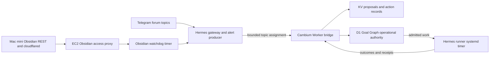

# Post-Phase-9 Cambium and Hermes Remediation Plan

- **Status:** Planned; evidence and implementation gates remain open
- **Prepared:** 2026-09-23
- **Scope:** Cambium, Hermes, mapped Telegram topics, and read-only runtime evidence
- **Roadmap relationship:** Supplemental follow-up. Phase 10 remains limited to allowlisted R2 reconciliation and retirement; this plan does not retarget it.

## Goal

After the Phase 9 inventory plan is accepted, establish a redacted current-state record for the mapped Telegram incidents and the Cambium/Hermes runtime, correct confirmed source defects, and keep unresolved owner decisions visible. A cluster is resolved only when the owning layer provides fresh evidence; silence, a green source test, or historical recovery alone is not live recovery proof.

## Architecture and ownership

Telegram carries interaction and alerts. Hermes owns message delivery and runner execution. Cambium validates bounded assignments and remains the governed bridge. KV can hold proposals; D1 remains operational authority. The 30-second Hermes runner systemd timer and the Hermes cron catalog are separate scheduling planes. The Obsidian watchdog monitors the Mac mini → tunnel → EC2 proxy path.

## Evidence snapshot

The following is a local source snapshot, not current production state. Preserve all dirty paths and do not reset, stage, commit, pull, merge, or switch branches during this work.

| Repository | Base revision observed | Relevant paths observed in the reviewed scope |
|---|---|---|
| Cambium | `746acf814b4ffce1a6ccef295ba1f4b0a09760b6` | `workers/quests/src/telegram-routing.ts`, `workers/quests/src/telegram-topic-map.v1.json`, `.planning/phases/09-source-inventory-and-classification/09-01-PLAN.md` |
| Hermes (`hermes-aws-ts`) | `0979669c41176f7297d0de41f283dc17cc0ebc66` | `ops/ec2/obsidian-tunnel-watchdog.sh`, `ops/ec2/obsidian-tunnel-watchdog.service`, `ops/ec2/obsidian-tunnel-watchdog.timer`, `ops/hermes/cron-catalog.json`, `contracts/thoughtseed.telegram-topic-map.v1.json` |

Both topic-map manifests currently have SHA-256 `8680362398721c473cb768cf977d5d43d3621720d5edb35d871513ff4f93a630` and contain nine mapped topics, including Adytum topic 147. Cambium's `telegram-routing.ts` names source commit `1931f6c2d0d9260cfbf29c37413e1504e7ebf9e4`; that commit's Hermes manifest digest is `edcbbb34bb468107400767442df8c772c418a40a9e3747651404a23ec33c7d2a`. The local map contents match, but the pinned provenance does not. Do not invent a commit or update the pin until the canonical Hermes map has an authorized, committed revision.

The Hermes watchdog files are untracked candidate files and `ops/hermes/cron-catalog.json` is modified. Preserve them as user work. The evidence and plan do not claim that these bytes are deployed.

## Source findings and disposition

| Finding | Source evidence | Classification | Planned owner/action |
|---|---|---|---|
| Obsidian watchdog conflates transport and health state | The candidate captures curl's process exit but not HTTP status; malformed JSON and missing `status` flow into the generic degraded branch; `last_error_detail` is written to status/logs and alert text; elapsed duration is estimated from failure count; the count resets after every alert. | Confirmed source defect in an untracked candidate; deployment parity unknown. | Compare deployed bytes and timer/service state first. If deployed semantics match, correct the candidate and add synthetic state-machine tests. Keep the six-hour default. |
| Recovery and alert retries are not durable transitions | State is represented by a failure counter only. There is no stored incident start, transition outbox, or retry state. Degradation and recovery use the same alert unit/cooldown identity. | Confirmed source defect in the candidate; delivery state unknown. | Persist incident start and pending transition. Send once on degradation and once on recovery; retry failed delivery; use per-transition cooldown identity so recovery cannot be suppressed by degradation. |
| Hermes runner Access 302 reports | `src/runner.ts` manually handles redirects and classifies a Cloudflare Access redirect as `cloudflare_access_authentication_required`. The source service declares the paired systemd credentials. | No runner source bug confirmed; deployed token-pair validity and actual Access failures are unknown. | Read the deployed unit and credential-file presence/metadata without reading values; inspect redacted runner failure counts and the exact Labs `curious` Access application. Never weaken the Access policy. |
| Gateway environment-file permissions | The tracked `hermes-agent.service` runs as `hermes` and names `/etc/hermes/hermes-runner.env`; that does not identify the deployed gateway unit or prove the file's owner/mode/readability. | Evidence gap; a live permission defect is not confirmed. | Identify the deployed gateway unit, its configured user, and environment-file path. Read metadata only. If access is broken, propose least-privilege repair with a file-level backup and rollback; never make the file world-readable. |
| Job inventory and scheduler planes | The source runner timer is scheduled every 30 seconds. The catalog has five disabled candidate entries, each with `enabled: false`, `runtimeJobId: null`, and `requiresReview: true`. | Source configuration is clear; live timers and Hermes cron runtime inventory are unknown. | Reconcile read-only systemd timers and Hermes cron jobs against Agent Ops snapshots. Keep all five catalog entries disabled. Do not treat catalog state as the runner timer. |
| Topic-map source provenance | Current Cambium and Hermes manifests match by digest, while Cambium's embedded `sourceCommit` points to a different historical Hermes manifest digest. | Confirmed provenance mismatch; map topics currently match in the local worktrees. | After the canonical Hermes map change is committed through its owning review, pin Cambium to that exact commit and digest; verify all nine topic routes and Adytum 147 in both repositories. |
| Phase 9 projection source validation | The Phase 9 plan previously permitted a source projection to become `derived-rebuild` without requiring full source envelope, canonical bytes, and exact-key HEAD metadata validation. | Confirmed plan gap; corrected in `09-01-PLAN.md`, whose final plan check passed without blockers or warnings. Authenticated inventory reads remain behind an explicit owner-approval checkpoint. | Require the producer contract and exact-key HEAD/list metadata on both source and target before classification. Apply the explicit outcome precedence matrix and run synthetic cases before any approval-gated inventory. |
| Telegram Obsidian alerts | A prior mapped-topic fetch yielded 148 Obsidian alert messages within a fetched window; messages must be grouped into incidents rather than counted as independent failures. | Historical snapshot; current recovery state unknown. | Re-read mapped history and group alerts into incident clusters with bounded, redacted evidence. Classify each as live-recovered, historical/self-recovered, owner action required, or unresolved. |
| Composio 410 or missing-tool reports | Reports exist in the mapped Telegram evidence; a source-level runtime cause has not been established here. | Current state unknown; owner action may be required. | Group by integration/tool and compare to the current tool catalog and service response. Keep retired Cambium endpoints that intentionally return 410 separate from Composio reports. |
| Provider fallback | Reports exist in mapped Telegram evidence; provider configuration changes are outside this plan. | Current state unknown; provider owner decision required if still active. | Record redacted fallback cause and affected workflow. Do not activate, replace, or reconfigure a provider. |
| Adytum browser retry loop | Reports exist in mapped Telegram evidence and reference the Adytum topic. | Current state unknown; workflow owner action may be required. | Correlate retry reports by incident and check whether a source-level bounded retry/termination fix exists. Do not change browser settings or install software without the owning approval. |
| Campaign lead-pool blockage | Reports describe a lead-pool/workflow blocker, not an admitted Cambium execution. | Owner-held business workflow blocker. | Record the missing owner input and current admission boundary. Do not import leads, spend, or send client-facing messages. |
| Credit-workflow exceptions | Reports describe exceptions in a financially sensitive workflow. | Owner-held; details remain redacted. | Preserve only exception class, count, required owner decision, and evidence pointer. Do not move credits or alter accounts. |

The current Telegram fetch is not proof of lifetime or gap-free history. The earlier 394-row Aug 30–Sep 23 window may be incomplete. On 2026-09-23, `tg chats list` returned two dialogs named `Thoughtseed Labs` with different peer types; the invite link was rejected by both `tg history` and `tg topics list` as an unsupported `join` deeplink, and trying the cached numeric dialog identifier returned `contact not found`. This is a peer-resolution limitation, not evidence that history is absent. No join or substitute peer was used. Continue with an exact public username or an owner-provided Telegram Desktop JSON export; use the invite only after the user explicitly authorizes membership change. Keep raw message bodies, peer identifiers, access hashes, credentials, and personal/financial details out of the repository plan and final summary.

## Execution plan

### 1. Preserve and establish evidence

1. Record exact Cambium and Hermes `HEAD`, relevant dirty paths, and a private initial worktree-status digest. Do not absorb or rewrite unrelated work.
2. Use the authenticated `tg` CLI in read-only mode against only the mapped Telegram peers/topics. Reconcile the available history window, pagination, and last-message bounds. Use Desktop JSON export only if the API window cannot establish the required archive range.
3. Group the 148 Obsidian alert messages into incidents. Build a private redacted evidence ledger; publish only cluster IDs, time bounds, count, status, owner, and sanitized evidence reference.
4. Perform read-only runtime inspection: deployed watchdog/service/timer bytes and cadence, alert cooldown state, Obsidian proxy HTTP status and response shape, runner Access failures, deployed gateway unit identity and environment-file metadata, systemd timer inventory, and Hermes cron inventory. Do not print message payloads, response bodies, environment values, secret contents, or raw logs.
5. Assign every incident one state: `live-recovered`, `historical/self-recovered`, `owner action required`, or `unresolved`. A successful endpoint check proves only that probe at that time.

### 2. Correct the Obsidian watchdog source, if deployed evidence supports this candidate

1. Compare deployed bytes to the untracked candidate. If deployed behavior differs, stop and re-diagnose against the deployed source before editing this candidate.
2. Capture curl's process exit and HTTP status separately. Distinguish transport error, non-2xx status, malformed JSON, missing status, explicit degraded response, and healthy response. Do not map parse failures to `unknown` or zero failures.
3. Persist incident start, current state, and pending alert transition under the watchdog state directory using atomic writes and restrictive permissions. Compute elapsed time from the stored incident start.
4. Notify once per degradation and once per recovery. Persist failed transitions and retry them on the next run. Use transition-specific cooldown identity so one state change cannot suppress the other or a later incident. Do not repeat alerts while the state is unchanged.
5. Bound and redact error details before status files, logs, and Telegram calls. Preserve the documented six-hour timer unless deployed evidence shows a different cadence.
6. Add synthetic tests for healthy HTTP 200, Access 302, HTTP 5xx, malformed/incomplete JSON, explicit degraded response, repeated degraded polls, recovery, a later incident, alert-send failure/retry, and accurate incident elapsed time.

### 3. Validate runner Access and gateway service configuration

1. Confirm the deployed runner unit, Labs `curious` Access application, and paired systemd credential-file metadata. Verify the pair is available to the service without printing or reading credential values into output. Keep redirects manually handled and Access policy intact.
2. Review redacted runner logs/counters for the agreed observation window. A 302 is an edge authentication block; it is not evidence that `/healthz` itself failed.
3. Identify the actual deployed gateway unit and its environment-file path, service account, file owner/group/mode, and rollback copy. Only propose a least-privilege permission or credential-loader change when the deployed evidence confirms it.
4. Keep all credential rotation, Access policy edits, gateway permission mutations, service restarts, and deployment behind a separate exact-target owner approval and rollback gate.

### 4. Reconcile jobs and topic-map provenance

1. Compare live `systemctl list-timers`/unit state with the Agent Ops snapshot and Hermes cron runtime inventory. Report the runner timer and the five catalog candidates in separate rows. Preserve every candidate as disabled.
2. Keep the local topic-map manifests aligned. Once the canonical Hermes map commit is approved and exists, pin Cambium's `sourceCommit` and digest to that exact commit; verify route parity, all nine topic IDs, and Adytum 147. Do not commit or guess provenance as part of this planning pass.

### 5. Resolve owner-held Telegram clusters

1. For Composio, provider fallback, Adytum retries, lead-pool blockage, and credit-workflow exceptions, record only redacted incident summaries and the exact missing owner action.
2. Do not change browser settings, install tools, import leads, spend credits, deliver client material, change accounts, or activate/replace providers without their separate owner decision.
3. After the deep evidence pass, present only the remaining decisions that require the user's or another named owner's judgment.

## Verification and acceptance

The remediation plan is ready for implementation when each gate has a concrete evidence source and a named owning layer. Work is accepted only when:

- Every message in the retrieved bounded Telegram history is assigned to a redacted incident or an explicitly excluded non-error class; the coverage window and Telegram retrieval limits are recorded.
- The 148 Obsidian alert messages are grouped into incident clusters, each with one of the four explicit status labels and fresh evidence where status is live.
- The deployed watchdog version and timer cadence are recorded before source changes; the candidate fix matches the active deployed behavior or is held for re-diagnosis.
- Synthetic watchdog tests cover every case in section 2, then Hermes Node/plugin suites and Cambium's declared `npm run test` suite pass after source implementation.
- Runner Access failures are checked against the deployed credential-loading path and the exact Access app without weakening policy; gateway identity and file metadata are read back without exposing contents.
- Systemd timers and Hermes cron jobs are reconciled as separate planes and all five catalog candidates remain disabled.
- The canonical Hermes topic-map commit and digest exactly match Cambium's pin, including Adytum topic 147.
- Owner-held business/provider/browser/credit exceptions remain classified as such until the owner supplies the missing decision or evidence.
- No production mutation is issued in this plan. Any EC2, Cloudflare Access, credential, service restart, Telegram delivery, provider, account, job activation, or deployment change gets its own target-specific approval and rollback plan.

## Approval boundaries

Local source edits and synthetic/repository tests can be planned after evidence confirms the deployed candidate and exact source ownership. This plan does not authorize EC2 edits, Access-policy changes, credentials, restarts, deployment, Telegram sends, cron activation, provider/account changes, lead imports, spending, client delivery, D1/KV writes, R2 transfers, or source retirement.

## Open decisions after the evidence pass

Ask only after the Telegram and runtime deep pass:

- Which named owner can resolve each still-active Composio, provider, Adytum browser, lead-pool, and credit-workflow exception?
- What observation window should establish zero Hermes runner Access failures after any separately approved configuration repair?
- Is a bounded Telegram history window sufficient, or should the operator export lifetime/gap-free Telegram Desktop JSON for the mapped channels?
- If the deployed watchdog differs from this candidate, should the fix be applied to the deployed-source branch or should this candidate remain a separate future correction?
