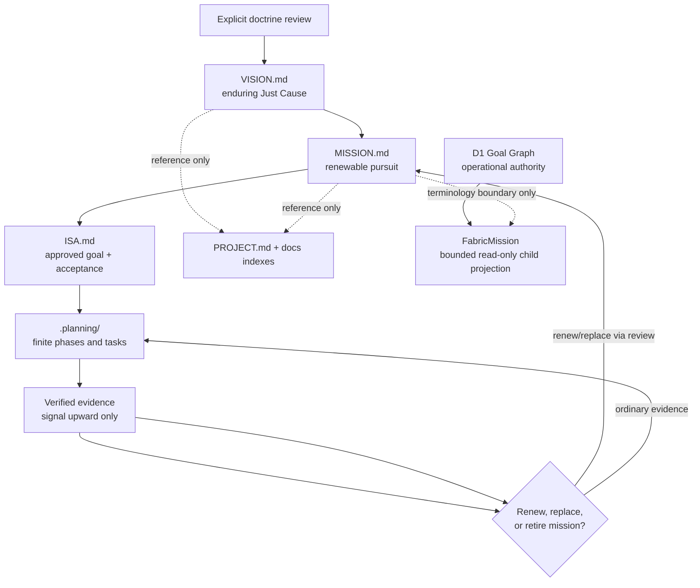

# Phase 3: Canonical Infinite-Game Anchors - Research

**Researched:** 2026-08-18
**Domain:** Repository doctrine, authority boundaries, and deterministic documentation contracts
**Confidence:** HIGH

<user_constraints>
## User Constraints (from CONTEXT.md)

### Locked Decisions

#### Anchor Semantics and Cadence
- **D-01:** Root `VISION.md` is Cambium's enduring Just Cause and near-invariant infinite-game direction. It changes only through an explicit doctrine review, not from ordinary task or milestone evidence.
- **D-02:** Root `MISSION.md` is the renewable current pursuit. It must state a finite horizon, progress evidence, renewal triggers, and explicit retirement or replacement conditions.

#### Doctrine and Planning Authority
- **D-03:** `VISION.md` and `MISSION.md` are normative doctrine anchors, not goal-setting or planning engines. ISA owns acceptance and approved goals; GSD owns finite planning state.
- **D-04:** Generated, operational, and inherited surfaces reference the anchors by path and digest. They must not copy doctrine or claim independent authority.

#### Mission Terminology Boundary
- **D-05:** “Repository Mission” names the singular renewable doctrine horizon in root `MISSION.md`.
- **D-06:** `FabricMission` remains a bounded, outcome-oriented child record inside one `WorkObject`; D1 Goal Graph owns its operational state and Mission Fabric only projects it.

#### Non-Destructive Discoverability
- **D-07:** Phase 3 adds the two anchors to existing root and documentation indexes while leaving older doctrine files in place.
- **D-08:** Overlapping claims in older doctrine are supporting context until Phase 6 inventories and classifies them; they do not compete with the root anchors.

### the agent's Discretion
- Choose concise anchor templates, cross-link wording, and deterministic reference formatting consistent with existing repository Markdown conventions.
- Prefer additive edits to existing indexes and authority tables; avoid speculative schema or runtime work.

### Deferred Ideas (OUT OF SCOPE)
- Deterministic intent graph implementation belongs to Phase 4.
- Ralph, GSD next-action, skill-cluster, OmniRoute, and manifest projection belong to Phase 5.
- Full doctrine corpus inventory and disposition mapping belong to Phase 6.
- Duplication, authority, freshness, sensitive-data, and handoff enforcement belong to Phase 7.
- Connected-repository overlays remain a future requirement after Cambium's canonical contract ships.
</user_constraints>

<phase_requirements>
## Phase Requirements

| ID | Description | Research Support |
|----|-------------|------------------|
| ANCHOR-01 | One canonical root `VISION.md` states the enduring Just Cause, infinite-game commitments, and non-goals without a finite product endpoint. | The recommended vision template extracts the stable direction from `INFINITE-GAME.md` while keeping the theory document as supporting context. [VERIFIED: codebase `INFINITE-GAME.md` §§2, 6, 14] |
| ANCHOR-02 | One canonical root `MISSION.md` states the renewable mission, horizon, progress evidence, renewal triggers, and retirement/replacement conditions. | The recommended mission template uses a milestone-completion horizon and evidence-triggered renewal without taking goal or plan authority. [VERIFIED: codebase `.planning/REQUIREMENTS.md`; `.planning/phases/03-canonical-infinite-game-anchors/03-CONTEXT.md`] |
| ANCHOR-03 | Repository Mission and bounded `FabricMission` records are explicitly distinguished by naming, scope, inheritance, and authority. | Existing runtime and contract shapes establish `FabricMission` as a child of one `WorkObject` and the projection as read-only D1 Goal Graph output; the phase only adds terminology notes around that frozen contract. [VERIFIED: codebase `workers/quests/src/mission-fabric.ts:43`; `docs/architecture/contracts/mission-fabric-v1.md`; `docs/architecture/cambium-operating-fabric.md` OF-C1–C3] |
| ANCHOR-04 | Normative vision and mission claims trace to the anchors instead of being copied into generated or operational files. | Existing doctrine and docs indexes are catalog-style surfaces; the recommended edits make them reference the anchors and label older overlaps as supporting context. [VERIFIED: codebase `PROJECT.md`; `docs/doctrine/README.md`; `docs/README.md`; `docs/LIFECYCLE.md`] |
</phase_requirements>

## Summary

Phase 3 should be a bounded documentation-contract change, not a runtime or schema change. Cambium already has the conceptual source material for the enduring direction in `INFINITE-GAME.md`, a current planning spine in GSD, and a frozen read-only operational `FabricMission` model. The missing piece is a concise pair of root anchors plus explicit reference and terminology boundaries. [VERIFIED: codebase `INFINITE-GAME.md`; `.planning/STATE.md`; `docs/architecture/contracts/mission-fabric-v1.md`]

The most faithful implementation creates `VISION.md` and `MISSION.md`, scopes the overlapping `INFINITE-GAME.md` and ISA language, adds reference-only discovery links to existing indexes, and adds a terminology note to Mission Fabric documentation. It must not alter `workers/quests/src/mission-fabric.ts`, projection schemas, D1 behavior, UI labels, or connected repositories. [VERIFIED: codebase `.planning/phases/03-canonical-infinite-game-anchors/03-CONTEXT.md` D-04–D-08]

The main execution risk is authority drift in the clean worktree: at research time `ISA.md` still identifies “Execute issue 331 dependency-safe Mini App queue” in its frontmatter and contains the older multi-iteration Goal, while `.planning/PROJECT.md` and `.planning/STATE.md` name v0.4 and say ISA holds the approved infinite-game goal. The plan must bind the already approved v0.4 goal into ISA before using ISA as acceptance evidence; it must not invent replacement wording. [VERIFIED: codebase `ISA.md:1-9`; `ISA.md` §Goal; `.planning/PROJECT.md` Current Milestone; `.planning/STATE.md` Project State]

**Primary recommendation:** Execute one sequential plan: add a focused failing anchor-contract test, align ISA to the already approved goal, create the two anchors, add reference-only discovery and terminology notes, then run the focused test, `npm test`, and `npm run drift:audit`.

## Architectural Responsibility Map

| Capability | Primary Tier | Secondary Tier | Rationale |
|------------|-------------|----------------|-----------|
| Enduring Just Cause | Repository doctrine (`VISION.md`) | Supporting doctrine (`INFINITE-GAME.md`) | The root anchor owns normative wording; the treatise explains the theory and points back. [VERIFIED: codebase context D-01, D-08] |
| Renewable current pursuit | Repository doctrine (`MISSION.md`) | ISA acceptance + GSD planning | The root anchor owns the pursuit horizon; ISA owns approved goals and GSD owns finite execution state. [VERIFIED: codebase context D-02–D-03] |
| Anchor discovery | Repository and docs indexes | Lifecycle map | Existing index pages are catalogs and explicitly disclaim authority. [VERIFIED: codebase `PROJECT.md`; `docs/doctrine/README.md`; `docs/README.md`] |
| `FabricMission` operational state | Database / storage (D1 Goal Graph) | API/backend read-only Mission Fabric projection | D1 is the sole operational writer; the compiler derives read-only child records. [VERIFIED: codebase `docs/architecture/cambium-operating-fabric.md` OF-C3; `docs/architecture/contracts/mission-fabric-v1.md`] |
| Anchor verification | Repository tests (`node:test`) | Release verification via `npm test` | Root `package.json` includes all `scripts/*.test.mjs` in the default test command, and release verification includes `npm test`. [VERIFIED: codebase `package.json`; `scripts/verify-release.mjs`] |

## Project Constraints (from AGENTS.md)

- Read `PROJECT.md` and `.project/HANDOFF.md` before changing the repository. [VERIFIED: codebase `AGENTS.md`]
- Treat the Thoughtseed Labs vault only as referenced knowledge; do not copy private notes, transcripts, or seed corpora. [VERIFIED: codebase `AGENTS.md`]
- Preserve declared tooling and deployment boundaries, use commands from `PROJECT.md`, and keep generated output ignored. [VERIFIED: codebase `AGENTS.md`; `PROJECT.md` Local commands]
- Keep edits inside Cambium; do not mutate vault registries, client stores, Paseo, OmniRoute configuration, provider credentials, or deployment state without separate approval. [VERIFIED: codebase `AGENTS.md`]
- Never add secrets, `.env` material, native session identifiers, prompt/response bodies, or machine-local absolute checkout paths. [VERIFIED: codebase `AGENTS.md`]
- Record a bounded `.project/HANDOFF.md` checkpoint only when a reviewed change is ready for pickup; Phase 7 owns milestone handoff enforcement. [VERIFIED: codebase `AGENTS.md`; phase context deferred ideas]
- ISA is the acceptance source of record, `.planning/` is the GSD planning spine, and `te-dispatch-paid`/`temperance-batch` is the parallel execution rail. [VERIFIED: codebase `AGENTS.md` Temperance project rail]
- Production deployment, registry writes, identity/session migration, and provider changes remain independently gated. [VERIFIED: codebase `AGENTS.md`]

## Standard Stack

### Core

| Tool | Version | Purpose | Why Standard |
|------|---------|---------|--------------|
| Markdown | repository-native | Canonical anchors and reference indexes | Existing durable doctrine is root Markdown and docs indexes are Markdown catalogs. [VERIFIED: codebase `docs/doctrine/README.md`] |
| Node.js built-ins (`node:test`, `node:assert`, `node:fs`) | Node v26.7.0 available | Deterministic anchor-contract tests | The repository's default suite uses Node's built-in runner and automatically includes `scripts/*.test.mjs`. [VERIFIED: environment probe; codebase `package.json`] |
| Git | 2.54.0 available | Reviewable provenance and bounded diffs | The repository operating contract requires reviewed, recoverable changes and forbids destructive handling of unrelated work. [VERIFIED: environment probe; codebase `AGENTS.md`] |

### Supporting

| Tool | Version | Purpose | When to Use |
|------|---------|---------|-------------|
| `npm test` | npm 11.19.0 available | Full regression gate | After focused anchor tests pass. [VERIFIED: environment probe; codebase `package.json`] |
| `npm run drift:audit` | repository script | Existing documentation/runtime drift gate | At the phase gate to ensure new current docs do not violate established operational-instruction rules. [VERIFIED: codebase `package.json`; `scripts/drift-audit.mjs`] |
| `npm run render-docs:check` | repository script | Generated documentation freshness check | At the phase gate because root/doc index changes must not leave generated docs unexpectedly stale. [VERIFIED: codebase `package.json`; `scripts/verify-release.mjs`] |

### Alternatives Considered

| Instead of | Could Use | Tradeoff |
|------------|-----------|----------|
| Focused `node:test` contract | Extend `drift-audit.mjs` immediately | Extending drift audit would begin Phase 7's broad enforcement early; a focused test proves Phase 3 semantics without widening the validator. [VERIFIED: codebase phase context deferred ideas; `scripts/drift-audit.mjs`] |
| Direct Markdown anchors | JSON/YAML doctrine schema | A new schema would create a second representation and invite copied doctrine before the Phase 4 projection contract exists. [VERIFIED: codebase context D-04; roadmap Phase 4] |
| Documentation-only terminology note | Rename runtime mission types or routes | Runtime renaming would break the frozen v1 projection vocabulary and exceed Phase 3. [VERIFIED: codebase `docs/architecture/contracts/mission-fabric-v1.md` Status and Projection Shape] |

**Installation:** None. This phase requires no external package and must not change package manifests or lockfiles. [VERIFIED: codebase existing Node built-in test pattern]

## Exact Write Set

### Required files

| File | Action | Bounded content |
|------|--------|-----------------|
| `VISION.md` | Create | Canonical Just Cause, infinite-game commitments, non-goals, authority statement, review/change rule, and supporting references. [VERIFIED: codebase ANCHOR-01; context D-01] |
| `MISSION.md` | Create | Singular Repository Mission, current pursuit, event-bounded horizon, evidence baseline/progress mechanism, renewal triggers, replacement/retirement conditions, and authority statement. [VERIFIED: codebase ANCHOR-02; context D-02, D-05] |
| `ISA.md` | Modify narrowly | Bind the already approved v0.4 goal and state that its existing iteration-scoped Vision/Goal material is acceptance context, not the repository Vision or Mission. Do not rewrite historical criteria in this phase. [VERIFIED: codebase `ISA.md`; context D-03, D-08] |
| `INFINITE-GAME.md` | Modify narrowly | Add a prominent reference note naming `VISION.md` and `MISSION.md` as canonical; retain the theory and cascade explanation as supporting context. [VERIFIED: codebase `INFINITE-GAME.md` §§0, 6, 14; context D-08] |
| `PROJECT.md` | Modify | Add direct root-anchor rows before the additive doctrine/planning maps and restate the ISA/GSD role split. [VERIFIED: codebase `PROJECT.md` Authority and pickup] |
| `docs/doctrine/README.md` | Modify | Put `VISION.md` and `MISSION.md` first in the root catalog; revise the one-sentence stack to begin at the anchors and treat `INFINITE-GAME.md` as theory. [VERIFIED: codebase `docs/doctrine/README.md`] |
| `docs/README.md` | Modify | Add “Enduring Just Cause” and “Current Repository Mission” entries before the existing doctrine links. [VERIFIED: codebase `docs/README.md` Doctrine table] |
| `docs/LIFECYCLE.md` | Modify | Add lifecycle rows for near-invariant Vision and renewable Repository Mission and explicitly deny them task/plan authority. [VERIFIED: codebase `docs/LIFECYCLE.md`; context D-03] |
| `docs/architecture/cambium-operating-fabric.md` | Modify narrowly | Add a terminology boundary near OF-C1/OF-C3: `FabricMission` is a bounded child record and does not inherit or replace Repository Mission. Fix wording only; do not change the TypeScript shape. [VERIFIED: codebase OF-C1–C3] |
| `docs/architecture/contracts/mission-fabric-v1.md` | Modify narrowly | Add the same terminology boundary to the frozen public contract. [VERIFIED: codebase contract Purpose and Projection Shape] |
| `scripts/infinite-game-anchors.test.mjs` | Create | Deterministic semantic tests for existence, required sections, authority wording, direct index links, lifecycle registration, and Mission/`FabricMission` distinction. [VERIFIED: codebase `package.json` test glob; `scripts/release-contract.test.mjs` test style] |

### Explicit non-write set

- Do not edit `workers/quests/src/mission-fabric.ts`, Mission Fabric route/UI modules, schemas, D1 storage, or projection digests. [VERIFIED: codebase context D-06 and deferred ideas]
- Do not add an intent graph, generated manifest, Ralph state, OmniRoute route, doctrine inventory, or broad drift validator. [VERIFIED: codebase context deferred ideas]
- Do not relocate or delete `INFINITE-GAME.md`, other root doctrine, `MEMORY/`, plans, or evidence. [VERIFIED: codebase context D-07–D-08]
- Do not commit `.temperance/goal.json` as doctrine; any local goal-binding receipt remains subordinate to ISA and GSD. [VERIFIED: codebase `.planning/STATE.md`; context D-03]
- Do not edit `ARCHITECTURE.md`: its organ/topology role does not compete with the two anchor semantics and it is already discoverable through the doctrine index. [VERIFIED: codebase `ARCHITECTURE.md`; `docs/doctrine/README.md`]

## Architecture Patterns

### System Architecture Diagram



The diagram preserves two independent authority lanes: repository doctrine/finite planning and D1 operational state. The only relationship between Repository Mission and `FabricMission` in Phase 3 is semantic scoping, not data inheritance or runtime mutation. [VERIFIED: codebase context D-03, D-05–D-06]

### Recommended Project Structure

```text
/
├── VISION.md                         # enduring canonical doctrine
├── MISSION.md                        # renewable canonical doctrine
├── ISA.md                            # approved goals and acceptance
├── INFINITE-GAME.md                  # supporting theory, reference-only
├── PROJECT.md                        # repository entry and discovery
├── docs/
│   ├── README.md                     # discovery index
│   ├── LIFECYCLE.md                  # authority/lifecycle classification
│   ├── doctrine/README.md            # root doctrine catalog
│   └── architecture/
│       ├── cambium-operating-fabric.md
│       └── contracts/mission-fabric-v1.md
└── scripts/infinite-game-anchors.test.mjs
```

### Pattern 1: Canonical body, reference-only overlays

**What:** Put normative Vision text only in `VISION.md` and normative Repository Mission text only in `MISSION.md`. Indexes contain a label, direct relative path, and authority role—never excerpts. [VERIFIED: codebase context D-04; existing catalog pattern in `docs/doctrine/README.md`]

**When to use:** Every discovery surface, generated projection, and later connected-repository overlay.

**Recommended reference form:**

```markdown
| Enduring Just Cause | [`VISION.md`](../../VISION.md) | Canonical doctrine; near-invariant |
| Current Repository Mission | [`MISSION.md`](../../MISSION.md) | Canonical doctrine; renewable horizon |
```

### Pattern 2: Event-bounded renewable mission

**What:** Define the first mission horizon by an observable completion condition—reviewed verification of v0.4—rather than only by a date. List renewal triggers and require explicit replacement/retirement. This makes the horizon finite without turning the mission into a task list. [VERIFIED: codebase ANCHOR-02; context D-02]

**When to use:** Root `MISSION.md` and future doctrine reviews.

**Recommended mission sections:**

```markdown
# Cambium Mission
## Authority and lifecycle
## Current pursuit
## Horizon
## Evidence of progress
## Renewal triggers
## Retirement or replacement
## Inherited boundaries
## Supporting references
```

### Pattern 3: Namespace the overloaded term

**What:** Use “Repository Mission” only for root `MISSION.md`; use the exact code identifier `FabricMission` for the D1-derived child record; use “Mission scene” only when referring to the UI. State that no automatic content or authority inheritance exists between them. [VERIFIED: codebase `workers/quests/src/mission-fabric.ts:43-54`; `workers/quests/src/page/operating-fabric/mission.ts`]

**When to use:** Mission Fabric architecture/contract prose and new documentation.

### Pattern 4: Semantic contract tests, not prose snapshots

**What:** Test stable headings, paths, authority phrases, and forbidden role confusion. Do not snapshot full prose or hash anchor contents in Phase 3. [VERIFIED: codebase Node test conventions in `scripts/release-contract.test.mjs`; Phase 4 owns digest projection]

**Example:**

```js
// Source pattern: scripts/release-contract.test.mjs
import assert from 'node:assert/strict';
import fs from 'node:fs';
import test from 'node:test';

const root = new URL('..', import.meta.url);
const read = (path) => fs.readFileSync(new URL(path, root), 'utf8');

test('repository mission is renewable doctrine, not a planner', () => {
  const mission = read('MISSION.md');
  assert.match(mission, /^# Cambium Mission/m);
  assert.match(mission, /^## Horizon/m);
  assert.match(mission, /ISA.*approved goals/i);
  assert.match(mission, /GSD.*planning/i);
});
```

### Anti-Patterns to Avoid

- **Doctrine excerpts in indexes:** excerpts drift and violate D-04; link directly instead. [VERIFIED: codebase context D-04]
- **Mission as a checklist:** unchecked or mutable task lists belong to GSD/ISA, not the doctrine anchor. Existing drift rules also treat unchecked operational checklists as suspect in current docs. [VERIFIED: codebase `scripts/drift-audit.mjs`]
- **Evidence rewriting Vision automatically:** `INFINITE-GAME.md` makes Vision the slowest variable, and D-01 requires explicit doctrine review. [VERIFIED: codebase `INFINITE-GAME.md` §10 invariant 3; context D-01]
- **Runtime type rename:** renaming `FabricMission` or its `kind: 'mission'` discriminant would alter the frozen public v1 contract. [VERIFIED: codebase `docs/architecture/contracts/mission-fabric-v1.md`]
- **Broad corpus cleanup:** Phase 6 owns inventory/classification; Phase 3 leaves older files in place. [VERIFIED: codebase context D-07–D-08]
- **Premature digest enforcement:** Phase 4 owns provenance/digests and Phase 7 owns stale/duplication rejection. [VERIFIED: codebase roadmap Phases 4 and 7]

## Existing Overlap and Required Disposition

| Surface | Current overlap | Phase 3 disposition |
|---------|-----------------|---------------------|
| `INFINITE-GAME.md` | Defines Just Cause, near-invariant Vision, renewable Mission cadence, and the vision→mission→goal cascade. [VERIFIED: codebase §§2, 6, 14] | Keep intact as theory; add a top canonical-anchor reference and an explicit supporting-context label. |
| `ISA.md` | Contains an iteration-specific `## Vision` and many finite `## Goal` paragraphs; at research time it still names issue 331. [VERIFIED: codebase `ISA.md`] | Bind the approved v0.4 goal, scope its Vision language as iteration acceptance, and point to root anchors; do not purge historical criteria. |
| `.planning/PROJECT.md` / `.planning/STATE.md` | State the v0.4 goal and current finite focus while asserting ISA authority. [VERIFIED: codebase planning files] | Keep as planning state; add no copied anchor bodies. |
| `docs/doctrine/README.md` | Currently starts the doctrine stack at `INFINITE-GAME`. [VERIFIED: codebase doctrine index] | Put Vision and Mission first; reclassify `INFINITE-GAME.md` as the explanation of the infinite-game frame. |
| `docs/README.md` | Lists “Infinite operator” but no canonical Vision or Mission. [VERIFIED: codebase docs index] | Add direct anchor links ahead of supporting doctrine. |
| `docs/LIFECYCLE.md` | Classifies ISA, contracts, runbooks, evidence, and plans, but not doctrine anchors. [VERIFIED: codebase lifecycle map] | Add explicit near-invariant/renewable doctrine rows and deny task/plan authority. |
| Mission Fabric architecture and v1 contract | Uses “mission” for a D1-derived bounded child node. [VERIFIED: codebase OF-C1–C3; contract Projection Shape] | Add an exact `Repository Mission` vs `FabricMission` terminology block; keep shapes unchanged. |
| Mission UI | Uses “Mission” as one of five navigation destinations and renders `FabricMissionLineage`. [VERIFIED: codebase `docs/architecture/cambium-operating-fabric.md` OF-C5; page module] | No code or label change; documentation distinguishes the scene label from doctrine. |
| `ARCHITECTURE.md` | Describes the fractal organ topology and points to integration/runtime owners. [VERIFIED: codebase `ARCHITECTURE.md`] | No Phase 3 edit; remain supporting architecture reached from indexes. |

## Don't Hand-Roll

| Problem | Don't Build | Use Instead | Why |
|---------|-------------|-------------|-----|
| Markdown parsing | A general Markdown AST/parser | Exact file reads plus stable heading/link regex in `node:test` | The contract is intentionally small and section-based; no package is needed. [VERIFIED: codebase existing test style] |
| Doctrine synchronization | A copier or generated duplicate files | Direct relative links to root anchors | D-04 forbids copied doctrine and independent authority. [VERIFIED: codebase context D-04] |
| Mission lifecycle engine | A new mission state machine | Explicit lifecycle prose in `MISSION.md`, with goals/plans in ISA/GSD | D-03 keeps planning authority outside the anchor. [VERIFIED: codebase context D-02–D-03] |
| `FabricMission` adapter | A new mapping from root Mission into D1 | Terminology note only | The operational node is scoped to a WorkObject and sourced from D1 Goal Graph facts. [VERIFIED: codebase context D-06; Mission Fabric contract] |
| Digest generator | A new hashing script | Defer to Phase 4's provenance projection | The graph/digest contract is a later dependency and should not be guessed here. [VERIFIED: codebase roadmap Phase 4] |

**Key insight:** Phase 3 succeeds by establishing semantic singularity and direct provenance, not by increasing machinery.

## Common Pitfalls

### Pitfall 1: Treating current ISA text as the approved v0.4 goal

**What goes wrong:** The anchors are written against issue 331 while planning claims the infinite-game goal is active. [VERIFIED: codebase `ISA.md`; `.planning/STATE.md`]

**Why it happens:** The clean branch was cut from `origin/main`, while goal binding occurred outside that historical base. [VERIFIED: codebase current branch contents and planning state]

**How to avoid:** Make ISA goal binding the first executable task and use the already approved text from the orchestrator; do not synthesize a new goal.

**Warning sign:** `ISA.md` frontmatter still contains `task: "Execute issue 331 dependency-safe Mini App queue"`. [VERIFIED: codebase `ISA.md:3`]

### Pitfall 2: Turning Vision or Mission into another planner

**What goes wrong:** The anchor contains task lists, issue sequencing, or a “next command,” competing with ISA/GSD. [VERIFIED: codebase context D-03]

**How to avoid:** Keep Vision direction-only and Mission horizon/evidence/renewal-only; link to ISA and `.planning/STATE.md` for approved goals and next actions.

**Warning sign:** An unchecked Markdown checkbox appears in either anchor or the mission names individual implementation tasks.

### Pitfall 3: Conflating Repository Mission with `FabricMission`

**What goes wrong:** Readers infer that root doctrine is projected into D1 nodes, or that one `FabricMission` can rewrite repository doctrine. [VERIFIED: codebase current overloaded terminology]

**How to avoid:** Use exact names, scopes, sources, and authority in a two-row terminology table in both Mission Fabric docs.

**Warning sign:** Prose says “the mission” without qualifying Repository Mission, `FabricMission`, or Mission scene.

### Pitfall 4: Solving ANCHOR-04 by deleting old doctrine

**What goes wrong:** Supporting theory/history is lost before Phase 6 inventory and review. [VERIFIED: codebase context D-07–D-08]

**How to avoid:** Add concise provenance notices and direct links; do not move or delete.

**Warning sign:** The diff includes broad removals from `INFINITE-GAME.md`, `MEMORY/`, `docs/plans/`, or evidence.

### Pitfall 5: Brittle full-prose assertions

**What goes wrong:** Any editorial improvement breaks tests even when authority semantics remain correct.

**How to avoid:** Assert headings, direct links, role phrases, and forbidden authority confusion; avoid full-file snapshots and exact paragraph hashes.

**Warning sign:** The test embeds the complete Just Cause or Mission body.

### Pitfall 6: Pulling Phase 4–7 work forward

**What goes wrong:** The anchor PR grows an intent graph, manifest, corpus inventory, or general-purpose authority scanner. [VERIFIED: codebase roadmap and context deferred ideas]

**How to avoid:** Enforce the required/non-write tables above during review.

## Code Examples

### Reference-only index assertion

```js
// Source pattern: scripts/release-contract.test.mjs
test('indexes point to anchors without embedding anchor bodies', () => {
  const doctrineIndex = read('docs/doctrine/README.md');
  assert.match(doctrineIndex, /\[VISION\.md\]\(\.\.\/\.\.\/VISION\.md\)/);
  assert.match(doctrineIndex, /\[MISSION\.md\]\(\.\.\/\.\.\/MISSION\.md\)/);
});
```

### Terminology boundary assertion

```js
test('Repository Mission and FabricMission have distinct authority', () => {
  for (const path of [
    'docs/architecture/cambium-operating-fabric.md',
    'docs/architecture/contracts/mission-fabric-v1.md',
  ]) {
    const source = read(path);
    assert.match(source, /Repository Mission/);
    assert.match(source, /FabricMission/);
    assert.match(source, /D1 Goal Graph/);
    assert.match(source, /read-only/i);
  }
});
```

### Authority floor assertion

```js
test('anchors cannot claim goal or planning authority', () => {
  for (const path of ['VISION.md', 'MISSION.md']) {
    const source = read(path);
    assert.match(source, /ISA.*approved goals/i);
    assert.match(source, /GSD.*planning/i);
    assert.doesNotMatch(source, /^\s*[-*]\s+\[ \]/m);
  }
});
```

These examples intentionally avoid testing a digest or parsing generated projections; those seams belong to later phases. [VERIFIED: codebase roadmap Phases 4 and 7]

## State of the Art

| Old Approach | Current Approach | When Changed | Impact |
|--------------|------------------|--------------|--------|
| `INFINITE-GAME.md` implicitly carries vision/mission theory and the doctrine index starts there. [VERIFIED: codebase current files] | Root `VISION.md` and `MISSION.md` become canonical; `INFINITE-GAME.md` becomes supporting theory. | Phase 3 / v0.4 | One normative source per anchor while preserving the treatise. |
| Unqualified “mission” across doctrine, runtime nodes, and UI. [VERIFIED: codebase current files] | “Repository Mission,” `FabricMission`, and “Mission scene” are explicitly namespaced. | Phase 3 / v0.4 | Readers can trace scope and authority without a runtime migration. |
| GSD planning says ISA holds the v0.4 goal while this clean branch's ISA still names issue 331. [VERIFIED: codebase current files] | Bind the already approved v0.4 goal before anchor acceptance. | Phase 3 prerequisite | Restores one acceptance source of record. |

**Deprecated/outdated:** Treating `INFINITE-GAME.md` as the canonical current mission becomes outdated after root anchors land; it remains valid theory and historical context. [VERIFIED: codebase context D-01–D-02, D-08]

## Assumptions Log

| # | Claim | Section | Risk if Wrong |
|---|-------|---------|---------------|

All implementation recommendations derive from locked context and inspected repository sources; no unverified external package, compliance rule, or runtime capability is assumed.

## Open Questions (RESOLVED)

1. **ISA binding — resolved by supplied approved goal.**
   - Exact active text: “Consolidate Cambium's doctrine into a provenance-preserving infinite-game architecture anchored by canonical VISION.md and renewable MISSION.md, with ISA and GSD as the only goal/planning authorities. Map vision → mission → finite goals → tasks → evidence → learning as a fractal graph, and expose Ralph next actions, skill-cluster and OmniRoute flows, gates, and stop conditions through Temperance.”
   - Resolution: Phase 3 binds this text byte-for-byte in ISA frontmatter and as the leading active Goal; issue-331 and earlier ISA material remains explicitly labeled historical acceptance evidence. The executor must not infer, shorten, or paraphrase the supplied text.

2. **First Repository Mission horizon — resolved as event-bounded v0.4 completion.**
   - Resolution: The horizon is reviewed verification and release completion of milestone v0.4, not a date-only deadline. Dates may appear as review metadata but cannot independently close or renew Repository Mission. [VERIFIED: context D-02–D-03]

3. **Runtime comment — resolved as documentation-only.**
   - Resolution: Phase 3 adds the `Repository Mission` / `FabricMission` / Mission scene distinction only to the two Mission Fabric documentation surfaces. It does not edit runtime source, routes, UI modules, schemas, D1 state, or frozen projection shapes. [VERIFIED: runtime and contract boundary]

## Environment Availability

| Dependency | Required By | Available | Version | Fallback |
|------------|------------|-----------|---------|----------|
| Node.js | Focused and full tests | ✓ | v26.7.0 | — |
| npm | Repository test/drift commands | ✓ | 11.19.0 | Invoke `node --test` for focused checks if npm wrapper is unavailable. |
| Git | Diff/provenance review | ✓ | 2.54.0 | — |
| ripgrep | Literal overlap and authority scans | ✓ | 15.2.0 | `git grep` |

**Missing dependencies with no fallback:** None. [VERIFIED: environment probe]

**Missing dependencies with fallback:** None. [VERIFIED: environment probe]

## Validation Architecture

### Test Framework

| Property | Value |
|----------|-------|
| Framework | Node built-in `node:test` on Node v26.7.0 [VERIFIED: environment probe] |
| Config file | None; root `package.json` declares globs. [VERIFIED: codebase `package.json`] |
| Quick run command | `node --test scripts/infinite-game-anchors.test.mjs` |
| Full suite command | `npm test` |

### Phase Requirements → Test Map

| Req ID | Behavior | Test Type | Automated Command | File Exists? |
|--------|----------|-----------|-------------------|-------------|
| ANCHOR-01 | `VISION.md` exists with Just Cause, commitments, non-goals, and explicit non-planner authority. | contract | `node --test scripts/infinite-game-anchors.test.mjs` | ❌ Wave 0 |
| ANCHOR-02 | `MISSION.md` exists with current pursuit, horizon, evidence, renewal, and retirement/replacement. | contract | `node --test scripts/infinite-game-anchors.test.mjs` | ❌ Wave 0 |
| ANCHOR-03 | Repository Mission, `FabricMission`, and Mission scene roles remain distinct and D1/read-only authority is explicit. | contract | `node --test scripts/infinite-game-anchors.test.mjs` | ❌ Wave 0 |
| ANCHOR-04 | Root/docs indexes and supporting doctrine use direct references while anchors do not claim goal/planning authority. | contract | `node --test scripts/infinite-game-anchors.test.mjs` | ❌ Wave 0 |

### Sampling Rate

- **Per task commit:** `node --test scripts/infinite-game-anchors.test.mjs`
- **Per wave merge:** `npm test && npm run drift:audit && npm run render-docs:check`
- **Phase gate:** Full suite plus the three documentation gates green before `$gsd-verify-work`.

### Wave 0 Gaps

- [ ] `scripts/infinite-game-anchors.test.mjs` — covers ANCHOR-01 through ANCHOR-04.
- [x] ISA goal input — exact approved text is now supplied verbatim in `03-01-PLAN.md`; implementation binding remains Task 2 work.

No test framework installation is required. [VERIFIED: codebase `package.json`]

## Security Domain

### Applicable ASVS Categories

| ASVS Category | Applies | Standard Control |
|---------------|---------|-----------------|
| V2 Authentication | no | No authentication surface changes in Phase 3. [VERIFIED: codebase phase boundary] |
| V3 Session Management | no | No session state changes; native session identifiers are forbidden from committed docs. [VERIFIED: codebase `AGENTS.md`] |
| V4 Access Control | no runtime change | Authority is documented, not mutated; D1 and Gate controls remain unchanged. [VERIFIED: codebase Mission Fabric contract] |
| V5 Input Validation | yes, repository input | Tests read exact bounded repository paths and assert semantic contracts; they do not execute Markdown content. [VERIFIED: codebase existing Node test pattern] |
| V6 Cryptography | no | Phase 3 creates no digest implementation; Phase 4 owns content-digest projection. [VERIFIED: codebase roadmap Phase 4] |

### Known Threat Patterns for Documentation Authority

| Pattern | STRIDE | Standard Mitigation |
|---------|--------|---------------------|
| Doctrine spoofing through a copied “Vision” or “Mission” | Spoofing | One canonical root path plus reference-only indexes. [VERIFIED: codebase context D-01–D-05] |
| Planning-authority escalation by an anchor or overlay | Elevation of privilege | Explicit ISA/GSD role statements and focused negative assertions. [VERIFIED: codebase context D-03–D-04] |
| Operational-state tampering through `FabricMission` confusion | Tampering | State that D1 remains sole writer and Mission Fabric is read-only; leave runtime unchanged. [VERIFIED: codebase contract] |
| Leakage of machine paths, prompts, sessions, or private vault material | Information disclosure | Use repository-relative links and enforce AGENTS constraints during review. [VERIFIED: codebase `AGENTS.md`] |

## Dependency-Aware Suggested Plan

Use two dependent plans because the exact anchor/ISA foundation must be committed and deterministically read back before documentation can close the remaining Mission terminology and provenance criteria. The plans remain strictly sequential (`03-01 → 03-02`); this split creates an evidence boundary, not parallel semantic authorship.

### Plan 03-01: Establish and prove canonical anchors

1. **Wave 0 — add failing semantic contract tests**
   - Own: `scripts/infinite-game-anchors.test.mjs`.
   - Assert required files/sections, direct index links, lifecycle rows, ISA/GSD authority floor, and `Repository Mission`/`FabricMission` distinction.
   - Verify the focused test fails only for the missing/misaligned Phase 3 contract.

2. **Bind acceptance and write canonical anchors**
   - Own: `ISA.md`, `VISION.md`, `MISSION.md`, `INFINITE-GAME.md`, `PROJECT.md`.
   - Bind the exact already approved v0.4 goal in ISA.
   - Create concise root anchors using the templates above.
   - Add only provenance/scoping references to `INFINITE-GAME.md` and `PROJECT.md`.
   - Check ISC-1273/1274 only after focused GREEN plus deterministic ISA readback, then commit Wave 1.

### Plan 03-02: Complete references, terminology, and ISA evidence

1. **Add discoverability and lifecycle references**
   - Own: `docs/doctrine/README.md`, `docs/README.md`, `docs/LIFECYCLE.md`.
   - Link; do not quote anchor bodies.
   - Preserve existing doctrine files and history.

2. **Clarify the Mission terminology boundary**
   - Own: `docs/architecture/cambium-operating-fabric.md`, `docs/architecture/contracts/mission-fabric-v1.md`.
   - Add one matching terminology table/note to each.
   - Confirm the committed merge-base→HEAD range contains no `workers/quests/src/mission-fabric.ts` change.

3. **Verify, close ISA, and review committed scope**
   - Run `node --test scripts/infinite-game-anchors.test.mjs`.
   - Run `npm test`.
   - Run `npm run drift:audit`.
   - Run `npm run render-docs:check`.
   - After full gates, check ISC-1275/1276, set `phase: verify` and `progress: 4/4`, append evidence, then rerun focused and deterministic ISA readback before the atomic Wave 2 commit.
   - Audit the committed merge-base→HEAD range for anchor-body duplication, absolute machine paths, secrets, runtime/schema edits, document moves, and out-of-phase generated artifacts.

## What Might Have Been Missed

- No graph context was available because `.planning/graphs/graph.json` is absent; all relationships in this research were traced directly through current repository sources. [VERIFIED: environment probe]
- Full root/doctrine corpus duplication analysis was intentionally not performed because Phase 6 owns the inventory and Phase 7 owns broad duplication enforcement. [VERIFIED: codebase context deferred ideas]
- Connected repositories, deployed services, D1 data, Cloudflare configuration, and Telegram state were intentionally not inspected because Phase 3 is repository-local and non-mutating. [VERIFIED: codebase phase boundary and AGENTS constraints]
- The existing Mission Fabric runtime was inspected only to confirm the frozen `FabricMission` shape and compiler source; no runtime behavior change is recommended. [VERIFIED: codebase `workers/quests/src/mission-fabric.ts`]

## Sources

### Primary (HIGH confidence)

- `.planning/phases/03-canonical-infinite-game-anchors/03-CONTEXT.md` — locked decisions, phase boundary, reusable assets, deferred scope.
- `.planning/ROADMAP.md` and `.planning/REQUIREMENTS.md` — Phase 3 goal, success criteria, and ANCHOR-01 through ANCHOR-04.
- `.planning/PROJECT.md` and `.planning/STATE.md` — milestone authority, current focus, and ISA/GSD role claims.
- `ISA.md` — current clean-branch acceptance state and the discovered goal mismatch.
- `PROJECT.md`, `docs/doctrine/README.md`, `docs/README.md`, `docs/LIFECYCLE.md` — current index and lifecycle conventions.
- `INFINITE-GAME.md` §§0, 2, 3, 6, 10, 14 — Just Cause, cadence, cascade, and near-invariant Vision theory.
- `ARCHITECTURE.md` — current fractal organ/topology scope.
- `docs/architecture/cambium-operating-fabric.md` OF-C1–C9 — operational ontology and authority map.
- `docs/architecture/contracts/mission-fabric-v1.md` — frozen read-only projection contract.
- `workers/quests/src/mission-fabric.ts` — implemented `FabricMission` type and compiler behavior.
- `package.json`, `scripts/verify-release.mjs`, `scripts/drift-audit.mjs`, `scripts/release-contract.test.mjs` — validation/test seams.
- `AGENTS.md` and `.project/HANDOFF.md` — repository safety, scope, and pickup constraints.

### Secondary (MEDIUM confidence)

- None; no external sources were needed for this codebase-bounded phase.

### Tertiary (LOW confidence)

- None.

## Metadata

**Confidence breakdown:**
- Standard stack: HIGH — existing repository commands and installed versions were directly inspected.
- Architecture: HIGH — locked context and implemented Mission Fabric contracts agree on the authority boundary.
- Pitfalls: HIGH — each risk is visible in current files or explicitly deferred by the phase contract.

**Research date:** 2026-08-18
**Valid until:** 2026-09-17, or until Phase 3 context/requirements or the Mission Fabric v1 contract changes.
