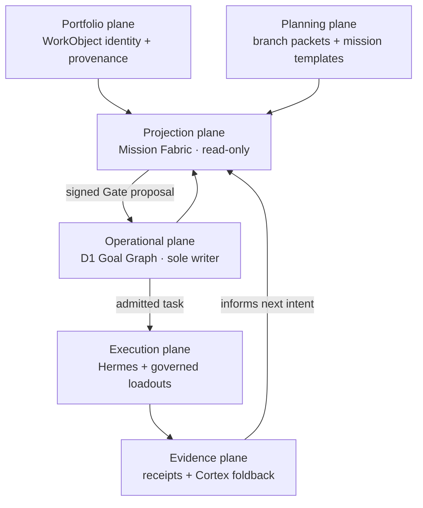

# Architecture — a governed operating organism

Cambium is the composition and control plane for a portfolio of ventures. It does not make every repository, packet, UI, agent, and evidence store authoritative at once. Its architecture works because each plane answers a different question and every join is explicit.

The reference trace is [Fitcheck's golden path](./docs/architecture/fitcheck-golden-path.md).

## The invariant

```text
one canonical WorkObject identity
  → one reviewed intent lineage
  → one admitted Goal Graph task
  → one governed skill/loadout pin
  → one execution lineage
  → immutable evidence
  → one bounded proposal for the next intent
```

Aliases are for search. Packets are for planned story. D1 is for operational intent. Receipts are for facts that happened. Cortex evidence may inform a proposal, but only a signed Gate and version-bound D1 compare-and-swap can change operational state.

## The six planes



| Plane | Owns | Does not own |
|---|---|---|
| Portfolio | canonical `sapling:`, `branch:`, and `program:` identities; roots; repository provenance | current tasks, approvals, or execution state |
| Planning | reviewed product/program story, missions, KPIs, gates, organ hints | live assignments or achieved outcomes |
| Operational | desired/current state, task lineage, approvals, versions, operational anchors | repository classification or narrative packet authorship |
| Projection | deterministic, tenant-scoped read model with freshness and gaps | independent writes or inferred joins |
| Execution | admitted directives, exact skill/loadout pins, runs, terminal outcomes | authority to rewrite intent |
| Evidence | immutable receipts, proof, learning, bounded next-intent proposals | automatic promotion or Goal Graph mutation |

## Two operator surfaces, one projection

### Portfolio Workbench

The Workbench is the reconciliation and preparation surface. It answers:

- Is this project canonically identified?
- Which folders, repositories, packets, and receipts support that identity?
- Which parts of the six-stage lifecycle are proved, missing, or held?
- What bounded proposal could safely enter Gate next?

It may prepare a birth, mapping, closeout, or intent action. It cannot claim that preparing or exporting an action executed it.

### Telegram Mini App

The Mini App is the situated operational surface. Its Mission, Flow, Workforce, Forge, Gate, and Inspect views read the same Mission Fabric projection at different decision depths. It may submit a signed Gate action through the Worker boundary. Selecting a project, opening a scene, or reading a packet never starts execution.

## The finite organs

The organ pattern remains self-similar: a hub of skill clusters, a conductor, explicit contracts, a memory boundary, and fail-closed gates.

| Organ role | Primary implementation | Function |
|---|---|---|
| Genesis | Brandmint/Meristem contracts | turns an idea into a bounded brand system |
| Taste | governed taste and design skills | evaluates and re-projects artifacts against declared constraints |
| Hands | skill clusters and task resolvers | builds bounded artifacts from admitted tasks |
| Will | business/marketing operations | operates approved commercial and distribution moves |
| Cortex | provider-neutral memory contracts | stores evidence and retrieves relevant learning |

Each organ plays a finite game: run, verify, emit a receipt, stop. Cambium is the infinite-game operator that chooses which finite game is safe and useful next.

## Runtime boundaries

| Surface | Current role |
|---|---|
| `workers/quests` | Cloudflare Worker boundary for tenant-scoped D1/KV/R2/Vectorize access, Mission Fabric projection, Telegram verification, signed actions, and receipts |
| D1 Goal Graph | sole operational writer; versioned graph and approval-bound CAS |
| Portfolio catalog/root map | canonical identity and provenance sidecar, joined only by exact WorkObject ID |
| Product branch packets | reviewed planning evidence with explicit canonical WorkObject identity |
| Hermes | topic-aware executor and delivery rail; consumes admitted assignments, returns terminal evidence |
| `apps/portfolio-cartographer` | Workbench for portfolio reconciliation, planning, governed action preparation, and closeout |
| `apps/cambium-r3f` | local/desktop constellation visualization using shared contracts or synthetic fallback data |

## Fitcheck trace

Fitcheck currently proves identity, system topology, and planning. It does not yet prove an issued mapping receipt:

```text
IDENTIFIED ✓ → SYSTEMS BOUND ✓ → MAPPING VERIFIED held → PLANNED ✓
→ D1 ELIGIBLE held → ADMITTED held → PINNED held → EXECUTED held → LEARNED held
```

The catalog and packet establish `sapling:fitcheck`, its supervised three-mission story, and the typed dependency `sapling:fitcheck --uses-backend--> program:hdilint`. Fitcheck's landing and HDILINT's backend remain separately-owned repository components. None of this proves a mapping-receipt readback, live D1 anchor, governed loadout pin, Hermes run, or foldback receipt. Both UIs must show those absences rather than filling them with plausible-looking data.

## Deployment and mutation boundary

Local implementation and tests do not authorize production effects. D1 migrations, Worker deployment, GitHub/R2 mapping receipts, skill promotion, Telegram topology changes, provider calls, paid execution, recurring schedules, and public claims each retain their own reviewed gate and rollback path.

## Canonical references

- [Operating Fabric](./docs/architecture/cambium-operating-fabric.md)
- [Mission Fabric contract](./docs/architecture/contracts/mission-fabric-v1.md)
- [Goal Graph operating model](./docs/architecture/goal-graph-operating-model.md)
- [Integration roadmap](./INTEGRATION.md)
- [Homeostasis](./HOMEOSTASIS.md)
- [Infinite Game](./INFINITE-GAME.md)
