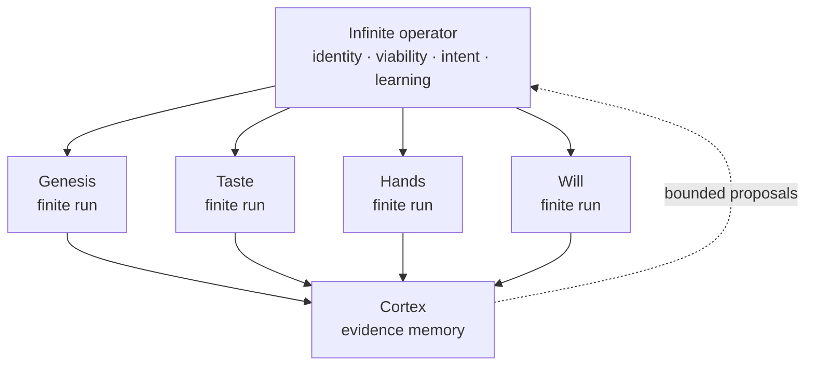

# The Infinite Game — verified finite moves in a living venture

Cambium treats a business as an infinite game: there is no final artifact or metric that ends the work. The system's purpose is to keep a venture able to play, coherent with its cause, responsive to reality, and solvent enough to continue.

Finite organs still need to finish. A brand mint, website build, campaign, analysis, or client delivery is a bounded game with an acceptance condition and a terminal receipt. The infinite-game operator chooses which bounded move should happen next and carries verified learning across moves.

Fitcheck is the first project-shaped trace of that architecture. See the [golden path](./docs/architecture/fitcheck-golden-path.md).

## Current truth

| Capability | State | Evidence boundary |
|---|---|---|
| canonical portfolio identity | Local | catalog/root-map contracts and exact WorkObject joins |
| reviewed project story | Local | validated product branch packets |
| read-only operating projection | Local | Mission Fabric and both UI surfaces |
| approval-bound operational graph | Local contract/runtime implementation | D1 Goal Graph and versioned CAS path |
| live Fitcheck operational anchor | Held | no exact current production task proof in this checkout |
| governed Fitcheck loadout pin | Held | packet organ hints are not a runtime pin |
| Hermes execution and terminal receipt | Held | synthetic/local contract proof is not live execution |
| evidence-to-next-intent foldback | Local contract / held live proof | direct graph mutation remains forbidden |
| autonomous venture operator | Not claimed | human-governed, event-driven moves only |

## Finite games inside the infinite one



The organs run, verify, emit evidence, and become dormant. The operator does not keep them continuously active. It wakes on a real event, chooses at most one bounded move, passes the relevant Gate, and returns to rest after evidence is reconciled.

## The control objective

The operator does not maximize revenue, engagement, or semantic similarity. It tries to preserve positive margin to the conditions that let the venture continue while advancing its Just Cause.

Let the venture state be `s ∈ S`, the allowed controls be `u ∈ U`, and `K ⊆ S` be the constraint set: states that remain legally, ethically, financially, operationally, and mission-wise playable.

The viability ideal is:

```text
choose bounded controls u(t)
so the venture remains inside K
while advancing the Just-Cause direction
and preserving enough evidence to choose again
```

Exact high-dimensional viability-kernel computation is not implemented or claimed. In practice Cambium uses explicit hard bounds, evidence freshness, authority checks, task/version lineage, and named human gates. A UI should show known margins and missing evidence, not invent a single “viability score.”

## The cascade

```text
VISION   durable Just Cause; changes rarely
  ↓ regulates                         ↑ reality informs
MISSION  current way of advancing it
  ↓                                   ↑
GOALS    bounded games with exit proof
  ↓                                   ↑
TASKS    admitted, versioned, skill-pinned moves
  ↓                                   ↑
EVIDENCE terminal receipts, outcomes, and contradictions
```

Revenue and growth are downstream evidence and fuel. Solvency is a hard constraint. Treating the metric as the cause would invite Goodhart failure: apparent optimization that hollows out the venture.

## Micro, meso, macro

| Level | Move | Rate | Authority |
|---|---|---|---|
| Micro | reversible adjustment under the same admitted intent | fast | bounded executor policy |
| Meso | interpret evidence, classify error versus intent, propose one change | event-driven | projection + human judgment |
| Macro | change mission, goal, or operating constraint | slow | signed Gate + current D1 graph version |

The overlap matters. A customer objection can require a micro copy correction, a meso interpretation, or a macro change in the product hypothesis. The system must preserve which one occurred instead of treating every feedback signal as permission to move the goal.

Epic meaning and a genuine threat of dropping out sit outside the routine tick. They invoke noesis and return the decision to the founder. The ethical onboarding treatment is defined in [ONBOARDING-OCTALYSIS.md](./ONBOARDING-OCTALYSIS.md).

## One wake cycle

```text
1. OBSERVE    receive a founder action, customer fact, task event, or scheduled probe
2. IDENTIFY   resolve tenant + exact WorkObject + current graph version
3. RECONCILE  read packet, Goal Graph, loadout, execution, and receipt authorities
4. ROUTE      choose micro, meso, or macro handling
5. PROPOSE    define one falsifiable change and required evidence
6. GATE       validate signer, nonce, expiry, graph head, spend, and rollback
7. EXECUTE    run only the admitted task with its exact governed loadout
8. VERIFY     classify terminal outcome against the admitted criteria
9. FOLD BACK  emit proof and a bounded next-intent proposal
10. REST      do not create work merely to keep the loop active
```

## The six-stage project lifecycle

```text
MAPPED → PLANNED → ADMITTED → PINNED → EXECUTED → LEARNED
```

- **Mapped**: exact portfolio identity and provenance exist.
- **Planned**: a reviewed packet defines story, missions, KPIs, gates, and candidate organ route.
- **Admitted**: D1 contains the exact WorkObject task/node at a known graph version.
- **Pinned**: that task points to a governed, available skill/loadout identity.
- **Executed**: the admitted directive reaches a terminal run with immutable evidence.
- **Learned**: the evidence is reconciled and may inform a new proposal.

No stage is inferred from its neighbor. This is why Fitcheck can honestly be mapped and planned while execution remains held.

## Fitcheck's one-change loop

Fitcheck is a supervised validation branch, not an autonomous Shopify business. Its current frontier is to validate the merchant problem and prove a bounded virtual try-on journey without claiming app-store approval, native Shopify integration, billing readiness, conversion lift, or a 48-hour launch.

The intended loop is:

1. gather one real merchant signal;
2. preserve the source and contradiction;
3. propose one change to a mission, artifact, or acceptance criterion;
4. pass the packet and operational gates independently;
5. execute one bounded task;
6. preserve its receipt;
7. let that proof inform, but not automatically become, the next intent.

## Co-evolution without an echo chamber

Models, personas, and simulations may explore alternatives. They are not market evidence. A simulated merchant can suggest questions; it cannot validate demand. A Founder-NPC can surface assumptions; it cannot sign a Gate. Reality remains the evaluation function.

Required grounding includes one or more of:

- a real customer conversation with consent and bounded retention;
- an observed behavior or experiment;
- an immutable provider or execution receipt;
- a human decision bound to the exact proposal and version;
- a contradiction preserved rather than summarized away.

## Multi-tenancy and memory

Tenant scope is part of identity, not a filter added at display time. WorkObjects, graph nodes, tasks, runs, receipts, vectors, and foldback must remain tenant-bound at storage and query boundaries. Cortex is a provider-neutral memory interface; embeddings are derived retrieval aids, not the venture's authoritative state.

Memory should retain the smallest safe evidence needed to choose again. It must not absorb secrets, raw private conversations, prompt/response bodies, native session identifiers, or unbounded founder data into a general corpus.

## Failure modes

| Failure | Countermeasure |
|---|---|
| busy loop invents work | event-driven wake and explicit rest state |
| packet becomes pseudo-database | read-only planning projection; D1 remains writer |
| alias joins wrong project | exact canonical WorkObject joins only |
| agent turns evidence into intent | foldback emits proposal; Gate + D1 CAS commits |
| skill hint becomes execution authority | require an exact governed loadout pin |
| synthetic proof is presented as live | provenance labels and held lifecycle stage |
| optimizing one metric hollows the mission | treat metrics as evidence/fuel under hard bounds |
| memory leaks across tenants | storage- and query-level tenant isolation |

## What completion means

The infinite loop is not complete because a dashboard renders or an agent can run. It is complete for one project when the system can replay, from exact authorities:

```text
identity → packet → D1 admission → loadout pin → terminal run
         → immutable evidence → bounded next proposal → fresh signed Gate
```

Fitcheck should prove that full trace once, under rollback, before the pattern is promoted across other Saplings.
