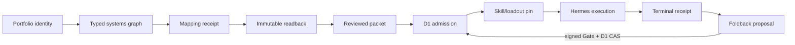

# Integration roadmap — from mapped project to learning loop

Cambium's next integration problem is no longer "can the organs be named and invoked?" It is "can one exact portfolio identity travel through planning, admission, skill selection, execution, evidence, and the next decision without changing meaning or gaining invented authority?"

Fitcheck is the reference project for answering that question. See the [golden-path contract](./docs/architecture/fitcheck-golden-path.md).

## The 8-node infrastructure spine

Cambium's architecture can be read as eight distinct nodes connected by seven
governed transitions. This is an authority and evidence map, not a claim that
every operation synchronously traverses every node. Each node reads from named
inputs, writes only through its governed boundary, and owns no authority outside
that boundary.

```
┌─────────────────────────────────────────────────────────────────┐
│ NODE 1: PORTFOLIO WORKBENCH (Telegram Mini App / Web Admin)     │
│ /admin/portfolio/web → generated founder-auth-gated bundle       │
│ Shows: WorkObject cards, Smart Views, Finish/Closeout, Operate  │
│ Reads: PORTFOLIO_CATALOG, portfolio-roots, golden paths         │
│ Authority: Read-only. Write → /v1/admin/portfolio/actions       │
└──────────┬──────────────────────────────────────────────────────┘
           │ catalog digest, root-map digest, classification digest
           ▼
┌─────────────────────────────────────────────────────────────────┐
│ NODE 2: CAMBIUM CHECKED-IN DATA (this repo)                     │
│ portfolio-catalog-data.ts → typed WorkObject catalog           │
│ portfolio-roots.v1.json → reviewed shallow-folder snapshot     │
│ operational-packet-registry.ts → FITCHECK/IVERIF golden paths   │
│ checked-in loadout authority → bounded eligibility           │
└──────────┬──────────────────────────────────────────────────────┘
           │ portfolio-roots / root-map → filesystem folders
           ▼
┌─────────────────────────────────────────────────────────────────┐
│ NODE 3: PROJECT FILESYSTEM                                      │
│ Root location is host-configured; no machine path is canonical  │
│ Shallow folders are proposed by portfolio-roots.v1.json         │
│ Exact Git identity must be verified before promotion            │
│ Vault infrastructure is context, never a WorkObject folder      │
└──────────┬──────────────────────────────────────────────────────┘
           │ thoughtseed-labs → R2-synced vault knowledge context
           ▼
┌─────────────────────────────────────────────────────────────────┐
│ NODE 4: R2 CLOUDFLARE STORAGE                                   │
│ Account, bucket, endpoint, and credentials are host-managed      │
│ Role: immutable/idempotent evidence and durability ONLY          │
│ NOT: live state, code history, repo ownership, Goal Graph writes│
└──────────┬──────────────────────────────────────────────────────┘
           │ mapping receipts → activation evidence → foldback
           ▼
┌─────────────────────────────────────────────────────────────────┐
│ NODE 5: HERMES (Proactive Relay + Cron Runner)                  │
│ Local contract: hermes-execution-foldback.ts                    │
│  - adaptHermesExecutionFoldback() → receipt → r2Key             │
│  - deriveHermesExecutionFoldbackCortexProjection() → memory     │
│  - Canary sequence: poll → claim → outcome → foldback → ACK    │
│ Authority: Telegram transport + topic topology owner            │
│ Cambium compiles bounded delivery intent; Hermes sends          │
└──────────┬──────────────────────────────────────────────────────┘
           │ foldback receipt → Cortex projection → Plexus whoami
           ▼
┌─────────────────────────────────────────────────────────────────┐
│ NODE 6: PLEXUS (Identity + Access Gateway)                      │
│ Default + Labs Wrangler:                                     │
│ teamforge-api.thoughtseedlabs.workers.dev/v1/whoami           │
│  - resolvePlexusPrincipal() → Access JWT → Plexus identity     │
│  - RBAC: founder (signed-action), team (chat-command),          │
│    consultant (read-only)                                       │
│  - KV cache key: plexus:whoami:<sha256(jwt)>                    │
│ Used by: Cambium Worker for Mini App authorization              │
│          Gate scene for principal resolution                    │
└──────────┬──────────────────────────────────────────────────────┘
           │ principal → role → interaction ladder → UI affordances
           ▼
┌─────────────────────────────────────────────────────────────────┐
│ NODE 7: TELEGRAM MINI APP + TG CHANNELS                         │
│ Mini App scenes: mission, gate, tools, story, inspect           │
│  - Mission Fabric: sapling/branch/program visualization         │
│  - Flow: task execution overlay                                 │
│  - Workforce: agent + skill-cluster loadout visibility          │
│  - Forge: build/output surface                                  │
│ TG Channels: Hermes-owned topic topology                        │
└──────────┬──────────────────────────────────────────────────────┘
           │ MCP protocol + OmniRoute → AI agents
           ▼
┌─────────────────────────────────────────────────────────────────┐
│ NODE 8: MCP, PLUGIN, AND AGENT ADAPTERS                         │
│ Host runtime owns tool availability, model routing, and secrets │
│ Cambium owns only checked-in contracts and acceptance evidence  │
│ Unmapped plugins stay held pending reviewed Git identity        │
└─────────────────────────────────────────────────────────────────┘
```

The foldback edge (Node 8 → Node 2) closes the conceptual loop: execution
evidence may return as a reviewed receipt or proposal through the repository's
normal governed write path. Tool calls do not directly mutate checked-in data
or operational state.

> Also see the visual flow diagram at [`docs/visual/cambium-infra-spine-flow.html`](./docs/visual/cambium-infra-spine-flow.html).

## Status vocabulary

Every integration statement uses one of five states:

| State | Meaning |
|---|---|
| **Doctrine** | designed and bounded, but not implemented evidence |
| **Local** | implemented and testable in this repository |
| **Production** | deployed and observed through the governed production path |
| **Held** | deliberately blocked pending named evidence or approval |
| **Retired** | explicitly excluded; never silently revived |

“Local” is not “production.” A packet is not a task. A prepared receipt is not an applied receipt. A synthetic run is not a Hermes execution.

## The integration spine



| Stage | Contract | Fitcheck status | Exit proof |
|---|---|---|---|
| Identify | exact canonical WorkObject plus typed provenance | **Local** | `sapling:fitcheck` resolves once; aliases stay non-authoritative |
| Bind systems | typed repositories, dependent WorkObjects, services, ownership, access, and mutation boundaries | **Local** | Fitcheck owns its experience surface and explicitly uses the separately-owned `program:hdilint` backend |
| Issue mapping | immutable repository-to-WorkObject receipt | **Held** | the exact reviewed receipt is conditionally written once |
| Verify mapping | authoritative receipt readback | **Held** | receipt bytes, repository ID, roles, roots, and catalog digests match current authority |
| Plan | reviewed branch packet with missions, KPIs, gates, and organ route | **Local** | packet validates and matches shared UI projection |
| Establish eligibility | verified mapping plus reviewed packet may form one D1 proposal | **Held** | no D1 action exists until receipt readback succeeds |
| Admit | D1 task/node carries exact WorkObject anchor | **Held** | current graph version returns one exact Fitcheck anchor |
| Pin | governed loadout is attached to the admitted task | **Held** | exact loadout identity and catalog state resolve without inference |
| Execute | Hermes consumes one admitted directive | **Held** | single rollback-bounded canary returns a terminal result |
| Preserve | immutable run and mapping evidence is written idempotently | **Held** | receipt digest, authority, subject, and source version verify |
| Learn | terminal proof proposes the next bounded intent | **Local contract / held live proof** | `proves` and `informs-next-intent` reappear without direct mutation |

## What is integrated locally

- The portfolio catalog and root map provide canonical WorkObject identities and explicit gaps.
- Product packets carry canonical WorkObject IDs and validate index/file parity.
- Mission Fabric is a deterministic, read-only projection over packet, Goal Graph, execution, skill, and portfolio facts.
- The Workbench can reconcile portfolio provenance and prepare governed actions.
- The Telegram Mini App can present Mission Fabric contexts and signed Gate entry points through the Worker boundary.
- Goal Graph contracts use tenant scope, graph versions, approval digests, and compare-and-swap semantics.
- Execution/foldback adapters preserve terminal evidence as proposals rather than direct operational writes.
- The composition CLI can plan, validate, and invoke declared finite organ adapters behind spend gates.

## The finite organ wires

| Wire | From → To | State | Boundary |
|---|---|---|---|
| I1 · brand to GTM | genesis output → business/marketing context | **Local / external history exists** | no claim that every tenant is continuously deployed |
| I2a · genesis | idea → brand system | **Local** | no-spend contract shim; source organ remains separately governed |
| I2b · hands | admitted build brief → artifact | **Local** | dispatch beyond local resolver requires its own Gate |
| I2c · taste | brand system → taste brief/verdict | **Local, spend-gated** | paid/provider execution requires explicit approval |
| I3 · cortex | evidence → tenant-scoped retrieval/write contract | **Local interface** | hosted providers are adapters, not product identity |
| I4 · why-handler | detected deviation → reroll or intent proposal | **Local seam** | current structural checks do not prove semantic contraction |
| B1 · name validation | proposed name → ownability evidence | **Held** | Fitcheck lesson; no asset spend before evidence |
| B2 · semantic visual QA | render → brief/claim match | **Held** | palette similarity alone is insufficient |
| B3 · reference continuity | campaign set → coherent identity | **Held** | requires reference-anchored generation evidence |

## Surface integration

### Portfolio Workbench

The Workbench owns project reconciliation and bounded proposal preparation. The Fitcheck Operate view now explains the canonical identity, packet missions, KPIs, organ route, gate ledger, and complete ten-stage `lifecycleLadder` from `identified` through `learned`, including current missing anchors. Its job is to make the next safe action obvious without making the held stages look complete.

### Telegram Mini App

Mission, Flow, Workforce, Forge, Gate, and Inspect consume the same Fitcheck projection but answer different questions. Packet owners are shown as planning roles, not live assignees. Organ hints are shown as a candidate route, not a pinned loadout. Packet gates remain contextual until a real signed action exists.

### Goal Graph and Hermes

D1 owns operational intent. Hermes executes only an admitted, pinned directive. A terminal Hermes outcome may prove execution and inform the next intent, but cannot update the graph. The Worker's signed Gate and graph-head CAS are the only return path.

## Next integration sequence

1. Verify the shared Fitcheck projection and its typed Fitcheck → HDILINT systems graph in both UIs.
2. Issue the exact Fitcheck mapping receipt with full root, classification, catalog, repository, and component-role provenance.
3. Read the immutable receipt back and fail closed on any identity, role, access, or digest mismatch.
4. Compile—but do not commit—one exact `sapling:fitcheck` D1 Mission → Task → governed-loadout proposal.
5. Apply the operational-anchor migration only through the separately governed D1 release path.
6. Approve and commit the current proposal through signed Gate plus graph-head compare-and-swap.
7. Run one execution-disabled Hermes canary using the reviewed preflight.
8. Prove terminal evidence folds back as a proposal and requires a fresh Gate.
9. Reuse the generic contract for the next Sapling or Client Branch; DLOCK remains access-held.

## Explicitly outside this document

This roadmap does not authorize production deployment, D1/R2/GitHub writes, folder movement, skill promotion, Telegram topology changes, provider changes, paid execution, publication, outreach, or recurring schedules.
