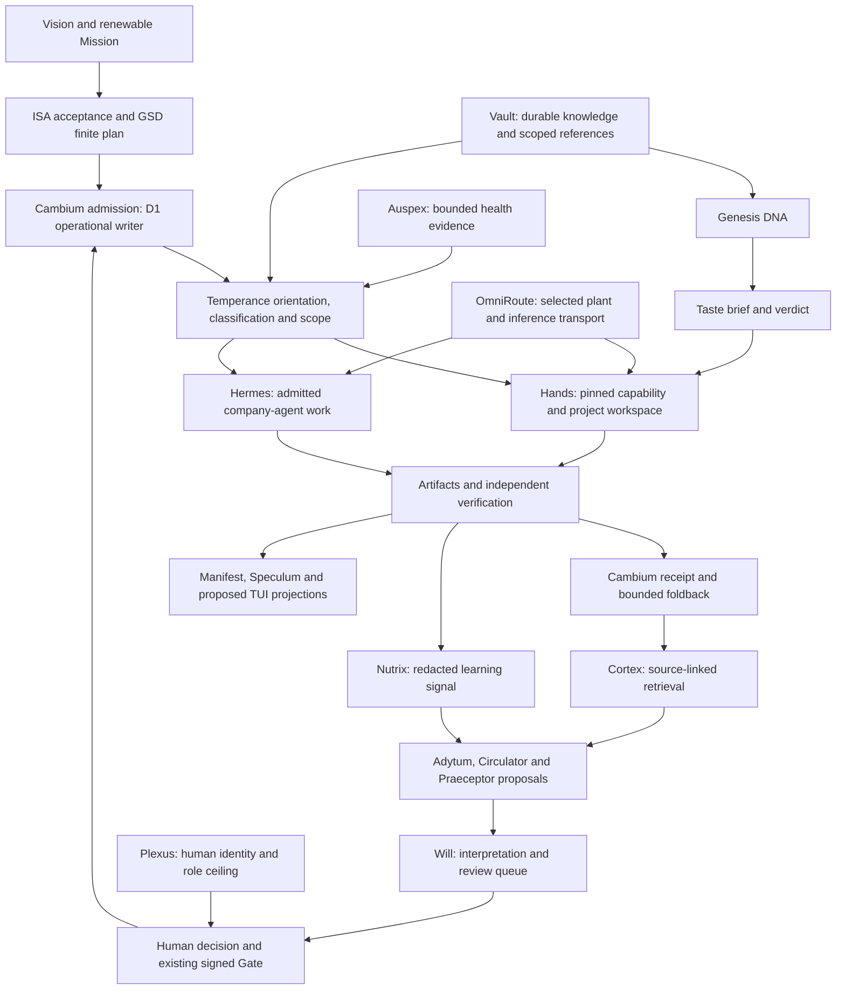

# Growth ecosystem deep review and migration implications

Status: source review and proposed design, 2026-10-01. No installation,
activation, publishing, paid generation, vault mutation or cloud change.

This extends the [Mac review](2026-10-01-modular-mac-system-review.md),
[evidence map](2026-10-01-modular-mac-system-map.json),
[TUI design](../superpowers/specs/2026-10-01-modular-mac-design.md) and
[implementation plan](../superpowers/plans/2026-10-01-modular-mac.md).
The [coverage ledger](2026-10-01-growth-file-coverage.json) identifies every
file in the authorized growth folder, its byte digest and review method.
References below use symbolic owner roots; they are not executable paths.

## Corrected system model

**Cambium, Temperance, the connected organs and their supporting systems form
one integrated operating ecosystem.** Distinct authorities preserve that
integration; they do not turn each organ into an isolated installation.
Snow Gloves OS remains outside this migration product. Its editorial packet
in the growth queue is a portfolio story, not a runtime dependency.

The missing migration system must reconstruct the relationships that make
work possible: identity, approved intent, phase, loadout, execution plant,
artifact, verification, receipt and proposed learning. Installing named
components without those relationships does not reproduce the ecosystem.

This is the conceptual integration, not a claim that every edge is installed
or accepted. A missing edge must remain visible as held or unknown.

## Complete-folder coverage

The inventory contains **100 files / 2,340,480 bytes**: 78 Markdown notes,
three HTML projections, two JSON contracts, one first-party PDF renderer,
three vendored KaTeX files, two font-license notices, eight fonts, two PDFs
and Finder metadata. At inspection, 81 files were tracked, 16 ignored local
artifacts and three untracked editorial files. These distinctions matter:
the local folder and a clean clone are different inputs.

Concurrent source drift was detected in the profile pointer during review;
its complete current body was re-read and the final digest recorded. The
other 99 initial growth digests were unchanged. Snow Gloves' unrelated
handoff also changed; its earlier review cut is retained as historical
context, with no claim about its new body. This review wrote no vault or
Snow Gloves file.

Markdown bodies, tables, fences and frontmatter were reviewed in full. HTML
was reviewed through complete semantic text, inline behavior and asset
references. Both JSON contracts were parsed and reviewed. All 32 PDF pages
were text-extracted and checked individually for content presence and source
version; this is not a claim of pixel-perfect review of every page. Fonts
were identified through file metadata and local reference closure. The
minified KaTeX engine and stylesheet received provenance/version and asset
dependency inspection, not a complete third-party security audit. Finder
metadata received file-type, size and digest inspection and is excluded from
portable configuration.

Two routed advisory reviews ended. One used nonexistent paths and incorrect
organ roles; the other reported 80 files and left five bodies unread, and
made unsupported connector/runtime claims. Those suggestions were checked
against source and do not establish coverage or independent approval.
Provider attribution for those calls remains unverified. The post-deliverable
Advisor invocation exited with a 30-second internal timeout and no verdict;
no independent approval is inferred.

## Five operating organs

| Organ | Contract and useful handoff | Migration treatment | Authority limit |
|---|---|---|---|
| Genesis | Approved context becomes structured `brand_system`, `copy_system`, `visual_system`; DNA flows into Taste and Hands | Attach canonical DNA/source manifests and the selected Meristem/Genesis adapter; validate required groups | Never manufacture DNA from marketing copy or treat an asset map as spend/publication approval |
| Taste | DNA and exemplars produce a brief, quality verdict and reroll request | Rebind approved references and an explicitly selected evaluator; keep paid runs held | A taste verdict cannot grant consent, payment or public delivery |
| Hands | ISA/GSD task and indexed capabilities become a pinned loadout, workspace, artifact and verification | Recreate selected git-root workspaces and bounded hub/core/spoke loadouts on the destination | Capability discovery is not task admission; cockpit and worker remain different roles |
| Will | Artifact, DNA, audience and delivery policy become interpretation, copy, search scorecards and review packets | Reconnect role inboxes, pack/fence, artifact provenance and existing delivery adapter references | Drafts cannot publish, enroll, buy or become operational intent without the applicable gate |
| Cortex | Scoped receipts and source versions become retrieval, deviations and next-intent proposals | Keep owner memory planes distinct; restore approved evidence or rebuild indexes with explicit lineage | Retrieval does not own truth, D1, doctrine or automatic policy promotion |

Cortex is cross-cutting rather than the final serial stage. Genesis, Taste,
Hands and Will compose finite work; Cortex supplies evidence to each.
Source: `vault:20-operations/growth/department/cambium-temperance-organ-atlas.md`,
`cambium:scripts/meristem-genesis-contract.mjs` and
`cambium:workers/quests/src/organ-update-delivery.ts`.

## Six cognitive organs

| Organ | Lifecycle and integration | Destination requirement |
|---|---|---|
| Vestibule | Session orientation from project, phase, route and federated context | Separate read-only rendering from claim refresh; declaration of read-only access is insufficient |
| Adytum | On-demand synthesis across sovereign planes; one next-action card or no action | Rebind bounded context and owner topic contracts; neither start it automatically nor let it merge memory planes |
| Nutrix | Session-end outcomes become redacted local learning signals consumed by later orientation/retrieval | Prove destination callback, containment, useful signal and later consumption; do not copy native session stores |
| Auspex | Scoped health evidence and explicitly bounded healing support eligibility and operator decisions | Preserve containment, refusal and retry bounds; scheduled freshness is not successful healing or provider authority |
| Circulator | Periodic evidence becomes recommendation-only digest | Select schedule/timezone and writer ownership explicitly; digest generation grants no policy promotion |
| Praeceptor | Daily bounded advisory drafts point to reviewable tasks | Preserve proposal-only output, scope and admission; a useful suggestion is not an admitted task |

The current runtime registry still lists Vestibule as read-only while also
listing `state/session-claims.json` in its writes. September 11 growth notes
hold read-only orientation; the September 29 runtime checkpoint records
claim-before-render work. These are different evidence cuts. The migration
must ask for a fresh zero-write renderer receipt rather than resolve the
difference by prose. The runtime checkpoint also retains organ soak,
native-host callback and sustained learning gaps, and reports an Auspex
scheduled exit 125. None was re-probed or repaired by this review.

Source: `runtime:router/organs.json`,
`runtime:bin/te-organ-hook.py`, `runtime:bin/te-organ-events.py`,
`runtime:docs/architecture/HEADLESS-COHESION-REMAINING-2026-09-28.md`,
`vault:20-operations/growth/temperance-continuous-learning-rollout.md`.

VAS/Manifest, Athanor, Mercurius/OmniRoute, Speculum and Constellation are
support surfaces, not additional organs. Events, voice, inference and glass
do not acquire planning, acceptance or D1 authority. Constellation remains
deferred and was not contacted.

## Six Will desks and four cell verbs

The department is a role map inside Will and the existing execution system,
not six new bots or daemons.

| Desk | Principal connections | Honest current posture |
|---|---|---|
| Head of marketing | Genesis positioning, Taste, Will strategy, CEO interpretation | Pointer-led positioning and competitor evidence; empty pricing stays empty |
| Copywriter | Will authoring, Taste/Analyst grading, Synthesist execution | Draft/current copy and reviewed examples; email vacancy and blocked editorial packets are not release failures |
| Creative strategist | Genesis references, Taste, Will creative interpretation, Designer | Saved-media harvest and hooks are inputs; personal account access does not transfer with an artifact |
| Launch lead | Will dispatch, Hands preparation, Hermes delivery | Prepared launch/checklist work; Product Hunt remains held for the current pack |
| SEO lead | Hands Search Stack plus Will/Scientist interpretation | SEO, SXO, GEO, AEO, DEO and SMO bind per WorkObject; dated runs and claim tables are drafts, not deployment evidence |
| Analyst | Taste checks, Cortex evidence, CEO audit | Grading and provenance matter; empty audits/fatigue cannot become fabricated scores |

The existing Krebs roles are CEO, Scientist, Engineer, Designer, Synthesist
and Hermes. Their source identities exist in Hermes; a desk is not a new
member. Packs bind voice, fence and channels. Search runs bind exact
`sapling`, `client-branch` or `standalone-brand` identity and must not borrow
another pack's authority.

The four data verbs preserve different effects: **extract** lands dated
material in a role inbox; **feed** promotes one item to a cell draft;
**read** follows declared dependencies without mutation; **edit** changes
only the owned cell/inbox and updates provenance. Approval and publication
remain subsequent, distinct transitions. A file watcher must not collapse
extract into feed or read into edit.

The schema requires `extract/feed/read/edit` keys on cell READMEs, but the
29 `growth-cell` files express their operations through prose/tables and
have none of those four frontmatter keys. This is a machine-contract gap,
not evidence that their human-readable workflow is absent. Cell states at
the cut: nine pointer, six empty, four graded, six draft, two inbox and two
held. A future parser must distinguish cell state from a dated run, queue
row, approval event and executable schedule.

## Connected systems and execution plants

Cambium’s D1 Goal Graph is the sole operational writer. Plexus resolves
human identity and role ceiling; it does not own the Goal Graph. ISA owns
acceptance and GSD owns finite planning. The TUI joins evidence from these
owners and cannot become another writer.

| System / binding | What crosses the seam | What remains with its owner |
|---|---|---|
| Cambium | Canonical WorkObject, graph/version, approved task, loadout and receipt references | D1 operational writer, signed Gate and cloud deployment |
| Plexus | Resolved human identity and role ceiling | Member/account state; marketing profiles are not member identity |
| ISA / GSD | Acceptance and finite plan/handoff respectively | Separate ledgers; the migration TUI creates neither a third planner nor a new acceptance store |
| Mac plant | Local worker endpoint and destination workspace/environment | Local process lifecycle, fresh access and resource limits |
| Hermes plant | Admitted company-agent execution, lease and redacted terminal receipt | Remote runtime/queues/state; it cannot consume Mac-only paths or loopback addresses |
| Phloem / Clio | Doors into the selected Hermes plant, with distinct access/identity bindings | Doors do not become inference plants or graph writers |
| OmniRoute / broker | Selected inference binding, stable lane and actual attempt evidence | Credentials, exact-account/fallback policy, quotas and combo-writer authority |
| Vault / Git | Scoped knowledge and committed source with provenance | Canonical notes and source history; local uncommitted files are not remotely available |
| Cortex / other memory | Source-linked retrieval and bounded lessons | Separate schemas, retention, embedding model/dimensions and privacy scope |
| Factor / Meristem / Field Theory | Reviewed knowledge, DNA and technique references | Extracted references are not promoted executable skills or a migration grant |
| NotebookLM / media / AutoSocial | Explicitly approved content/artifact or optional tool attachment | Notebook/account selection, paid generation, personal sessions and public publication gates |

Growth's Bridge A plan keeps the growth tree outside Hermes write zones.
The founder Mac can extract/feed there; Hermes can read committed/synced
documents and write only its admitted output scope. The old dual-remote plan
is explicitly superseded by the sole vault origin. Recreating two sync lanes
would resurrect retired topology.

The current Hermes source still uses legacy `te-*` role model labels and an
older absolute vault hint, while local Temperance instructions retire those
aliases for new dispatches. Keep plane and evidence date explicit: do not
blindly rename remote bindings or copy their path hints into a new Mac.
Source compatibility and owner readback precede a routing change.

## Findings that should change the plan

| Priority | Finding and evidence | Proposed repair / migration behavior |
|---|---|---|
| P1 | **Current topic source parity is incomplete.** Cambium runtime and its vendored map have eight topics; Hermes's owner contract has nine including Adytum. Their current byte digests differ. Growth's claim that local copies are aligned is not true of these checkouts. | Hold the Adytum connection in the TUI. Reconcile owner versions and consumers in a separate bounded source change; do not merely update a digest or create another topic. |
| P1 | **Project enrollment metadata has effectful meaning.** The whitepaper JSON declares automatic enrollment, Hands and Speculum flags. `thoughtseed-project-map.ts` consumes it to prepare owned project/host configuration. | Treat the map as scoped enrollment input, unlike the explanatory HTML. Current apply requires an exact plan fingerprint and source-map readback; retain that gate on the destination. |
| P1 | **Organ source presence does not close the lifecycle.** Runtime checkpoints retain admission, callback, useful consumption, operational soak and learning limitations. | Show trigger → admission → contained run → artifact → consumer → verification separately; require a complete accepted work unit before claiming the migrated loop works. |
| P2 | **Growth contracts are not yet a reliable machine graph.** All 29 cell files lack the schema's four verb keys in frontmatter; eleven of 231 explicit local Markdown links do not resolve. | Preserve prose as source. Propose typed, owner-reviewed bindings and a dry-run link/contract validator; never infer permission from an unresolved path. |
| P2 | **Local paper bundle is not reproducible from a clean clone.** Sixteen files are ignored; renderer imports Playwright from a machine-specific checkout. KaTeX CSS contains 60 CDN font URLs. | Decide separately whether to package or regenerate these artifacts; pin renderer dependencies, include approved asset closure and prove offline rendering before calling it portable. |
| P2 | **Full PDF is stale against the HTML.** All 31 pages have text, but PDF retains the September 3 cut and omits the accepted-work-unit/September 11 amendment present in HTML. NotebookLM source pack still calls it 24 pages. | Bind source and render digests plus review cut; mark stale outputs. Do not upload by filename alone or claim the current HTML and PDF are interchangeable. |
| P2 | **Publication and content access are separate from setup.** The rolling queue is candidate/blocked, the Snow Gloves draft needs version reconciliation, and older calendar rows are still queued. Whole-file upload permissions coexist with operator-only details. | Use artifact-level redaction/approval and content hashes. Installation cannot approve a row, inherit an account grant or upload a source pack. |
| P2 | **Knowledge lineage must survive migration without flattening it.** Canonical brand notes, Cortex, Nutrix signals, Hermes memory and Field Theory references are distinct planes. | Rebuild derived indexes or selectively restore approved evidence through the owner; preserve schema/model/version, source digest, freshness and consent. |
| P3 | **Projection metrics and status labels drift.** Console says two disabled candidates while JSON has four disabled cadence modes. Its dedup display omits cadence window; health says OFFLINE as a static cut. | Render metrics and labels from a pinned contract plus fresh bounded observations; retain historical cuts without representing them as current health. |

The eleven unresolved links are detailed in the coverage ledger. Ten point
outside the growth tree and one is an internal desk path. Some are relative
depth mistakes; target existence must be checked before choosing a repair.
Missing future week spines and deliberately empty cells are not broken links
or permission to manufacture content.

## Migration design for both equal use cases

**Replacement workstation:** reconstruct selected local toolchains, native
callbacks and Hands workspaces; rebind approved vault/brand references;
attach Cambium/Plexus/Hermes through existing owner adapters; freshly prove
one admitted synthetic work unit through artifact, independent acceptance
and bounded foldback. Preserve remote operational data. Transfer only selected
durable scheduler ownership after destination acknowledgment; reconcile
unknown effects before retiring the old host.

**Additional always-on Mac:** issue a distinct node identity and explicit
role. It may host selected local workers/organs or act as a remote operator
client; it must not silently mirror the workstation's daily/weekly jobs,
personal accounts or vault writer. Attach the same logical ecosystem with
destination-specific access, endpoints, scopes and budgets. Prove reboot,
login/keychain, network-loss recovery and late-result handling on the device.
Fence only genuinely shared queue/scheduler/writer ownership, not every
independent router on another host.

Both flows work without Snow Gloves OS. Neither recreates remote cloud state,
copies native session stores, replays public effects or enables held organs
just because their definitions were restored.

## Rich TUI: inspect the work path, then operate the machine

Keep the existing Temperance OpenTUI/controller and lifecycle journal. Add
Ecosystem, Organs, Work and Knowledge views alongside Machine, Modules,
Access, Services, Handoffs and Recovery. A useful organ detail shows:

- owner and exact selected source/installed version;
- task/WorkObject, ISA/GSD phase, selected plant and pinned loadout;
- required inputs and their source/freshness, plus unresolved interlinks;
- declared trigger versus installed schedule and active ownership;
- last artifact, consumer acknowledgment and independent verdict;
- allowed next read/prepare action, hold reason and applicable external gate.

The first end-to-end inspection follows one synthetic admitted task:
Cambium → Temperance/Vestibule → Taste/Hands → selected Mac workspace →
artifact/verifier → Cambium receipt → Cortex/Nutrix proposal. Company-agent
inspection uses Hermes/Phloem instead of the Hands workspace. Unknown
evidence stays unknown. The TUI cannot authorize a Goal Graph commit,
promote a skill, approve a post or change provider policy by selection.

Prove source fidelity and read-only joins first; then manifest export/diff,
one recoverable owned local transaction and shared TUI/headless semantics;
then the two real Mac acceptance flows. Actual owner interoperability is a
core migration requirement. Fleet expansion, public delivery, paid media,
secrets sync and Snow Gloves work remain separately scoped.

## Analysis and limits

FirstPrinciples: executable source, identity, authority, durable artifacts
and recoverable effects are the irreducible migration needs. An organ name
or folder copy satisfies none of the joins by itself.

SystemsThinking: installation-only feedback makes a broken integration look
healthy; evidence freshness and consumer acknowledgment expose the actual
constraint. The high-value intervention is typed relationship proof with
owner-bound effects, rather than adding more agents or dashboards.

ISA refinements distinguish full-folder review acceptance from future
implementation and physical migration acceptance. Memory helped recover
prior organ and NotebookLM decisions; this report uses fresh local source
for its findings. ReReadCheck preserves the user's integrated-system
correction, equal Mac scenarios, complete growth scope and Snow Gloves
exclusion.

No fresh remote deployment, customer grant, Composio connection, provider
capacity, physical-node or all-host lifecycle acceptance was established.
The earlier focused install-surface tests retain three dependency-loader
errors; this documentation iteration does not change or retest that code.
