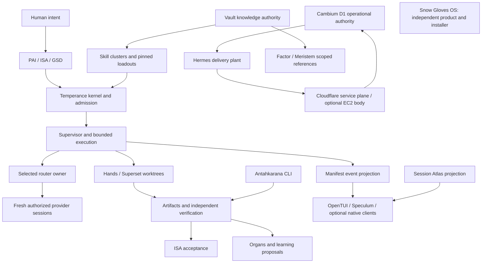

# Integrated system review: modular Mac setup

Status: reviewed source inventory and proposed architecture, 2026-10-01.
This review authorizes no installation or migration. The machine-readable
[evidence map](2026-10-01-modular-mac-system-map.json) records the inspected
source bytes; [design](../superpowers/specs/2026-10-01-modular-mac-design.md)
and [plan](../superpowers/plans/2026-10-01-modular-mac.md) are proposals.

## Finding

The ecosystem has substantial modular infrastructure already. The missing
piece is a reproducible Temperance machine lifecycle with explicit boundaries
for separately owned projects and products.
Starting another installer or TUI would duplicate existing foundations.

The Temperance **distribution** has an OpenTUI seven-step onboarding wizard,
one controller shared with agent mode, private host bindings, project
capsules, dependency planning, health reports, and bounded local events.
It also has install/update/uninstall/rollback/receipt commands, prepared
surfaces, preimage capture, journals and path-hazard checks. These are source
primitives, not proof that the complete personal setup can migrate.

The personal **runtime** has a different release and routing plane, optional
module descriptors, Supervisor, Manifest, dispatch adapters, organs and
source-candidate staging. Snow Gloves has its own capability-onboarding
Textual TUI and detailed node/fleet/secrets plans. Its physical-node pilot
still has draft contracts rather than an accepted bootstrap implementation.

The operator confirmed two equal use cases: replacing the workstation and
adding an always-on Mac. They share provisioning mechanics but have different
identity, scheduler, recovery and authority transitions.

The operator explicitly requires **no merge of Cambium, Temperance Engine
and Snow Gloves OS**. Their repositories, runtimes, installers, state,
credentials, releases and authorities remain separate. Temperance's new-Mac
flows must work without Snow Gloves. Cambium is an independently restored
project or explicitly attached remote service; Snow Gloves is a separate,
optional product, never a Temperance runtime pack or a generic node prerequisite.

## Scope and confidence

The pass covered component boundaries across the personal runtime, public
distribution, skill clusters, Cambium, Hermes, Snow Gloves, Antahkarana,
Session Atlas, Factor, Meristem and the Vault's project entry point. It
inspected selected implementation seams, declared version contracts, local
binary/app presence, safe LaunchAgent metadata and listener presence.

It did not inspect every portfolio application's internals, private notes,
conversations, provider databases, tokens, customer corpora, or remote
deployment state. Cloud resources below are source-declared, not freshly
verified live inventory. Listener presence is not a health or work receipt.
Older architecture and generated README sections are dated evidence only.

## System map

Arrows describe roles and declared integrations; they do not certify every
edge as installed or accepted. The UI consumes owners' results and invokes
reviewed adapters; it does not inherit their authority.

| System | Existing useful seam | Migration treatment | Important limit |
|---|---|---|---|
| macOS, CLT, shell, Git, language tools | Binary discovery and project version declarations | Inspect, then provision selected pinned toolchains | Presence is not supported-version proof; launchd has its own environment |
| PAI / Temperance doctrine | Algorithm, ISA, hooks and phase contracts | Install reviewed public baseline; rebind selected private overlay | Keep compatibility shims; do not export private memory wholesale |
| GSD / project rails | Repository `.planning`, project manifests and handoffs | Transfer approved project source; re-enroll destination paths | Project/local runtime IDs and old approvals are not portable grants |
| Skill clusters / plugins / CodeGraph | Index, tiered hubs, activators, locks, AST index | Rebuild hub links and indexes from pinned source | Startup scans stay hubs-only; plugin installations may require fresh permissions |
| Temperance distribution | `package/install-surface` OpenTUI and lifecycle core | Extend as the generic provisioning product | It currently selects 9router; personal OmniRoute parity is unproven |
| Personal Temperance runtime | Kernel, optional registry, staged runtime candidates | Explicit personal profile over a verified release | Source, installed tree, active process and accepted result are separate |
| OmniRoute / 9router | Router-owned models, keys, connections, combos | Select one backend per endpoint; authenticate afresh | Same default port creates a conflict; no automatic backend replacement |
| Supervisor | Local admission, leases and execution receipts | Reinstall/rebind; recover only owner-approved durable outcomes | Do not transfer live leases or assume an old PID still identifies a run |
| Manifest / Speculum / banner | Redacted event projection and optional glass | Reinstall from pinned artifacts; rebuild projections | Optional display failure must not stop headless recovery |
| Pulse / voice / native widget | Notifications and optional native surfaces | Optional pack with exact service ownership | Constellation remains deferred; no new runtime probe or activation |
| Organs / learning | Vestibule, Nutrix, Auspex, Circulator, Praeceptor seams | Install selected definitions; preserve holds; rebuild observations | Accepted work lineage and containment precede background enablement |
| Codex, Claude, OpenCode, Cursor, Kimi, Grok and other CLIs | Native wrappers and supported adapter contracts | Independent install, sign-in, config merge and callback proof | Native sessions, permissions and authentication differ by client |
| Hands / Superset | Portable worktree setup/run/teardown contracts | Recreate selected workspaces from approved source | Hands stays on the Mac plant; Codex cockpit is not its worker |
| Cambium | D1 Goal Graph, Gate, quests, ISA, GSD, portable MCP packet | Restore an independent project and attach explicit environment refs | Never folded into Temperance or Snow Gloves; setup does not redeploy Workers or complete OpenAI live gates |
| Hermes | Cloudflare-first bridge, topic-map ownership, optional EC2 runner | Attach as a remote integration; fresh destination credentials | Remains a separate execution plant; cannot inherit Mac paths or loopback URLs |
| Cloudflare / remote access | Existing declared D1/R2/KV/Queues/Vectorize/Access/tunnels | Discover through owning contracts; retain remote data | Account and resource reuse require live owner verification; no new resources assumed |
| Vault / Obsidian / retrieval | Knowledge authority and bounded references | Explicit approved attachment and scoped backup | No private note/corpus copying into Cambium or public release; rebuild projections |
| Snow Gloves / Axtech | Capability catalog, Textual flow, brand scopes, node/fleet drafts | Separate optional product with its own installer and future plan | No bundled runtime or node dependency; its profile-refresh work and pilot remain independent |
| Antahkarana | Agent-agnostic JSON CLI and preview/confirm/receipt discipline | Reinstall optional CLI; preserve its versioned envelope | Direct accepted workflow does not certify every gateway, app or transport |
| Session Atlas | Code-only CLI scaffold and local projection contracts | Optional read projection; rebuild indexes from approved local data | Real session records cannot enter Git or generic migration export |
| Factor / Meristem | Harvest handoff and brand/project knowledge packets | Optional scoped business packs | Their docs are intent/source evidence, not a fleet identity or deployment grant |
| Browser, media, native build tools | Existing CLIs and selected application presence | Optional worker-role packs with explicit budgets | Do not provision full Xcode, browsers and media engines on every node |

## Concrete portability gaps

1. **Two product planes need a compatibility join.** The distribution release
   is `0.6.0`; the personal runtime has its own version plane and private
   overlay. The distribution's core catalog preselects `provider.9router`
   pinned at `0.5.75`. The installed personal tool resolves to OmniRoute;
   current runtime documents describe `3.8.50`. There is no evidence here
   that the public install reproduces the personal plant. Preserve explicit
   backend choice and hold an unsupported personal adapter.
2. **Paths are host bindings, not identity.** Optional `product` and `package`
   symlinks resolve into a mounted project volume. LaunchAgents contain
   resolved executables and working directories. A voice definition also
   refers to a candidate runtime. Rebuild these from a destination binding;
   never copy the plists as portable declarations.
3. **The existing lifecycle covers a bounded install surface.** Its
   journaling, preimages and recovery helpers are reusable. They are not
   yet a migration/export contract for services, project WIP, vault
   attachments, router state and remote jobs. Journal recovery comments
   alone do not prove a usable cross-machine `resume` flow.
4. **Discovery and activation are different.** All 21 personal module
   descriptors inspected default to disabled. Source presence, PATH
   presence, saved preferences, socket listeners and health results each
   answer different questions. A migration cannot turn them into one green
   checkbox.
5. **Toolchain needs differ.** The distribution install surface declares
   Bun `1.3.5`, OpenTUI `0.5.11`, AJV `8.20.0` and TypeScript `5.9.3`.
   Its headless package declares Node `>=22 <23`, while Session Atlas
   declares Node `>=26`. Use per-project environments and a release
   compatibility matrix; avoid one global 'latest Node' policy.
6. **Native history is not durable execution.** Carry accepted artifacts,
   source/plan digests, unresolved effect IDs and a redacted checkpoint;
   fresh destination sessions reauthorize and resume. Do not clone vendor
   session IDs, OAuth caches, process identities or stale leases.
7. **Secret sync is designed, not delivered.** Cambium's personal-secrets
   contract and Snow Gloves fleet enrollment are separate product proposals,
   each needing its own implementation and recovery evidence. Temperance's
   initial migration should use current OS credential
   stores and fresh login, rather than depend on that future service.
8. **Always-on means boot and recovery proof.** A user LaunchAgent after
   login is not proof of unattended operation after power loss. The
   selected FileVault, login/keychain, sleep, network and remote recovery
   policy must be measured on the actual new Mac.
9. **Operational state needs writer-specific migration rules.** Rebuild
   cached catalogs and rankings. Do not restore copied router SQLite files,
   active queue ownership or budgets into a second writer. Database backup
   and restore must be owner-supported and consistent.
10. **A full cross-machine control plane is premature as the first gate.**
    Prove one local inspect/export/diff and interrupted owned-file
    transaction before adding fleet leases, network queues and secrets sync.

## What moves and what stays

| Class | Examples | Rule |
|---|---|---|
| Reinstall | Versioned source, public skills, CLIs, TUI, dependencies | Verified release and exact locks; clean install ancestry |
| Regenerate | Plists, absolute paths, hub symlinks, indexes, local project/runtime IDs | Render from new host binding and portable logical references |
| Reauthenticate | Provider, GitHub, native clients, Cloudflare Access, OS credentials | Human sign-in or explicitly scoped enrollment; no bulk session export |
| Restore selectively | Approved project WIP, private settings, durable receipts, selected knowledge | Encrypted allowlisted backup with ownership, provenance and restore proof |
| Reconcile | Unknown provider effects, incomplete local transactions, remote work | Query the owning ledger; never blind reissue or copy a live lease |
| Leave remote | Cambium/Hermes Cloudflare state, production assets, external service configuration | New host attaches through current authority; migration is not cloud recreation |
| Exclude | Tokens, raw prompts/responses, vendor session stores, caches, stale approvals | No generic export; scoped exceptions require a separate reviewed contract |

## Analysis methods and rejected assumptions

FirstPrinciples/Deconstruct: the irreducible needs are executable source,
destination identity, authorized access, durable work, and recoverable
effects. Matching every old pathname or running every optional application
is not required for those needs. A modular install is a reconstruction from
declared capabilities, not a copy of the old home directory.

SystemsThinking/Iceberg: the visible event is a difficult new-Mac migration;
the recurring pattern is disconnected source/install/runtime evidence.
Contributing structures are multiple installers, volume-dependent bindings,
native authentication, projections mistaken for readiness and drafts with
no common compatibility join. A reinforcing loop grows one-off repairs
into more host-specific dependencies. The balancing intervention is a
Temperance capability manifest, explicit external project references and
fresh evidence after each owned transition. Independent products retain
their own manifests and writers; a review map creates no shared installer.

The first Advisor recommended universal cross-router authority transfer.
That was broader than this review's evidence: independent inference plants
may coexist on separate endpoints. Fencing is required when transferring
shared scheduler/job ownership; router replacement remains a separate
explicit operation. The conflict was surfaced for a corrected review.

## Approaches compared

| Approach | Benefit | Cost / weakness | Recommendation |
|---|---|---|---|
| Extend current Temperance install surface | Reuses OpenTUI, controller, contracts and lifecycle | Must resolve personal/public compatibility and migration scope | Preferred |
| Start with a fleet control service | Early remote dashboard and central enrollment | Adds cloud/secrets/lease complexity before one Mac is reproducible | Later, after local proof |
| Wrap current scripts with a new TUI | Fast visual demo | Preserves hidden side effects and duplicate rollback semantics | Use only as explicitly typed adapters |

## Verification boundary

Fresh focused tests of existing wizard, preferences, operator CLI/TUI and
operation-executor seams are recorded in the root ISA. They support reuse
of those seams; they do not certify the new migration design. The evidence
map joins exact current source hashes, including dirty source where noted.
Two routed reviews supplied suggestions without verified provider
attribution. Cato could not run because its fixed model is unsupported on
this account; the final Advisor attempt timed out. No independent audit pass,
physical Mac migration, service
restart, credential transfer or remote deployment is inferred.

Apple documents Migration Assistant as a transfer of applications, accounts,
files and settings. That can be a separate transport choice, but this kit
must still reconstruct and verify capability readiness afterwards. See
[Apple Migration Assistant](https://support.apple.com/en-us/102613) and
[FileVault](https://support.apple.com/guide/mac-help/protect-data-on-your-mac-with-filevault-mh11785/mac).
OpenTUI's official docs describe TypeScript bindings, native artifacts,
in-memory testing and cleanup; validate against the existing pinned version,
not an unreviewed upgrade: [runtime support](https://opentui.com/docs/getting-started/runtime-support/),
[testing](https://opentui.com/docs/core-concepts/testing/),
[cleanup](https://opentui.com/docs/core-concepts/lifecycle/).
