# Ecosystem visual integration — source research

07 October 2026. Research and local review only. No runtime, cloud, credential,
publication or physical acceptance is implied.

The atlas represents source identities and relationships. Curious renders a
bounded operational graph. Their remaining integration needs exact identity,
owner-produced readback and independent evidence states.

| Inspected inventory | Count | Meaning |
| --- | ---: | --- |
| Organs / systems / Will desks | 11 / 13 / 6 | Current bundled source ontology |
| Vault WorkObjects | 80 | Fresh read of the September registry cut: 24 Saplings, 40 Client Branches, 16 Programs |
| Action / display catalogs | 72 / 75 | Distinct sets; three display additions are proposal-only |
| Mission Fabric node kinds | 7 | Work, mission, task, agent, skill-cluster, run, receipt |
| Temperance modules | 20 | All default disabled; per-dispatch admission remains separate |
| Sovereign memory planes | 5 | Three enabled as configuration metadata; live reads unverified |

These counts are neither a live census nor an integration percentage. Alias,
registry, action, display, runtime and admission identities require explicit joins.

```mermaid
flowchart LR
  S[Source / canonical WorkObject] --> I[Reviewed identity mapping]
  I --> A[Existing admission and signed Gate]
  A --> L[Assignment / pinned loadout]
  L --> R[Admitted execution attempt]
  R --> P[Artifact / receipt]
  P -. required join .-> C[Consumer acknowledgment]
  C -. required join .-> V[Independent verdict]
  V -. serving gap .-> F[Foldback / reviewed learning]
  F -. proposal only .-> N[Fresh admission]
```

The diagram is an integration proposal. It does not attest any operational hop.
Permission, transport completion and semantic acceptance remain separate receipts.

| Coverage view | Exists in inspected source | Required connection |
| --- | --- | --- |
| Purpose / acceptance | ISA, Goal Graph, finite plans | Exact work/criterion and independent verdict |
| Work / identity | Registry, action/display catalogs, portfolio admin | Project → repository → WorkObject/node → tenant/read grant |
| Organs / roles | Eleven organs, six desks, thirty typed source links | Definition → owned instance → invocation → delivery readback |
| Capability / plant | Assignment, loadout, modules, routing contracts | Installed version, admitted executor, lease and attempt |
| Run / evidence | Work → Mission → Task → Run → Receipt views | Artifact acknowledgment, evidence strata and usefulness |
| Growth / business | Pack, search, draft, editorial and publication contracts | Approved author/body → delivery receipt → observed outcome |
| Knowledge / learning | Cortex, foldback, separate memory planes | Scoped read lineage, accepted learning and reviewed proposal |
| Eligibility / holds | Health, recovery and physical proof contracts | Fresh owner evidence, expiry/revocation and permitted next step |

Cross-cutting coverage must include schedules, queues, leases, deadlines,
quota/spend, durable readback/recovery, actor/tenant/device identity, consumer
usefulness and rejected/expired/revoked states. Their presence in a source model
cannot establish an enabled schedule, paid entitlement or usable provider.

## Concrete missing joins

1. Atlas mounting receives the compiled source model, with no tenant projection
   input. The operational projection must remain distinct from source definitions.
2. `POST /v1/bridge/organ-update-delivery` checks/compiles an instruction and returns
   it. It does not persist a delivery. Mission Fabric serves the static plan with
   empty `activeDeliveries`. Persistence/readback and transport handoff are new
   owner-reviewed prerequisites.
3. Foldback supports optional persistence through an injected store. Its adapter
   and client are not composed into the audited app serving path. A prepared
   result does not prove populated storage, readback or consumer acknowledgment.
4. Knowledge, lead observation, inbox/standup, proactive delivery, workflow learning
   and provider interfaces retain separate private operator boundaries. Several
   lack direct Curious page reads; existing admin surfaces should be linked with
   their scope preserved.
5. The current Hermes owner is `hermes-aws-ts`. Its nine-topic contract differs
   from Cambium's eight-topic copy by `adytum`. Read DTOs default unavailable;
   five founder cron catalog jobs default disabled. Contract reconciliation comes
   before transport changes.
6. Connected product owners extend beyond the thirteen-system atlas. Registry
   membership and portraits do not establish their runtime or admission. Retired
   Superset/Constellation remain historical, with no recreated operational role.

## Implementation sequence — proposal

| Packet | Writer / reader | Acceptance before claiming integration |
| --- | --- | --- |
| 1. Scope and read envelope | Existing mapping/principal owners / server-composed scoped read | Requested/resolved identity agrees; ambiguous, expired and cross-tenant joins hold |
| 2. One evidence/foldback trace | Existing terminal/foldback owners / read-only sidecars | Exact attempt, artifact, consumer, verdict and receipt; no GET effects; fresh Gate for later admission |
| 3. Delivery persistence/readback | Existing delivery owner; Hermes transport owner / bounded delivery read | Replay-stable identity, durable readback and distinct transport/semantic receipts; compile-only until proved |
| 4. Runtime and knowledge reads | Independent Temperance/Hermes/Cortex/Vault/Plexus owners / redacted adapters | Exact instance/version/freshness; distinct planes; no raw memory; unavailable remains visible |
| 5. Growth and connected products | Editorial/publication/CRM/product owners / summaries and existing admin links | Author/body/approval/receipt/outcome lineage; no inferred publishing, conversion or health |
| 6. Fleet and recovery observations | Independent Snow Gloves producers / redacted evidence sidecars | Separate local/deployed/device proof; internal management stays internal; existing physical gates stay open |

The first implementation packet should define and test an authenticated,
read-only envelope beside Mission Fabric. Each component carries its owner,
canonical IDs, tenant/server-derived reader scope, source revision/digest,
observation/expiry, typed gaps and component digest. Proof origin, freshness,
coverage, lifecycle, admission and the three receipt strata are separate fields.
No read compiles a delivery, persists foldback, dispatches work or arms a schedule.

## Source anchors and verification boundary

- [Source ontology](../../shared/cambium-system-atlas.ts) and
  [atlas contract](contracts/system-atlas-v1.md).
- [Mission Fabric](../../workers/quests/src/mission-fabric.ts),
  [handler](../../workers/quests/src/handler.ts),
  [atlas component](../../workers/quests/src/page/components/system-atlas.ts).
- [Delivery compiler](../../workers/quests/src/organ-update-delivery.ts) and
  [delivery contract](contracts/organ-update-delivery-v1.md).
- [Existing workbench verification](../explainers/curious-workbench-2026-10-07.md)
  remains a prior local app result, separate from this research.

Three independent source researchers and a cross-report reviewer inspected 93
source references across 88 unique paths. Initial hash readback matched all 93.
The private visual review contains 177 categorized research records and six
packets, with hashed source drill-down. Desktop and 390/320 CSS-pixel review,
filter/search/pagination, selection and source-relationship inspection passed.
This research made no app source change and reran no platform regression suite.

A local console requested/resolved project mismatch was observed; its cause is
unknown and the private observation is retained. It is not enrollment, tenant,
backend-health or device-attestation evidence. Source/configuration metadata is
not installed/live state. Company billing, paid-plan entitlements and connected
product health were not inspected. Snow Gloves core remains 25/51, with company
streaming, physical jobs/recovery, durable handoff and soak open.
