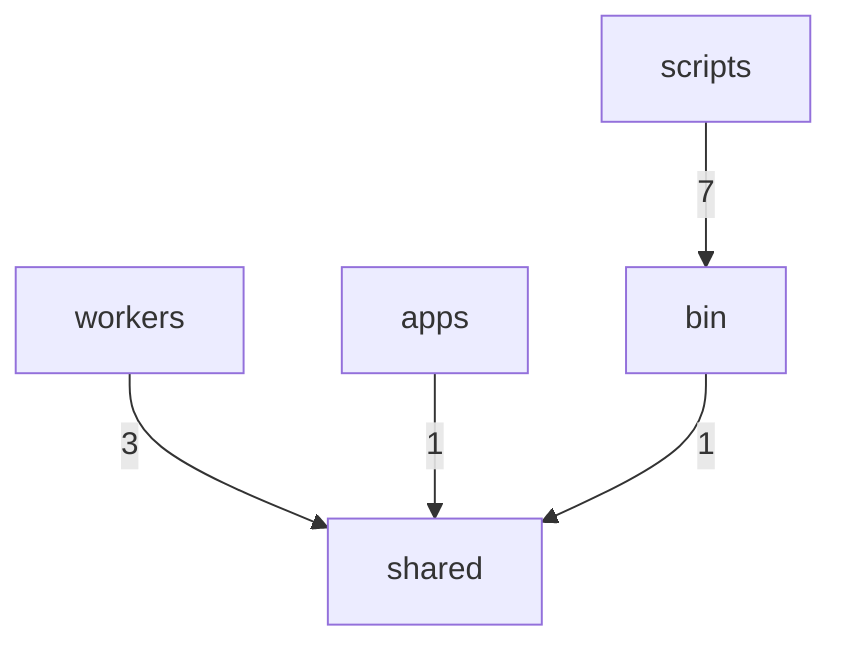

# Dependency Graph

> Auto-generated by `ArchitectureAssetsSync.hook.ts`. Last refreshed: 2026-06-22T20:05:03.298Z
> Scanned 126 source files. Edges aggregate to top-level directories (or `src/<name>`).

## Module graph

## Edge counts

| From | To | Imports |
|---|---|---|
| `scripts` | `bin` | 7 |
| `workers` | `shared` | 3 |
| `apps` | `shared` | 1 |
| `bin` | `shared` | 1 |