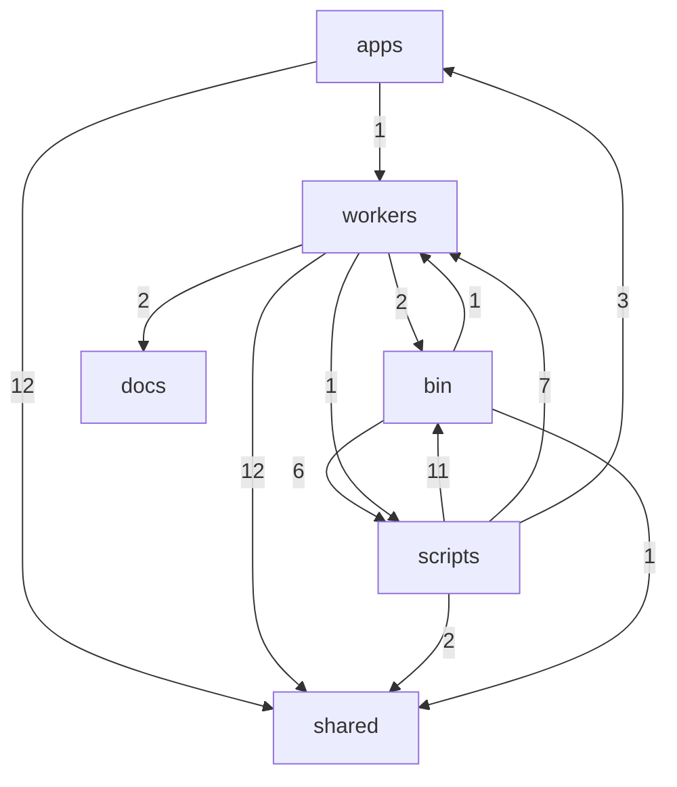

# Dependency Graph

> Auto-generated by `ArchitectureAssetsSync.hook.ts`. Last refreshed: 2026-08-30T13:04:17.348Z
> Scanned 440 source files. Edges aggregate to top-level directories (or `src/<name>`).

## Module graph

```mermaid
graph TD
  apps["apps"] -->|12| shared["shared"]
  workers["workers"] -->|12| shared["shared"]
  scripts["scripts"] -->|11| bin["bin"]
  scripts["scripts"] -->|7| workers["workers"]
  bin["bin"] -->|6| scripts["scripts"]
  scripts["scripts"] -->|3| apps["apps"]
  scripts["scripts"] -->|2| shared["shared"]
  workers["workers"] -->|2| bin["bin"]
  workers["workers"] -->|2| docs["docs"]
  apps["apps"] -->|1| workers["workers"]
  bin["bin"] -->|1| workers["workers"]
  bin["bin"] -->|1| shared["shared"]
  workers["workers"] -->|1| scripts["scripts"]
```

## Edge counts

| From | To | Imports |
|---|---|---|
| `apps` | `shared` | 12 |
| `workers` | `shared` | 12 |
| `scripts` | `bin` | 11 |
| `scripts` | `workers` | 7 |
| `bin` | `scripts` | 6 |
| `scripts` | `apps` | 3 |
| `scripts` | `shared` | 2 |
| `workers` | `bin` | 2 |
| `workers` | `docs` | 2 |
| `apps` | `workers` | 1 |
| `bin` | `workers` | 1 |
| `bin` | `shared` | 1 |
| `workers` | `scripts` | 1 |