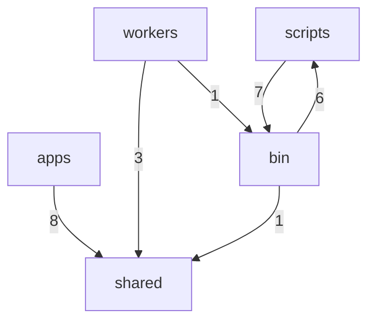

# Dependency Graph

> Auto-generated by `ArchitectureAssetsSync.hook.ts`. Last refreshed: 2026-07-21T07:18:00.937Z
> Scanned 189 source files. Edges aggregate to top-level directories (or `src/<name>`).

## Module graph

```mermaid
graph TD
  apps["apps"] -->|8| shared["shared"]
  scripts["scripts"] -->|7| bin["bin"]
  bin["bin"] -->|6| scripts["scripts"]
  workers["workers"] -->|3| shared["shared"]
  bin["bin"] -->|1| shared["shared"]
  workers["workers"] -->|1| bin["bin"]
```

## Edge counts

| From | To | Imports |
|---|---|---|
| `apps` | `shared` | 8 |
| `scripts` | `bin` | 7 |
| `bin` | `scripts` | 6 |
| `workers` | `shared` | 3 |
| `bin` | `shared` | 1 |
| `workers` | `bin` | 1 |