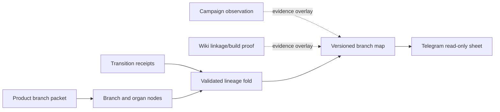

# Branch Traversal Map

Status: D1 receipt + authenticated read-only route slice (2026-07-23)

The branch map answers a different question from the existing branch-story
sheet: **which branch/product has entered which organ, with what evidence and
current status?** Branch packets remain the source for intended routing and
promotion gates. Transition receipts are the source for observed traversal.
Campaign and wiki records are reconciliation overlays; they cannot promote,
pause, or rewrite a branch node.



## Current evidence inventory

The machine-readable inventory is [`docs/plans/product-branches/branch-map.json`](../plans/product-branches/branch-map.json).

| Alias | Canonical branch | Current evidence | What the map must show |
| --- | --- | --- | --- |
| `iverif.io` / `iverif` | `iverif` | Packet exists; fixed Explee project `16763`, campaign `45711`, GET-only observe policy | IVerif packet and organ route are mapped; campaign is a read-only observed overlay; claim, wiki, and customer-contact gates remain blocked/pending |
| `getfitcheck` / `fitcheck` | `fitcheck` | `fitcheck.md` exists; exact `getfitcheck` slug and campaign binding are not evidenced | One canonical Fitcheck branch; `getfitcheck` is an unresolved alias, not a second product; campaign/wiki status is explicit no-signal/unmapped |
| `getleads.io` / `getleads` | unresolved | Adapter catalog entry `getleads-capture@1.0.0` is registered disabled; no branch packet or live binding | An unresolved branch/adapter gap; no campaign, tenant, credential, or provider output may be invented |
| `explee` | scoped service/provider | Explee read adapter is active only for fixed IVerif binding; no Fitcheck or iBerev binding | Provider surface is shown as scoped to IVerif; other branch mappings remain unmapped |

The inventory deliberately records uncertainty. A packet’s declared Brandmint
or wiki path is not proof that the path is present in this checkout or that a
campaign belongs to that product.

## Authoritative map contract

`workers/quests/src/branch-map.ts` provides a pure projection over:

- Goal Graph nodes (tenant, namespace/branch, desired/current state, status,
  source reference/digest, graph version);
- transition receipts (tenant, branch, from/to nodes, organ, observed time,
  evidence references, source reference/digest, graph version, and receipt
  status); and
- explicit branch lineage records.

`branchMapInputFromPackets` is the packet adapter for the first slice. It
turns a bounded packet view (branch metadata plus Organ Routing rows) into a
stable macro branch node and meso organ nodes. It does not fabricate receipts;
every packet-derived node remains visibly pending until an observed transition
receipt is supplied.

The projection sorts every collection, rejects cross-tenant and graph-version
drift, reports dangling or duplicate references as gaps, and emits a digest
over the versioned envelope. Missing receipts and lineage are visible as
`pending`/`unknown` gaps rather than silently treated as progress.

The D1 integration now appends immutable transition history through
`branch-map-receipt-store.ts`. Replays are keyed by a tenant-scoped evidence
digest, semantic drift conflicts, and the read path remains separate from the
Goal Graph writer.

## Campaign and wiki overlays

Campaign overlays use the bounded vocabulary `observed-active`,
`observed-paused`, `claimed-paused`, `pending`, `blocked`, or `unknown`, with
source and freshness fields plus an optional evidence receipt reference. They
never change `authoritativeStatus`. The current IVerif Explee binding is
observe-only and GET-only; user-reported “paused” state must remain
`claimed-paused`/unverified until a fresh provider observation is recorded.

Wiki overlays report linkage/build evidence only. They do not turn a missing
packet into a branch, and they do not make a public claim or campaign action
eligible.

## Test flow

Run the narrow contract and signed route proof first:

```sh
node --test workers/quests/src/branch-map.test.ts
node --test workers/quests/src/branch-map-receipt-store.test.ts workers/quests/src/branch-map-sheet.test.ts workers/quests/src/branch-map-route.test.ts
```

The focused fixtures prove:

1. IVerif and Fitcheck packets can be represented as branch/organ nodes.
2. GetLeads and Explee aliases remain explicit unresolved/scoped gaps.
3. Receipt and lineage order does not affect the digest.
4. Dangling, duplicate, cross-tenant, and invalid references fail closed.
5. Campaign/wiki overlays remain separate from authoritative node status.
6. Projection-shaped input is not accepted as a fresh authoritative write.

Then run the existing packet and repository gates:

```sh
npm run validate:product-branches
npm test
```

The route suite uses synthetic signed Telegram `initData` and in-memory D1
authority doubles. It proves authentication, tenant isolation, receipt reads,
sheet rendering, and digest binding without calling Explee, Telegram, R2,
Composio, or a campaign endpoint. This is Worker/Telegram contract proof, not
fresh founder-device evidence.

## Telegram view shape

The intended read-only sheet is one branch row per canonical branch, expandable
to ordered organ nodes. Each node shows `status`, `sourceRef`, `observedAt` (or
an explicit missing-evidence gap), and the campaign/wiki overlay badges. The
sheet must expose the projection digest and generated time so stale evidence is
visible. It must never expose provider credentials, raw lead content, or a
write/action control from this projection.

The authenticated Worker endpoint is `GET /v1/branch-map/{tenant}` with the
signed Telegram init data in `X-Telegram-Init-Data`. It returns the versioned
projection, bounded sheet, and a proof object binding graph, projection, sheet,
and authenticated-read digests. The operator procedure (auth checks, failure
states, redaction) lives in
[`docs/runbooks/telegram-operator-surface.md`](../runbooks/telegram-operator-surface.md).
The existing `branchStories` surface remains
useful for missions, KPIs, gates, and proof paths. The traversal map sits beside
it: stories describe intent; receipts show what a branch actually traversed.
