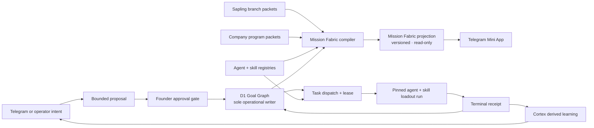

# Cambium Operating Fabric

Status: zero-traffic candidate implementation; portfolio-catalog extension remains local until approval-gated staging proof.

Date: 2026-07-28

Authority: the D1 Goal Graph remains the only operational writer. This document defines a read model and its user experience; it does not authorize a runtime mutation, deployment, provider call, schedule, or external action.

The additive portfolio classification sidecar is frozen separately in
[`contracts/portfolio-catalog-v1.md`](./contracts/portfolio-catalog-v1.md).
It lets Canopy list the complete mapped portfolio while keeping catalog
classification visibly subordinate to Goal Graph state.

The event-driven delivery boundary is frozen separately in
[`contracts/organ-update-delivery-v1.md`](./contracts/organ-update-delivery-v1.md).
It maps receipt-backed Genesis, Taste, Hands, Will, and Cortex updates to
Hermes-owned Telegram topics without making this read model a sender or
scheduler.

## Decision

Cambium needs one visual operating fabric without turning every kind of work into a product branch.

The model has three separate planes:

1. **Work plane** — saplings and company programs contain missions and tasks.
2. **Execution plane** — agents receive task assignments and pin versioned skill loadouts.
3. **Evidence plane** — runs produce receipts and approved summaries may inform later Goal Graph intent.

The Mission Fabric joins these planes as a versioned, read-only projection. It never becomes a second workflow engine.

### Mission terminology boundary

These three meanings share a word but do not share content, lifecycle, or
authority:

| Term | Scope and source | Authority and inheritance |
| --- | --- | --- |
| **Repository Mission** | Cambium's singular renewable doctrine horizon in root [`MISSION.md`](../../MISSION.md) | Doctrine only. It does not own tasks, plans, D1 state, routes, or UI state. |
| **`FabricMission`** | An outcome-bounded D1 Goal Graph child record inside exactly one `WorkObject` | D1 Goal Graph owns its operational state. Mission Fabric only compiles and serves it read-only. |
| **Mission scene** | The UI destination that renders the selected WorkObject's projection | It has no doctrine or write authority and cannot create, revise, or close either meaning above. |

There is no automatic content or authority inheritance among these meanings.
A `FabricMission` does not inherit, replace, rewrite, or close the Repository Mission.
Mission Fabric is neither a planner nor a writer; the signed Gate and
D1 boundaries below remain unchanged.

Goal Graph task rows may carry the additive nullable operational anchors
`work_object_id`, `work_object_kind`, and `pinned_loadout_id`. Exact catalog
membership admits the WorkObject relationship; aliases and inferred slugs do
not. An admitted task produces `contains`, while a valid immutable loadout
produces one WorkObject-level `pins-loadout` edge. Legacy unanchored rows remain
readable and produce explicit gaps.

Hermes foldback occurs only after D1 has persisted an `executed` or `failed`
terminal outcome under the current fencing token. The immutable foldback proof
then emits `proves` and `informs-next-intent`. It cannot write the Goal Graph;
the next iteration still requires a bounded proposal, founder Gate, and D1 CAS.

### Entity authority map

The Fabric may read or reflect these entities. It never acquires their write authority.

| Entity | Canonical operational owner | Metadata or evidence source | Fabric permission |
| --- | --- | --- | --- |
| sapling | D1 Goal Graph for desired/current state and approvals | product branch packet for branch kind, proof ladder, gates, and organ route | read, adapt, display |
| company program | D1 Goal Graph program namespace for desired/current state and approvals | versioned program packet for kind, outcome metric, and lifecycle vocabulary | read, adapt, display |
| mission | D1 Goal Graph child intent | legacy `BranchMission` metadata during compatibility period | read, adapt, display |
| task | D1 task, dependency, assignment-intent, and lease records | proof requirement and latest receipt reference | read, display |
| agent | existing agent runtime or human operator registry for presence and permission telemetry | D1 task assignment edge | read, display |
| skill cluster / loadout | `.agents` cluster registry and Cambium Skill Forge catalog for versions and eligibility | D1 task requirement plus immutable run loadout digest | read, display |
| run | D1 lease/run ledger; the selected agent runtime executes within that lease | pinned agent, loadout, timing, and terminal state | read, display |
| receipt | immutable D1 receipt store | evidence references and approval binding | read, display, prove |
| Cortex learning | receipt-derived foldback store | numeric summaries derived from completed receipts | read, display, propose only |
| Mission Fabric projection | no independent owner; deterministic compiler output | all sources above with version, digest, freshness, and gaps | derive and serve read-only |

The signed Gate delegates approved mutations to D1. No Canopy, Mission, Flow, Workforce, Forge, Inspect, compiler, fixture, or Cortex component may order tasks, acquire leases, retry runs, reassign agents, promote skills, or change lifecycle state directly.

### Positive authorization matrix

The first slice has one interactive approval principal class: a Telegram identity in the server-owned `founderIds` allowlist. The Mini App submits current Telegram `initData`; the Worker verifies Telegram's third-party Ed25519 signature against Telegram's public key, authentication age, and founder allowlist before accepting a Gate action. This is not the bot-token HMAC validation path. For Goal Graph changes, the Worker binds tenant, change digest, intent version, founder ID, expiry, and nonce, then calls the D1 Goal Graph store's approval-bound CAS commit. Multiple founders may be allowlisted, but v1 is any-one approval with no quorum or separation of duties. No delegated approver role is implied.

`founderIds` is deployment authority, not product data. It comes from the Worker `GATE_FOUNDER_IDS` environment configuration, is unreadable and unchangeable from the Mini App or Mission Fabric, and fails closed when absent. Changing it requires the existing infrastructure release path, explicit founder authorization, repository/config review, and a new Worker version/rollback receipt. Allowlist rotation is outside the Fabric's write contract.

| Entity | Mutation verb | Authorized requester or runtime principal | Verifier / enforcement | Authoritative write |
| --- | --- | --- | --- | --- |
| sapling or program | create, revise, prioritize, pause, complete, retire | configured founder through `approve-goal-graph` | Worker Telegram validation + approval digest + D1 CAS | D1 Goal Graph |
| mission or task intent | create, revise, transition, change dependency | configured founder through `approve-goal-graph` | Worker Telegram validation + graph-head CAS | D1 Goal Graph |
| task execution policy | assign or reassign agent, change skill requirement | configured founder through a signed Gate proposal | Worker validation + graph-head CAS | D1 Goal Graph task intent |
| task lease / run | claim, heartbeat, complete, fail, stop | only the D1-dispatched runtime holding the current fenced lease | scoped runtime handler + lease owner + fencing token + idempotency | D1 task/lease/run ledger |
| run recovery | retry or reconcile | configured founder through signed Gate; the runtime may only report `reconciliation-required` | Worker validation + prior receipt/lease guard | new D1 run intent; prior receipts remain immutable |
| receipt | append terminal evidence | current fenced runtime for its own run | task/run identity + fencing + canonical digest + idempotency | immutable D1 receipt store |
| skill cluster / loadout | promote candidate or change catalog state | configured founder through existing `promote-skill` Gate action | Worker Telegram validation + governed Skill Forge apply receipt | Skill Forge catalog; no Goal Graph mutation |
| Cortex proposal | submit a possible next intent | receipt-derived foldback process | numeric receipt derivation + bounded proposal schema | proposal queue only |
| Cortex proposal | accept into operational intent | configured founder through `approve-goal-graph` | same approval digest and D1 CAS path as any other intent | D1 Goal Graph |
| Mission Fabric | read or filter | authenticated tenant reader | Worker tenant scope, bounds, freshness, and redaction | none |

Saplings and programs share the same downstream mission, task, lease, run, receipt, approval, and read authorities. Their only asymmetry is source metadata and lifecycle vocabulary: saplings retain branch promotion; programs do not.

### Commit and execution invariants

- **Single-use approval:** the D1 batch atomically inserts an immutable approval witness unique on `(tenantId, changeDigest, intentVersion, approverId, nonce)` and the corresponding graph event. Exact replay returns the original event and performs no write; nonce drift or semantic drift fails closed.
- **Commit-time digest:** the D1 commit boundary must recompute the canonical change-set digest from tenant, expected head, graph version, ordered node changes, source reference, and source digest, then compare it with both the submitted `changeDigest` and approval binding before any write.
- **Trusted time:** client time is ignored. The Worker supplies commit time from its server clock; the D1 store validates approval expiry and decision time against that value inside the same commit attempt.
- **Fence validation:** every lease heartbeat, run transition, and terminal receipt append compares the submitted fencing generation with the current D1 lease generation. A stale or superseded holder receives `409 stale_fence` and cannot append evidence.
- **Immutable history:** retry and reconciliation create a new run intent and receipt lineage. They never overwrite a prior run, receipt, approval, or event.

## Backward compatibility [OF-C4]

Runtime currently permits `BranchKind = 'product' | 'client' | 'internal-service'`.

The first slice avoids a destructive packet migration:

| Existing source | Fabric compatibility view | Rule |
| --- | --- | --- |
| `product` branch | `WorkObject.kind = sapling` | retains branch promotion |
| `client` branch | `WorkObject.kind = program`, `programKind = client` | promotion copied only as legacy metadata, never displayed as program lifecycle |
| `internal-service` branch | `WorkObject.kind = program`, `programKind = capability` or `operations` | requires an explicit mapping; unknown becomes a gap |

The compatibility adapter is read-only. A later packet-v2 migration can replace the legacy source after live parity tests prove that no proof, gate, loop, or receipt is lost.

## Telegram Mini App information architecture [OF-C5]

The root navigation remains five destinations.

### 1. Canopy

Purpose: answer “what work exists and what needs attention?”

- two clearly labeled zones: **Saplings** and **Programs**
- work nodes use different silhouettes
- one active frontier per selected work object
- counts: active, blocked, stale, needs approval
- selecting a node opens its Mission page

### 2. Mission

Purpose: answer “what outcome moves next?”

- selected WorkObject context
- next mission
- mission stages
- blockers
- proof required
- contextual Gate and Inspect actions

This retains the strongest parts of the shipped Mission Control scene.

### 3. Flow

Purpose: answer “how are tasks moving right now?”

- mission-scoped dependency graph
- lanes for queued, leased, running, verifying, and complete
- assignment edge to agent
- requirement edge to skill cluster
- receipt edge for completed work
- stale or reconciliation-required work is visually discontinuous

### 4. Workforce

Purpose: answer “who or what is executing?”

- human and agent nodes remain visually distinct
- current task, availability, permission profile, and last-seen state
- load bars show bounded active assignments, not productivity scores
- selecting an agent shows assignments and receipts, never private prompt or credential content

### 5. Forge

Purpose: answer “what capability is available, required, or learning?”

- skill clusters as stable capability nodes
- skill versions and eligible agents behind detail
- task demand vs. available capability
- candidate → validated → production promotion state
- declining telemetry appears as an amendment proposal, not an automatic skill mutation

### Contextual sheets

- **Gate sheet** — the only interactive UI mutation entrypoint; preflight, consequence, reversibility, signed submit, receipt. Scoped execution runtimes may append lease/run/receipt facts through their fenced server handlers, never through the visual fabric.
- **Inspect sheet** — provenance, freshness, source, graph version, gaps, raw-but-redacted identifiers.
- **Work detail sheet** — program/sapling type-specific fields without forcing one state vocabulary.
- **Run detail sheet** — pinned loadout, receipt, reconciliation state.

## Navigation migration from the current five scenes

| Current | Destination | Migration |
| --- | --- | --- |
| Mission | Mission | retain and generalize from branch to selected WorkObject |
| Gate | Gate sheet | remove from root only after global entrypoint and deep links pass |
| Tools | Flow | live surfaces become task/run lanes; actions still route through Gate |
| Story | Canopy timeline / receipt sheets | evidence-backed beats remain available by work object |
| Inspect | Inspect sheet | keep global and contextual access |
| new | Workforce | promote existing agent telemetry from Inspect |
| new | Forge | promote existing skill telemetry from Inspect |

## Visual grammar [OF-C6]

State is never color-only.

| Dimension | Encoding | Example |
| --- | --- | --- |
| node kind | silhouette + glyph | sapling starburst, program ring, mission capsule, task square, agent flower, skill cluster hex |
| state | color + icon + border/rail | active chartreuse solid; blocked peach warning + broken rail |
| freshness | opacity + timestamp | stale node fades and displays `stale 4h` |
| authority | source chip + lock/read icon | `D1 · v42 · read` |
| assignment | thin solid rail | task → agent |
| skill requirement | dotted double rail | task → cluster |
| proof | packet dots flowing to receipt | run → receipt |
| reconciliation | discontinuous amber rail | ambiguous completion |

Palette remains the frozen Cambium system:

- deep base `#00272B`
- surface `#012F34`
- active `#E0FF4F`
- highlight `#D6FFF6`
- deep shadow `#231651`
- warning peach `#FFC7A1`

## Why the current branch-first model is insufficient

The shipped Mission scene is truthful for proof-bound branch packets. It shows a branch's next mission, gate, proof, questline, promotion state, and KPIs. That model is deliberately optimized for venture launch:

```text
proof-only → supervised branch → autonomous branch
```

Company-wide work does not necessarily promote through that ladder. A release program, infrastructure migration, hiring initiative, research program, or operating-system improvement can be active and important without becoming an autonomous venture. Encoding those as product branches would make the UI reusable at the cost of making the data untrue.

The first-principles requirement is simpler:

> Every active body of work needs a stable identity, desired outcome, mission/task lineage, owner, next action, blockers, proof, and freshness. Only saplings need branch promotion.

## Core ontology [OF-C1]

### 1. WorkObject

`WorkObject` is the root union for things the company is trying to move.

```ts
type WorkObject =
  | SaplingWork
  | ProgramWork;

interface WorkObjectBase {
  workId: string;
  tenantId: string;
  name: string;
  desiredState: string;
  currentState: string;
  status: 'draft' | 'ready' | 'active' | 'blocked' | 'paused' | 'complete' | 'retired';
  ownerId: string;
  nextAction: string | null;
  proofRequired: boolean;
  reviewAt: string | null;
  sourceRef: string;
  sourceDigest: string;
}

interface SaplingWork extends WorkObjectBase {
  kind: 'sapling';
  branchId: string;
  branchKind: 'product';
  promotionState: 'proof-only' | 'supervised-branch' | 'autonomous-branch';
  currentGate: string;
  organRoute: string[];
}

interface ProgramWork extends WorkObjectBase {
  kind: 'program';
  programKind: 'company' | 'client' | 'capability' | 'operations';
  lifecycle: 'proposed' | 'approved' | 'executing' | 'verifying' | 'complete' | 'retired';
  outcomeMetric: string;
}
```

The first schema version keeps only saplings and programs at the union root. Missions and tasks are children, not peer root types.

### 2. Mission

A mission is an outcome-bounded movement inside one WorkObject.

```ts
interface FabricMission {
  missionId: string;
  workId: string;
  title: string;
  objective: string;
  status: 'queued' | 'ready' | 'active' | 'blocked' | 'complete';
  gateId: string | null;
  proofRequirement: string;
  taskIds: string[];
  sourceRef: string;
}
```

Existing `BranchMission` rows adapt into this interface without changing their source packet.

### 3. Task

A task is the smallest schedulable unit with durable ownership and proof.

```ts
interface FabricTask {
  taskId: string;
  missionId: string;
  desiredState: string;
  status: 'queued' | 'ready' | 'leased' | 'running' | 'blocked' | 'verifying' | 'complete' | 'failed';
  dependencyIds: string[];
  assignedAgentId: string | null;
  requiredClusterIds: string[];
  pinnedLoadoutId: string | null;
  leaseId: string | null;
  proofRequirement: string;
  latestReceiptId: string | null;
}
```

Task identity does not change when the assigned agent, model route, or skill loadout changes.

### 4. Agent

An agent is an executor, not a work item.

```ts
interface FabricAgent {
  agentId: string;
  role: string;
  runtime: 'codex' | 'hermes' | 'paperclip' | 'human' | 'other';
  status: 'offline' | 'available' | 'assigned' | 'running' | 'blocked';
  activeTaskIds: string[];
  permissionProfile: string;
  lastSeenAt: string;
  sourceRef: string;
}
```

### 5. SkillCluster and SkillLoadout

A cluster is a capability family. A loadout is the immutable version snapshot used by one run.

```ts
interface FabricSkillCluster {
  clusterId: string;
  name: string;
  status: 'inactive' | 'available' | 'active' | 'degraded';
  skillIds: string[];
  eligibleAgentIds: string[];
  successRate: number | null;
  sourceRef: string;
}

interface FabricSkillLoadout {
  loadoutId: string;
  clusterIds: string[];
  skillVersions: Array<{ skillId: string; version: string }>;
  policyVersion: string;
  catalogVersion: string;
  digest: string;
}
```

### 6. Run and Receipt

```ts
interface FabricRun {
  runId: string;
  taskId: string;
  agentId: string;
  loadoutId: string;
  startedAt: string;
  terminalAt: string | null;
  status: 'invoking' | 'running' | 'reconciliation-required' | 'complete' | 'failed';
}

interface FabricReceipt {
  receiptId: string;
  runId: string;
  taskId: string;
  graphVersion: number;
  status: 'complete' | 'failed' | 'stopped' | 'reconciliation-required';
  inputDigest: string;
  outputDigest: string | null;
  evidenceRefs: string[];
  approvalRef: string | null;
  createdAt: string;
}
```

## Mission Fabric projection [OF-C2]

The public read model is a typed graph, not a second database.

```ts
interface MissionFabricProjectionV1 {
  schema: 'cambium.mission-fabric-projection.v1';
  projectionVersion: 1;
  tenantId: string;
  graphVersion: number;
  graphDigest: string;
  generatedAt: string;
  asOf: string;
  sourceOfTruth: 'd1-goal-graph';
  readOnly: true;
  nodes: FabricNode[];
  edges: FabricEdge[];
  gaps: FabricGap[];
}

type FabricNode =
  | { kind: 'work'; value: WorkObject }
  | { kind: 'mission'; value: FabricMission }
  | { kind: 'task'; value: FabricTask }
  | { kind: 'agent'; value: FabricAgent }
  | { kind: 'skill-cluster'; value: FabricSkillCluster }
  | { kind: 'run'; value: FabricRun }
  | { kind: 'receipt'; value: FabricReceipt };

type FabricEdgeKind =
  | 'contains'
  | 'depends-on'
  | 'assigned-to'
  | 'requires-cluster'
  | 'pins-loadout'
  | 'executes'
  | 'produces'
  | 'proves'
  | 'informs-next-intent';
```

Every client-visible projection carries:

- `sourceOfTruth`
- `graphVersion`
- `graphDigest`
- `generatedAt`
- `asOf`
- `readOnly`
- per-node `kind`
- per-node source reference
- explicit gaps instead of invented relationships

## Authority and data flow [OF-C3]



The only return path from Cortex or the UI to graph truth is a new bounded proposal followed by the same approval and CAS gates.

### Entity authority map

The Fabric may read or reflect these entities. It never acquires their write authority.

| Entity | Canonical operational owner | Metadata or evidence source | Fabric permission |
| --- | --- | --- | --- |
| sapling | D1 Goal Graph for desired/current state and approvals | product branch packet for branch kind, proof ladder, gates, and organ route | read, adapt, display |
| company program | D1 Goal Graph program namespace for desired/current state and approvals | versioned program packet for kind, outcome metric, and lifecycle vocabulary | read, adapt, display |
| mission | D1 Goal Graph child intent | legacy `BranchMission` metadata during compatibility period | read, adapt, display |
| task | D1 task, dependency, assignment-intent, and lease records | proof requirement and latest receipt reference | read, display |
| agent | existing agent runtime or human operator registry for presence and permission telemetry | D1 task assignment edge | read, display |
| skill cluster / loadout | `.agents` cluster registry and Cambium Skill Forge catalog for versions and eligibility | D1 task requirement plus immutable run loadout digest | read, display |
| run | D1 lease/run ledger; the selected agent runtime executes within that lease | pinned agent, loadout, timing, and terminal state | read, display |
| receipt | immutable D1 receipt store | evidence references and approval binding | read, display, prove |
| Cortex learning | receipt-derived foldback store | numeric summaries derived from completed receipts | read, display, propose only |
| Mission Fabric projection | no independent owner; deterministic compiler output | all sources above with version, digest, freshness, and gaps | derive and serve read-only |

The signed Gate delegates approved mutations to D1. No Canopy, Mission, Flow, Workforce, Forge, Inspect, compiler, fixture, or Cortex component may order tasks, acquire leases, retry runs, reassign agents, promote skills, or change lifecycle state directly.

### Positive authorization matrix

The first slice has one interactive approval principal class: a Telegram identity in the server-owned `founderIds` allowlist. The Mini App submits current Telegram `initData`; the Worker verifies Telegram's third-party Ed25519 signature against Telegram's public key, authentication age, and founder allowlist before accepting a Gate action. This is not the bot-token HMAC validation path. For Goal Graph changes, the Worker binds tenant, change digest, intent version, founder ID, expiry, and nonce, then calls the D1 Goal Graph store's approval-bound CAS commit. Multiple founders may be allowlisted, but v1 is any-one approval with no quorum or separation of duties. No delegated approver role is implied.

`founderIds` is deployment authority, not product data. It comes from the Worker `GATE_FOUNDER_IDS` environment configuration, is unreadable and unchangeable from the Mini App or Mission Fabric, and fails closed when absent. Changing it requires the existing infrastructure release path, explicit founder authorization, repository/config review, and a new Worker version/rollback receipt. Allowlist rotation is outside the Fabric's write contract.

| Entity | Mutation verb | Authorized requester or runtime principal | Verifier / enforcement | Authoritative write |
| --- | --- | --- | --- | --- |
| sapling or program | create, revise, prioritize, pause, complete, retire | configured founder through `approve-goal-graph` | Worker Telegram validation + approval digest + D1 CAS | D1 Goal Graph |
| mission or task intent | create, revise, transition, change dependency | configured founder through `approve-goal-graph` | Worker Telegram validation + graph-head CAS | D1 Goal Graph |
| task execution policy | assign or reassign agent, change skill requirement | configured founder through a signed Gate proposal | Worker validation + graph-head CAS | D1 Goal Graph task intent |
| task lease / run | claim, heartbeat, complete, fail, stop | only the D1-dispatched runtime holding the current fenced lease | scoped runtime handler + lease owner + fencing token + idempotency | D1 task/lease/run ledger |
| run recovery | retry or reconcile | configured founder through signed Gate; the runtime may only report `reconciliation-required` | Worker validation + prior receipt/lease guard | new D1 run intent; prior receipts remain immutable |
| receipt | append terminal evidence | current fenced runtime for its own run | task/run identity + fencing + canonical digest + idempotency | immutable D1 receipt store |
| skill cluster / loadout | promote candidate or change catalog state | configured founder through existing `promote-skill` Gate action | Worker Telegram validation + governed Skill Forge apply receipt | Skill Forge catalog; no Goal Graph mutation |
| Cortex proposal | submit a possible next intent | receipt-derived foldback process | numeric receipt derivation + bounded proposal schema | proposal queue only |
| Cortex proposal | accept into operational intent | configured founder through `approve-goal-graph` | same approval digest and D1 CAS path as any other intent | D1 Goal Graph |
| Mission Fabric | read or filter | authenticated tenant reader | Worker tenant scope, bounds, freshness, and redaction | none |

Saplings and programs share the same downstream mission, task, lease, run, receipt, approval, and read authorities. Their only asymmetry is source metadata and lifecycle vocabulary: saplings retain branch promotion; programs do not.

### Commit and execution invariants

- **Single-use approval:** the D1 batch atomically inserts an immutable approval witness unique on `(tenantId, changeDigest, intentVersion, approverId, nonce)` and the corresponding graph event. Exact replay returns the original event and performs no write; nonce drift or semantic drift fails closed.
- **Commit-time digest:** the D1 commit boundary must recompute the canonical change-set digest from tenant, expected head, graph version, ordered node changes, source reference, and source digest, then compare it with both the submitted `changeDigest` and approval binding before any write.
- **Trusted time:** client time is ignored. The Worker supplies commit time from its server clock; the D1 store validates approval expiry and decision time against that value inside the same commit attempt.
- **Fence validation:** every lease heartbeat, run transition, and terminal receipt append compares the submitted fencing generation with the current D1 lease generation. A stale or superseded holder receives `409 stale_fence` and cannot append evidence.
- **Immutable history:** retry and reconciliation create a new run intent and receipt lineage. They never overwrite a prior run, receipt, approval, or event.

## Backward compatibility [OF-C4]

Runtime currently permits `BranchKind = 'product' | 'client' | 'internal-service'`.

The first slice avoids a destructive packet migration:

| Existing source | Fabric compatibility view | Rule |
| --- | --- | --- |
| `product` branch | `WorkObject.kind = sapling` | retains branch promotion |
| `client` branch | `WorkObject.kind = program`, `programKind = client` | promotion copied only as legacy metadata, never displayed as program lifecycle |
| `internal-service` branch | `WorkObject.kind = program`, `programKind = capability` or `operations` | requires an explicit mapping; unknown becomes a gap |

The compatibility adapter is read-only. A later packet-v2 migration can replace the legacy source after live parity tests prove that no proof, gate, loop, or receipt is lost.

## Telegram Mini App information architecture [OF-C5]

The root navigation remains five destinations.

### 1. Canopy

Purpose: answer “what work exists and what needs attention?”

- two clearly labeled zones: **Saplings** and **Programs**
- work nodes use different silhouettes
- one active frontier per selected work object
- counts: active, blocked, stale, needs approval
- selecting a node opens its Mission page

### 2. Mission

Purpose: answer “what outcome moves next?”

- selected WorkObject context
- next mission
- mission stages
- blockers
- proof required
- contextual Gate and Inspect actions

This retains the strongest parts of the shipped Mission Control scene.

### 3. Flow

Purpose: answer “how are tasks moving right now?”

- mission-scoped dependency graph
- lanes for queued, leased, running, verifying, and complete
- assignment edge to agent
- requirement edge to skill cluster
- receipt edge for completed work
- stale or reconciliation-required work is visually discontinuous

### 4. Workforce

Purpose: answer “who or what is executing?”

- human and agent nodes remain visually distinct
- current task, availability, permission profile, and last-seen state
- load bars show bounded active assignments, not productivity scores
- selecting an agent shows assignments and receipts, never private prompt or credential content

### 5. Forge

Purpose: answer “what capability is available, required, or learning?”

- skill clusters as stable capability nodes
- skill versions and eligible agents behind detail
- task demand vs. available capability
- candidate → validated → production promotion state
- declining telemetry appears as an amendment proposal, not an automatic skill mutation

### Contextual sheets

- **Gate sheet** — the only interactive UI mutation entrypoint; preflight, consequence, reversibility, signed submit, receipt. Scoped execution runtimes may append lease/run/receipt facts through their fenced server handlers, never through the visual fabric.
- **Inspect sheet** — provenance, freshness, source, graph version, gaps, raw-but-redacted identifiers.
- **Work detail sheet** — program/sapling type-specific fields without forcing one state vocabulary.
- **Run detail sheet** — pinned loadout, receipt, reconciliation state.

## Navigation migration from the current five scenes

| Current | Destination | Migration |
| --- | --- | --- |
| Mission | Mission | retain and generalize from branch to selected WorkObject |
| Gate | Gate sheet | remove from root only after global entrypoint and deep links pass |
| Tools | Flow | live surfaces become task/run lanes; actions still route through Gate |
| Story | Canopy timeline / receipt sheets | evidence-backed beats remain available by work object |
| Inspect | Inspect sheet | keep global and contextual access |
| new | Workforce | promote existing agent telemetry from Inspect |
| new | Forge | promote existing skill telemetry from Inspect |

## Visual grammar [OF-C6]

State is never color-only.

| Dimension | Encoding | Example |
| --- | --- | --- |
| node kind | silhouette + glyph | sapling starburst, program ring, mission capsule, task square, agent flower, skill cluster hex |
| state | color + icon + border/rail | active chartreuse solid; blocked peach warning + broken rail |
| freshness | opacity + timestamp | stale node fades and displays `stale 4h` |
| authority | source chip + lock/read icon | `D1 · v42 · read` |
| assignment | thin solid rail | task → agent |
| skill requirement | dotted double rail | task → cluster |
| proof | packet dots flowing to receipt | run → receipt |
| reconciliation | discontinuous amber rail | ambiguous completion |

Palette remains the frozen Cambium system:

- deep base `#00272B`
- surface `#012F34`
- active `#E0FF4F`
- highlight `#D6FFF6`
- deep shadow `#231651`
- warning peach `#FFC7A1`

## Error and empty states [OF-C7]

- Missing program packet: show an explicit `program source missing` gap.
- Unknown legacy branch mapping: show `classification needed`; never guess.
- Stale projection: freeze mutation affordances and route to Inspect.
- Missing agent telemetry: task remains visible as `unassigned` or `executor unknown`.
- Missing skill match: task shows `capability gap`, not a fabricated loadout.
- Ambiguous run completion: show `reconciliation required`; do not auto-retry.
- Empty company: preserve the Canopy structure and offer bounded intake, not demo data.

## Security and privacy [OF-C8]

- No raw Telegram `initData`, provider token, prompt body, private client payload, or credential appears in the projection.
- Agent nodes expose roles and assignments, not secrets or unrestricted transcripts.
- Program visibility is tenant and role scoped.
- Read projections never carry mutation instructions.
- Every desired-state or governed-control mutation deep-links to the signed Gate client and binds tenant, subject, graph version, actor, expiry, and idempotency. Scoped execution facts use fenced runtime handlers and cannot change desired state.
- Approval commits consume a unique nonce witness, recompute the approved change digest, and use Worker commit time; terminal execution writes reject stale fencing generations.
- Generated visual fixtures use synthetic IDs and digest-shaped evidence only.

## Ten predictable failure modes and their countermeasures

1. **Everything becomes a branch** → keep `sapling | program` as distinct root kinds.
2. **Mission Fabric becomes another database** → projection is versioned and `readOnly: true`.
3. **Agents look like projects** → agents are separate node kinds connected by `assigned-to`.
4. **Skills look “installed” but cannot run** → show eligible agents, pinned loadout, and last receipt.
5. **Mobile cards hide type differences** → encode kind by silhouette and glyph.
6. **Stale cards look actionable** → display `asOf`, fade stale nodes, and disable mutation.
7. **A task changes identity when reassigned** → task ID is independent from agent/loadout.
8. **Legacy client branches claim autonomy** → compatibility adapter maps them to programs without promotion UI.
9. **Cortex becomes a silent writer** → learning can only propose a new approval-bound intent.
10. **A beautiful fixture outruns production data** → fixtures remain subsets of the public projection contract.

## Implementation boundary [OF-C9]

This contract is planning-complete, not runtime-complete. Implementation requires:

1. schema and compiler contracts,
2. synthetic fixtures,
3. versioned authenticated route,
4. Canopy/Flow/Workforce/Forge scenes,
5. Mission generalization,
6. contextual Gate/Inspect navigation,
7. viewport and text-density proof,
8. live founder-device signed-action proof before any completion claim.

The implementation plan is [`../plans/2026-07-28-cambium-operating-fabric-implementation-plan.md`](../plans/2026-07-28-cambium-operating-fabric-implementation-plan.md).

### Visual reconciliation rule [OF-C6.1]

The visual system must preserve a separation that the current branch-first
Mission renderer temporarily obscures: `product` branches are Saplings and use
the Sapling silhouette plus promotion vocabulary; `client` and
`internal-service` branches are Programs and use their client/capability or
operations silhouette plus program vocabulary. A missing mapping is a visible
gap, never a generic product card. Responsive composition changes placement,
not this semantic distinction: 320/390/430px are first-class proof widths and
desktop may add context only without changing reading order or hiding actions.
The detailed implementation contract is
`docs/plans/2026-08-12-mission-control-visual-reconciliation.md`.

## Error and empty states [OF-C7]

- Missing program packet: show an explicit `program source missing` gap.
- Unknown legacy branch mapping: show `classification needed`; never guess.
- Stale projection: freeze mutation affordances and route to Inspect.
- Missing agent telemetry: task remains visible as `unassigned` or `executor unknown`.
- Missing skill match: task shows `capability gap`, not a fabricated loadout.
- Ambiguous run completion: show `reconciliation required`; do not auto-retry.
- Empty company: preserve the Canopy structure and offer bounded intake, not demo data.

## Security and privacy [OF-C8]

- No raw Telegram `initData`, provider token, prompt body, private client payload, or credential appears in the projection.
- Agent nodes expose roles and assignments, not secrets or unrestricted transcripts.
- Program visibility is tenant and role scoped.
- Read projections never carry mutation instructions.
- Every desired-state or governed-control mutation deep-links to the signed Gate client and binds tenant, subject, graph version, actor, expiry, and idempotency. Scoped execution facts use fenced runtime handlers and cannot change desired state.
- Approval commits consume a unique nonce witness, recompute the approved change digest, and use Worker commit time; terminal execution writes reject stale fencing generations.
- Generated visual fixtures use synthetic IDs and digest-shaped evidence only.

## Ten predictable failure modes and their countermeasures

1. **Everything becomes a branch** → keep `sapling | program` as distinct root kinds.
2. **Mission Fabric becomes another database** → projection is versioned and `readOnly: true`.
3. **Agents look like projects** → agents are separate node kinds connected by `assigned-to`.
4. **Skills look “installed” but cannot run** → show eligible agents, pinned loadout, and last receipt.
5. **Mobile cards hide type differences** → encode kind by silhouette and glyph.
6. **Stale cards look actionable** → display `asOf`, fade stale nodes, and disable mutation.
7. **A task changes identity when reassigned** → task ID is independent from agent/loadout.
8. **Legacy client branches claim autonomy** → compatibility adapter maps them to programs without promotion UI.
9. **Cortex becomes a silent writer** → learning can only propose a new approval-bound intent.
10. **A beautiful fixture outruns production data** → fixtures remain subsets of the public projection contract.

## Implementation boundary [OF-C9]

This contract is planning-complete, not runtime-complete. Implementation requires:

1. schema and compiler contracts,
2. synthetic fixtures,
3. versioned authenticated route,
4. Canopy/Flow/Workforce/Forge scenes,
5. Mission generalization,
6. contextual Gate/Inspect navigation,
7. viewport and text-density proof,
8. live founder-device signed-action proof before any completion claim.

The implementation plan is [`../plans/2026-07-28-cambium-operating-fabric-implementation-plan.md`](../plans/2026-07-28-cambium-operating-fabric-implementation-plan.md).
