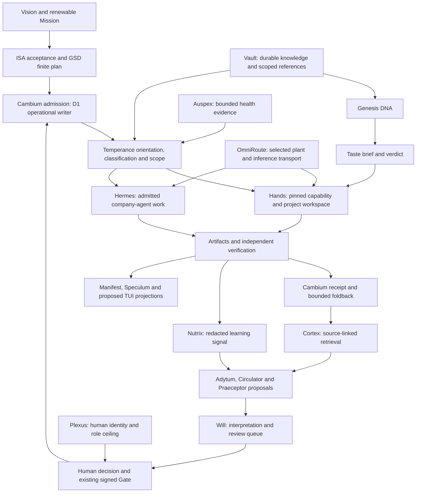

# Growth ecosystem topology v1

This curated source projection carries the reviewed ecosystem topology into
the public atlas. Its lineage is the **1 October 2026 growth ecosystem review**,
source SHA-256 `435fc0cc9ab8a225c5529187929bd2674a2bd53d16e5829a18ea31ccdae2880d`.
The diagram, system boundaries and cell effects retain that review's meaning.
It supplies source relationships; runtime acceptance requires owner receipts.

## Connected system

Cambium, Temperance, the connected organs and their supporting systems form
one integrated operating ecosystem. Distinct authorities preserve that
integration. Identity, approved intent, phase, loadout, execution plant,
artifact, verification, receipt and proposed learning bind its work.

This is conceptual integration. A missing or unaccepted edge remains held
or unknown. Source relationships cannot establish installed callbacks,
provider health, useful consumption, operational soak or live delivery.

## System ownership

Cambium's D1 Goal Graph is the sole operational writer. Plexus resolves
human identity and role ceiling. ISA owns acceptance and GSD owns finite
planning. Read-only projections join evidence from those owners.

| System | What crosses the seam | Authority retained by the owner |
| --- | --- | --- |
| Cambium | WorkObject, graph version, approved task, loadout and receipt references | D1 operational writer, signed Gate and cloud deployment |
| Plexus | Resolved human identity and role ceiling | Member and account state |
| ISA / GSD | Acceptance and finite plan or handoff respectively | Their separate ledgers |
| Hermes | Admitted company-agent execution, lease and redacted terminal receipt | Remote runtime, queues, state and admitted output scope |
| OmniRoute | Selected inference binding, stable lane and actual attempt evidence | Credentials, account and fallback policy, quotas and combo writer |
| Company vault / Git | Scoped knowledge and committed source with provenance | Canonical notes and source history |
| Cortex / other memory | Source-linked retrieval and bounded lessons | Separate schemas, retention, embedding model and privacy scope |

Growth's Bridge A plan keeps the growth tree outside Hermes write zones.
The founder Mac can extract/feed there; Hermes can read committed/synced
documents and write only its admitted output scope. The sole vault origin
owns that source boundary. Scoped references do not extend a write grant.

## Growth desks and cell effects

The six growth desks sit inside Will and the existing execution system.
[The desk source map](growth-desk-map-v1.md) records document ownership,
principal organ, Will desk and intended execution binding separately.

| Desk | Complementary connections |
| --- | --- |
| Head of Marketing | Genesis positioning, Taste, Will strategy and CEO interpretation |
| Copywriter | Will authoring, Taste and Analyst grading, Synthesist execution |
| Creative Strategist | Genesis references, Taste, Will creative interpretation and Designer |
| Launch Lead | Will dispatch, Hands preparation and Hermes delivery |
| SEO Lead | Hands Search Stack with Will and Scientist interpretation |
| Analyst | Taste checks, Cortex evidence and CEO audit |

The existing execution roles are CEO, Scientist, Engineer, Designer,
Synthesist and Hermes. A desk assignment requires its own admitted work
identity and scope.

The four cell verbs preserve separate effects: **extract** lands dated
material in a role inbox; **feed** promotes one item to a cell draft;
**read** follows declared dependencies without mutation; **edit** changes
only the owned cell or inbox and updates provenance. Approval and publication
remain separate transitions.

The reviewed growth source records incomplete machine verb bindings.
Human-readable workflow remains source evidence; missing executable
contracts stay held until typed, owner-reviewed bindings exist.
