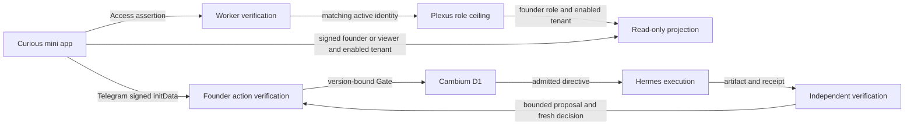

# System atlas v1

The atlas is a read-only, public-safe source projection shared by the pocket
operator and the visual field guide. It answers: **which owner receives this
input, what does it produce, and where does the evidence return?**

`shared/cambium-system-atlas.ts` owns the curated topology. It contains five
finite Cambium organs, six Temperance operator organs, six desks inside Will,
typed connections, authority boundaries and portable source references. The
atlas creates no operational graph, registry, identity, command or schedule.
Cortex is cross-cutting; the finite composition is Genesis → Taste → Hands →
Will. Recommendations return to a fresh gate rather than becoming admission.

The same renderer appears in legacy Inspect → System, an inspection entry in
the enabled Operating Fabric, and the standalone visual guide. Selection,
keyboard navigation and disclosures have no mutation authority. Inspectable
source contracts remain available when runtime evidence is missing.

## Evidence and identity

Source, local verification, production receipts, held and retired are distinct.
There is no inferred green status, progress percentage or invented runtime
metric. The current atlas does not assert live health of any organ. Runtime
observations must name an existing validated receipt and its scope before a
future view may label them production evidence.

The read/action cross-section retains separate boundaries:

An account email, browser Access session or illustration cannot replace an
active Plexus role or Telegram founder signature. Root HTML is served separately
from authenticated quest reads; the atlas bundle therefore contains no private
vault prose, email allowlist, raw authentication, session data or machine paths.
Current edge policy and deployed identity membership require separate readback.
See [Cloudflare JWT validation](https://developers.cloudflare.com/cloudflare-one/access-controls/applications/http-apps/authorization-cookie/validating-json/)
and [Telegram Mini App validation](https://core.telegram.org/bots/webapps#validating-data-received-via-the-mini-app).

The vault owns durable prose; GitHub holds versioned repository history and
committed source transport. These source-owner roles do not assert a live sync,
repository mutation or callback. Optional model transport and Worker provider
broker configuration require their own installed-hop and provider receipts.

## Visual contract

Reuse the product palette, 8px rhythm, rails, packets, rings and patterned state
tokens. The eleven TSOC concept portraits retain their canonical IDs and source
hashes. Build/ops remain display aliases for Hands/Will. A transport marker is
not a progress gauge. Reduced motion is static; all controls have text names,
keyboard focus and a 44px target. Mobile uses a readable organ strip and contract
drawer rather than shrinking a desktop diagram.

The Worker has no existing static image binding. Reviewed small WebP derivatives
are bundled with the renderer; it makes no new image-origin requests. Full PNGs
and held/unresolved references remain in their existing library. Derivative
lineage does not promote reference artwork into runtime or founder acceptance.

## Local acceptance and later gates

The ISA slice records topology, identity/privacy, scene reachability, output
parity, asset lineage, accessibility and regression probes. Browser screenshots
prove local layout and interaction only. A source guide or SVG is never a
Telegram-device, live organ, deployment or provider receipt.

Publication, cloud policy, credentials, delivery, enrollment, live runtime wiring
and production promotion require their existing owner and reviewed packet. The
retired Superset, Constellation, Paperclip and legacy app planes are historical
references, never implementation targets.
