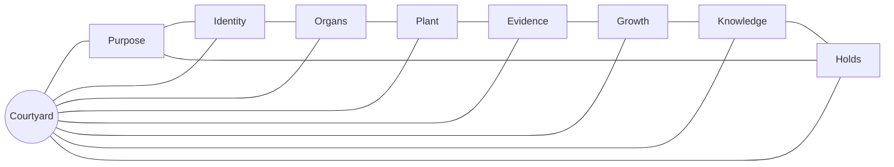
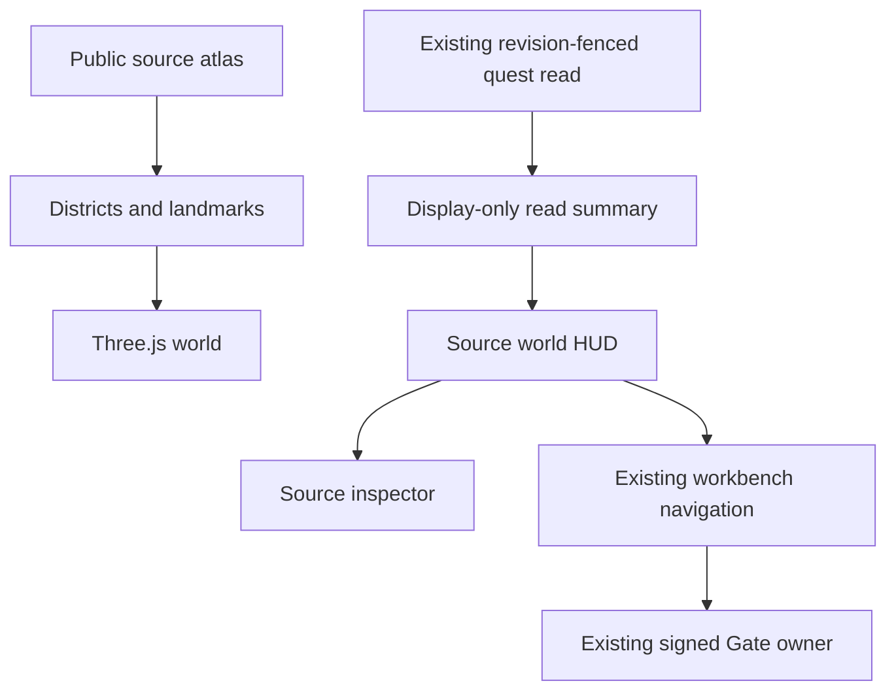
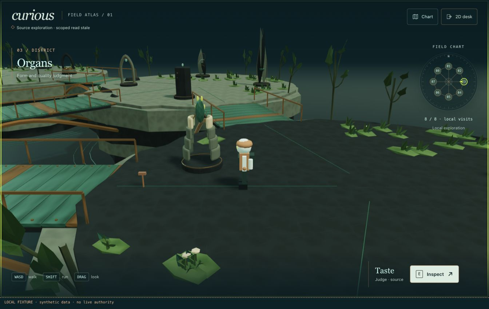
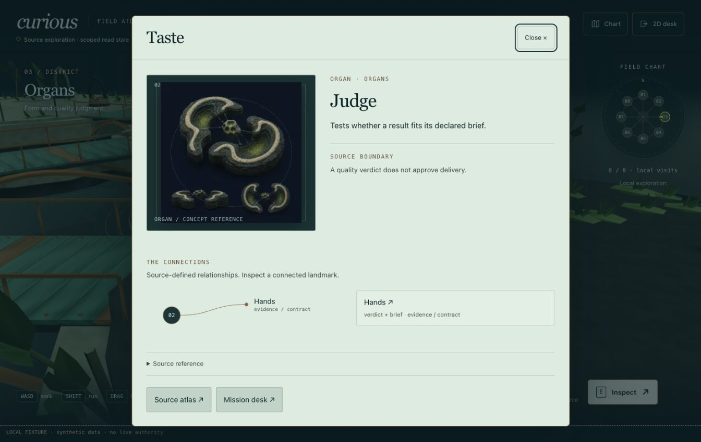
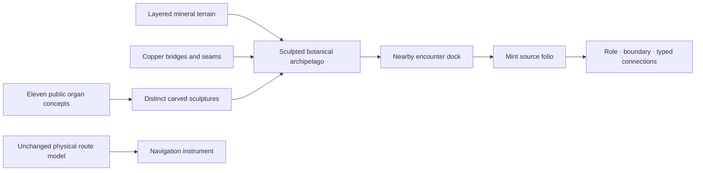
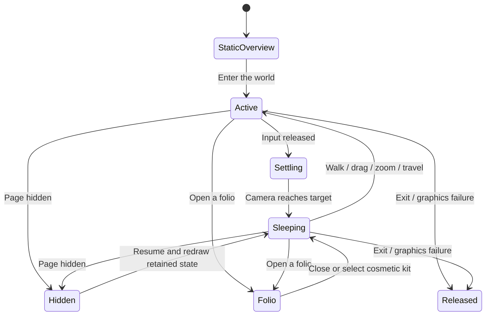
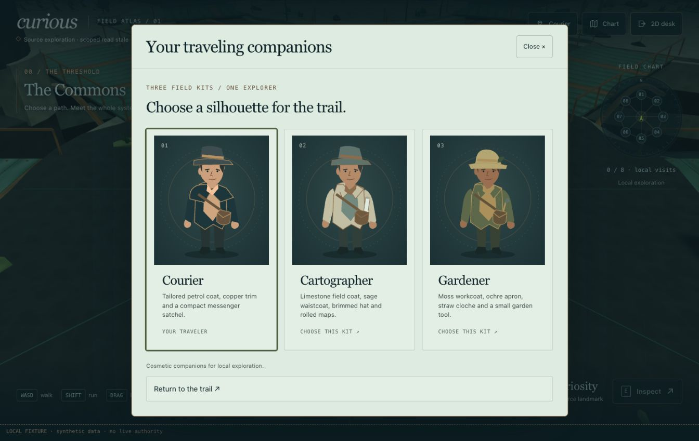
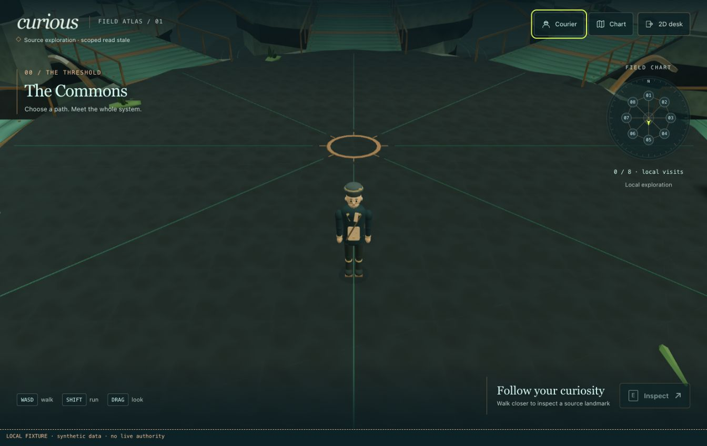

# Curious pocket world

Curious gains a walkable miniature ecosystem inside the existing browser and
Telegram page. The player explores public source contracts. Operational decisions
return to the existing workbench and its authenticated, version-bound Gate.



The eight districts contain the public atlas's eleven organs, thirteen systems
and six growth desks. Paths express traversable geography. Typed source
relationships remain inspectable; their geometry does not assert an installed
transport or current health. Landmark shapes are original procedural
interpretations of the mineral, copper and lichen reference language. Organ
portraits remain explicitly identified reference concepts.

| Input | Result |
| --- | --- |
| WASD / arrows | Camera-relative walking |
| Shift | Faster walking |
| Drag / wheel | Orbit / zoom |
| E / Inspect | Nearby source contract |
| Map | District traversal and source directory |
| Touch stick | Phone movement |
| Escape | Close inspection, then return to the workbench |

Discovery stamps describe this exploration session. They do not complete a
mission, approve work, deliver an artifact or accept an operational receipt.



The world has no fetch or action writer. Its read summary contains only a state
and label. It is cleared while a refresh is pending and held on invalid,
cross-tenant, missing, unauthorized or failed reads. No projection body, principal,
credential or private research inventory is copied into the world.

The focused build uses the existing Three/Vite package without invoking the
historical R3F app's contract synchronization. A single IIFE and scoped stylesheet
are embedded in the Worker PAGE; no separate hosting, iframe or CDN is required.
The original workbench remains the fallback and receives explicit scene links.

```sh
npm --prefix apps/cambium-r3f run curious:bundle
npm --prefix apps/cambium-r3f run curious:check
node --test apps/cambium-r3f/src/curious-world/*.test.ts
CAMBIUM_ATLAS_PREVIEW_PORT=18758 node scripts/preview-system-atlas.mjs
```

The preview server uses synthetic, read-only fixtures and refuses writes. Local
browser proof is separate from the published Worker, Cloudflare Access/Plexus,
physical Telegram devices and installed runtime acceptance. Publication and
deployment require their own later authority.

Rendering owns its canvas, geometry, materials, observers and input listeners.
Exit releases those resources; hidden documents and dialogs pause movement;
WebGL failure returns to the 2D workbench. Reduced motion disables automatic
ambient animation while retaining deliberate user movement. DPR and geometric
complexity are capped for phone use.

Implementation and fresh verification are recorded in the Curious pocket-world
ISA section. Earlier suite totals and research receipts remain historical.

The first functional baseline used the assembled Worker PAGE at `/miniapp/browser`,
including its existing quest and Fabric owners. Its affected regressions passed
353/353; the text-density harness passed 11/11. Model, read-summary, payload and
input tests are included in those results. TypeScript and a reproducible
bundle build passed. That baseline added 621,893 bytes before transport compression.

Actual in-app browser checks cover desktop walking, collision, camera, all eight
visits, source cards, old workbench return, context loss and reduced motion.
Phone-width checks at 320 and 390 pixels cover held joystick input and release,
nearby Inspect, centered cards and keyboard map travel, with no horizontal
overflow. Physical Telegram touch, sustained hardware performance and live
Cloudflare state remain separate acceptance steps. Document-hidden containment
was source-audited; real canvas blur and modal input ownership were browser-tested.


## Sculpted expedition direction





These are the read-only local preview, using public source identities and synthetic data.

The visual upgrade has two linked layers: an authored miniature landscape and a
small field instrument. The world carries spatial understanding; opening a
landmark reveals its source folio.



| Visual element | Meaning |
| --- | --- |
| Dark mineral / carved cavity | Place and organ form |
| Oxidized copper / engraved route | Structure and traversable connection |
| Mint core / limestone surface | Source identity and readable detail |
| Restrained acid accent | Current interaction |
| Botanical shore and static water contours | Environmental depth |
| Player arrow and district stamp | Actual position and local exploration |

The opening uses a static overview; deliberate entry changes to the walking
camera. Scene detail keeps the physical floor at zero and leaves the model's
routes and landmark approaches clear. Original procedural art uses owned
geometry, instancing and bounded materials. New resources follow the same disposal
owner as the original renderer. The miniature remains a source interpretation;
its cores and copper conduits do not depict live traffic or operational health.

The interface uses approved serif and system typography, an original physical
minimap, compact controls and an opened mint-paper folio. All existing keyboard,
phone input, focus containment, read-state and authenticated workbench boundaries
remain acceptance requirements. No external font or asset service is introduced.

Fresh visual-upgrade results belong to ISC-2901–2932 in the candidate ISA. The
first functional suite counts above do not accept this later appearance.

The 8 October visual upgrade passed 377 affected regression and text-density
checks with no skips; final material refinements also passed the 29 focused world
and page checks. TypeScript, deterministic bundle parity and the read-only
text-density audit passed. The existing ratified fourteen-word empty-state
override remains explicit in that audit.

The static scene contains 130,494 triangles in fifteen material/shadow batches.
Actual district views measured 33–40 draw calls and 130,890–131,842 triangles;
desktop and phone DPR remain capped at 1.5 and 1.2. Original organ sculptures rise
1.808–4.629 metres while retaining every collision footprint. Branching foliage
leaves wider landmark clearings; mineral inclusions use restrained, fine-grained
contrast. The physical source model retains eight districts and thirty landmarks.

Actual in-app-browser review covered all eight district visits, walking and
camera controls, 320/390-pixel layouts, touch hold/release and inspection, source
folios and typed navigation, modal suspension, reduced-motion idle/walking,
world exit/reentry and a real WebGL context-loss fallback. A paused phone resize
redraws one static frame; visibility return uses the same guarded redraw.
Independent source and image review resolved clipping, resize, heading, input,
material-contrast and undefined bump-scale findings. Its own browser was
unavailable, so interaction proof belongs to the parent reviewer. Physical
Telegram devices, sustained hardware performance and live deployment remain open.


## Expedition travelers and sleeping graphics

The local character follow-up uses three original expedition designs: Courier,
Cartographer and Gardener. These are cosmetic exploration companions. Changing
one preserves the world position and uses the same articulated rig, geometry and
material ownership. The selection folio uses small original vector portraits;
it introduces no second WebGL renderer or external asset request.



| Resource | Local implementation limit |
| --- | --- |
| Active frame pacing | Nominal 30 fps; measured windows obey `frames <= ceil(elapsedMs * 30 / 1000) + 1` |
| Steady idle / hidden world | No pending animation frame or HUD interval |
| Desktop canvas | At most 2 million backbuffer pixels; DPR at most 1.5 |
| Phone canvas | At most 1 million backbuffer pixels; DPR at most 1.2 |
| Traveler | Under 6,000 triangles and at most 12 visible meshes |
| Character assets | Shared procedural geometry; no new textures or dependencies |
| Lighting | Existing single bounded shadow light |

The world wakes for deliberate input, entry, resize and finite camera settling.
The chart consumes world-state events rather than a recurring timer. Background
suspension releases input and retains the same page-local position, chosen kit
and exploration stamps. This does not require an invisible graphics loop.
Browser or operating-system termination can discard a page; this slice does not
promise durable background job execution.

The implementation follows Three.js's
[rendering-on-demand guidance](https://threejs.org/manual/pages/rendering-on-demand.html)
and responds to the browser's
[Page Visibility API](https://developer.mozilla.org/en-US/docs/Web/API/Page_Visibility_API).
Rendered geometry, texture, program and framebuffer counts are owned-resource
measurements. Browser JavaScript heap samples are not total device RAM or GPU
memory measurements. Physical Telegram soak remains a separate evidence level.

Fresh acceptance for this follow-up belongs to ISC-3001–3032. The earlier visual
and regression counts above describe their earlier snapshots.





| Fresh local probe | Observed result |
| --- | --- |
| Standing still | 0 rendered frames and 0 RAF callbacks in 1,503.2 ms |
| Walking | 30 rendered frames in 1,001.6 ms |
| Shared traveler rig | 3,076 triangles, 11 meshes, 2 materials; variants use 990,792 CPU bytes |
| Cosmetic switching / three remounts | 33 GPU geometries, 6 textures and 11 programs remain stable; exit removes the canvas |
| Backbuffer | 1,328,142 desktop pixels; 267,872 at 320 CSS pixels and 375,375 at 390 CSS pixels |
| Responsive / deliberate motion | Narrow kit selection, joystick hold/release, reduced-motion walking and nearby Taste source folio verified |
| Graphics loss | Controlled WebGL context loss returns to the existing functional 2D desk |
| Regression | 394 affected tests pass in 7 suites, with no skipped tests; TypeScript and bundle parity pass |

The final embedded build is 690,436 bytes, SHA-256
`bee85861df3efecd269be4f9991b8e59445e613bbed12413383af4fe0390d366`.
The final narrow-screen typography adjustment changes CSS only; lifecycle,
movement and remount probes also retain their exact preceding bundle identity
and unchanged core source hashes in the private receipt.

The in-app browser did not emit a genuine hidden-page transition when switching
tabs. A controlled fixture exercised the actual visibility handler, observed
zero hidden scheduling and retained position/kit, then removed its temporary
getter. Native phone-size joystick holds establish local pointer behavior;
physical Telegram touch, background soak, device RAM and VRAM remain unproven.
No publication or deployment is implied by this local evidence.
