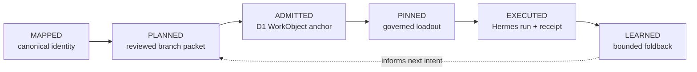

# Fitcheck golden path

Status: local reference projection. No promotion, production deployment, Goal Graph write, mapping-receipt issue, provider call, or Telegram mutation is authorized by this document.

Fitcheck is Cambium's first project-shaped tracer slice. It proves whether a mapped portfolio identity can become a governed quest without collapsing planning, operational state, execution evidence, and learning into one ambiguous record.

## One identity, several authorities

The canonical WorkObject is `sapling:fitcheck`. `FitCheck` and `getfitcheck` are display/search aliases only. They never join runtime data, authorize a write, or identify a tenant.

| Question | Authority | Current Fitcheck truth |
|---|---|---|
| What project is this? | portfolio catalog + root map | `sapling:fitcheck`, canonical parent `cambium` |
| What is the intended branch story? | reviewed product packet | supervised product branch with three missions, two KPIs, and seven explicit gates |
| What should happen now? | D1 Goal Graph | no exact live Fitcheck WorkObject task anchor has been proved in this checkout |
| Which skills may execute it? | governed loadout catalog + D1 task anchor | candidate organ route exists; no live loadout pin is claimed |
| What actually happened? | execution store + immutable receipts | no live Hermes execution is claimed |
| What may inform the next intent? | terminal receipt + bounded foldback proposal | local synthetic foldback is contract proof only |

## The lifecycle



Fitcheck is presently **mapped and planned**. Admission, pinning, execution, and learning remain visibly held until their own authorities provide exact evidence.

## Product story

Fitcheck helps a Shopify apparel merchant test a virtual try-on experience without confusing a persuasive storefront prototype with a proven app, integration, or commercial result.

The golden path contains these three packet missions:

1. **Run authenticated Shopify widget QA** — requires credentials and a screenshot plus widget event log.
2. **Wire Dodo reservation URL into production env** — requires the Payment gate and an environment receipt plus checkout smoke.
3. **Approve first merchant outreach packet** — requires the Customer contact gate and approved copy plus a target-list note.

The two packet KPIs are evidence targets, not achieved metrics:

- **Qualified merchant demo** — survive when one qualified merchant completes a demo or reservation flow; advance when one schedules a supervised pilot.
- **First merchant pilot proof** — survive when a pilot proof packet exists; advance when tracked widget events and customer proof fold into Cambium.

## One-change execution loop

Each pass changes one falsifiable thing:

```text
observe → propose one change → pass Gate → pin exact task/loadout
        → execute → preserve receipt → fold back evidence
        → propose the next bounded intent
```

The return edge never mutates operational intent directly. A terminal Hermes result may emit `proves` and `informs-next-intent` evidence; a founder-approved, version-bound D1 compare-and-swap remains the only path back into operational state.

## Surface responsibilities

| Surface | It should do | It must not imply |
|---|---|---|
| Portfolio Workbench | reconcile identity, inspect packet truth, expose missing operational anchors, prepare bounded intent | that a packet is a live task or that a repository mapping executed |
| Telegram Mini App | show current Mission Fabric state, adjudicate signed Gate proposals, inspect execution and evidence | that selecting Fitcheck starts work or that packet owners are live assignments |
| D1 Goal Graph | own desired/current state, task lineage, approvals, and graph versions | repository or packet provenance it does not contain |
| Hermes | execute an admitted, pinned directive and return terminal evidence | permission to rewrite the Goal Graph or promote a skill |
| Cortex / foldback | preserve learning and propose next intent | authority to commit that proposal |

## Gate ledger

The reviewed packet defines seven gates:

| Gate | Required before | Evidence class |
|---|---|---|
| Human approvals | submissions, wording, outreach, or public claims | explicit founder approval for the exact action |
| Spend approvals | live metered try-on generation | explicit spend approval and bound execution scope |
| Privacy/legal | handling customer media or refund/consent claims | approved retention, deletion, no-training, consent, and refund language |
| Payment | exposing a reservation/payment path | Dodo link and production-environment proof |
| Customer contact | sending merchant outreach | approved outbound copy and target-list note |
| Public claims | claiming approval, lift, or merchant outcomes | claim-specific proof packet and founder approval |
| Credentials | authenticated Shopify QA | storefront/admin access and approved runtime action route |

These are packet gates, not approved runtime actions. The UI may render them as context but cannot synthesize a signed action from them.

## Current hold line

The local schema and projection work can be reviewed now. The next operational proof still requires all of the following independently:

1. apply and verify the reviewed D1 operational-anchor migration through its governed release path;
2. read one exact current Goal Graph task carrying `sapling:fitcheck`;
3. read one exact governed Fitcheck loadout pinned to that task;
4. issue the required repository/R2 mapping receipt without treating R2 as live state;
5. approve a single execution-disabled Hermes canary and preserve its terminal foldback receipt;
6. re-read Mission Fabric and prove the evidence informs, but does not bypass, the next Gate.

## Canonical implementation references

- Product packet: [`docs/plans/product-branches/fitcheck.md`](../plans/product-branches/fitcheck.md)
- Shared UI projection: [`shared/fitcheck-golden-path.ts`](../../shared/fitcheck-golden-path.ts)
- Operating Fabric: [`docs/architecture/cambium-operating-fabric.md`](./cambium-operating-fabric.md)
- Mission Fabric contract: [`docs/architecture/contracts/mission-fabric-v1.md`](./contracts/mission-fabric-v1.md)
- Goal Graph model: [`docs/architecture/goal-graph-operating-model.md`](./goal-graph-operating-model.md)
- Hermes preflight: [`docs/project-management/hermes-execution-foldback-preflight.v1.json`](../project-management/hermes-execution-foldback-preflight.v1.json)
