# GitHub-backed knowledge plane

## Decision

Company knowledge for Hermes, Plexus, Cambium, the Fractal Tapestry, and
inference is read from the private GitHub repository
[`Sheshiyer/thoughtseed-labs`](https://github.com/Sheshiyer/thoughtseed-labs).
GitHub is the knowledge source of truth. This plane does not read or write
Cloudflare R2 or D1.

The migration is deliberately narrow. Existing D1 and R2 bindings that support
bridge execution, approved operational receipts, and portfolio evidence remain
outside this knowledge plane; they are not company knowledge stores.

## Spine

```mermaid
flowchart LR
  User["Founder, team, or model request"] --> Plexus["Plexus: identity and role only"]
  Plexus --> Policy["Role + source-path policy"]
  Policy --> GitHub["Private GitHub: thoughtseed-labs"]
  GitHub --> Projection["Bounded markdown projection"]
  Projection --> Vectorize["Cloudflare Vectorize"]
  Vectorize --> Inference["Inference retrieval"]
  Inference --> Tapestry["Cambium Fractal Tapestry"]
```



Plexus does not store, curate, retrieve, or infer knowledge. Its existing D1
resolver is retained solely to resolve an authenticated principal's role. The
Worker's internal context routes retain their service-token and tenant checks;
Plexus role enforcement for user-facing retrieval is a separate route-wiring
task and must fail closed before exposure.

## Direct-read contract

The Worker resolves the configured branch/ref to one full Git commit SHA before
reading any file. It then reads only exact, allowlisted Markdown paths at that
revision through GitHub's Contents API. The response carries repository, commit,
file SHA, and path provenance, but never raw documents, tokens, or source
response bodies.

Required runtime configuration:

- `GITHUB_KNOWLEDGE_TOKEN` — Worker secret with GitHub **Contents: read** access
  to `Sheshiyer/thoughtseed-labs` only. It must be distinct from
  `GITHUB_AGENT_TOKEN`, which is a governed command/write credential.
- `GITHUB_KNOWLEDGE_REPOSITORY=Sheshiyer/thoughtseed-labs` — committed public
  identifier.
- `GITHUB_KNOWLEDGE_REF=main` — resolved to a full SHA per request.
- `GITHUB_KNOWLEDGE_ROUTINE_ALLOWLIST_JSON` — exact routine-to-path mapping;
  globbing, traversal, directories, and unlisted paths are rejected.

Example allowlist value (provision as a Worker secret or encrypted deployment
configuration; do not put sensitive paths in public artifacts):

```json
{
  "daily-standup-digest": [
    {
      "id": "system-records",
      "title": "System of records",
      "paths": ["00-meta/system-of-records.md"]
    }
  ]
}
```

## Retrieval and inference

Hermes owns the GitHub-to-Vectorize synchronization job. It reads the same
allowlisted, policy-screened repository paths, projects bounded chunks with
commit/file provenance, and upserts only those chunks to Vectorize. Inference
queries Vectorize with tenant and kind filters; raw GitHub documents never go to
the browser or Telegram client.

The first allowlist must exclude HR, compensation, finance, invoices, legal,
contracts, payment records, credentials, private transcripts, agent outputs,
heartbeats, archives, and client material unless a separate visibility policy
allows a specific path. A source or provider failure returns a bounded
`blocked-no-signal` result, never a fallback scrape or an invented answer.

## Retired path

`CONTEXT_PROJECTIONS`, the R2-backed `POST /v1/context/projections` writer, and
the `CONTEXT_PROJECTION_WRITE_TOKEN` contract are retired for knowledge. The
route returns HTTP 410. `CAMBIUM_CORTEX` remains the Vectorize retrieval index;
it is not a source of truth.

## Rollout

1. Create the repository-scoped read token and configure the four values above.
2. Start with a single reviewed allowlist path and verify provenance plus
   `blocked-no-signal` failure behavior.
3. Enable Hermes' policy-screened Vectorize synchronization.
4. Wire Plexus role policy into user-facing retrieval before exposing it beyond
   the current internal context route.
5. Only then remove the legacy R2 projection implementation and tests in a
   separately reviewed cleanup change.

No production deployment, GitHub credential creation, Vectorize upsert, or
Plexus/D1 mutation is performed by this repository change.
