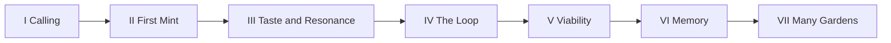

# Loops → graphs — mapping machine layers to Cambium quests

Status: **doctrine bridge** (additive). Does not change runtime authority.
Source framing: [starmex on X](https://x.com/starmexxx/status/2086854363134194094)
(LangChain: *loop engineering is a simple version of graphs* — fix **down** the stack).

## The five layers (diagnose down, not up)

| Layer | Name | Symptom if broken | Real fix (article) |
|---:|---|---|---|
| **L1** | The ask | “Add more instructions” burns tokens | examples, schema, positive constraints |
| **L2** | The context | 8× tokens for a worse answer | retrieve · rank · compact · clear dead tool output |
| **L3** | The harness | “Model bugs” that are scopes/timeouts | explicit scopes, timeouts, human-required gates |
| **L4** | The loop | “It stopped” / verifier said ok to garbage | machine-checkable exit, turn cap, rubric |
| **L5** | The graph | wrong agent selected; “graphs too hard” | name node specialties; delete decoration |

**Rule:** a symptom at L4 usually starts at L2. A bigger model on a broken harness is still locked in the empty room.

## Cambium already has this stack

```text
L1 ask      → ONBOARDING-OCTALYSIS (bounded interactions) · Gate proposals · ISA criteria
L2 context  → Mission Fabric projection · cortex recall · CodeGraph · packets (not raw vault dump)
L3 harness  → AGENTS.md · Worker RBAC · signed Gate · TE scopes · sandboxed batch
L4 loop     → organ finite run (genesis/taste/hands/will) · HOMEOSTASIS · quest fold
L5 graph    → D1 Goal Graph · six planes · 8-node INTEGRATION spine · skill-cluster resolve
```

**Quest log is not a separate tracker.** Per QUESTLOG.md it is a **pure fold** over world evidence → ledger. That is already a *simple graph*: nodes = arcs, edges = prerequisites, state = derived.

## What becomes loops vs graphs

### Keep as **loops** (L4 simple graphs)

One specialty, one exit test, one turn budget:

| Loop | Cambium surface | Exit test (machine-checkable) |
|---|---|---|
| Onboarding session | Octalysis 20-interaction | session 20/20 · drives complete · noesis peaks |
| Finite organ run | compose stage / organ | contract JSON + ISA criteria for that stage |
| Homeostasis cycle | detect drift → hold/reroll/intent | typed drift class + receipt |
| Quest arc progress | `quine quests` fold | evidence predicates only (no fake % ) |
| Skill forge mint | ≥3 signature → candidate | first verified ok use → validated |
| Heartbeat / viability | operator heartbeat | margins + missing-evidence flags |

These should **not** become multi-agent decoration. Name one node, one verifier.

### Promote to **graphs** (L5) only when fan-out is real

Multiple specialties, dependencies, or durable operational identity:

| Graph | Cambium surface | Nodes / edges |
|---|---|---|
| Goal Graph | D1 sole writer | tasks · approvals · versions · CAS edges |
| Mission Fabric | projection | WorkObject · missions · KPIs · gaps |
| Portfolio identity | catalog + root map | sapling/branch/program · provenance |
| Integration spine | INTEGRATION.md 8 nodes | Workbench → data → FS → R2 → Hermes → Plexus → TG → MCP |
| Fitcheck golden path | architecture + runbooks | IDENTIFIED → … → LEARNED (held stages explicit) |
| Conductor resolve | skill-clusters | task → cluster-orchestrator → spokes |
| Temperance fleet | te-dispatch-paid | seats ranked by live quota (host TE) |

**58% of graph failures are wrong-agent selection** (article). Cambium’s answer is already: pin specialty (`resolve-task` / loadout / organ), not “generic agent + more context.”

## Quest arcs as a dependency graph (from QUESTLOG)



| Arc | Prefer | Why |
|---|---|---|
| I–II | Loop | single-tenant, single exit |
| III–IV | Loop → light graph | micro/meso/macro are tick-rates, not agents |
| V–VI | Loop + L2 context | viability/memory are evidence folds |
| VII | Graph | multi-tenant isolation is a real multi-node system |

## Fitcheck reference path (where loops should harden first)

From ARCHITECTURE / INTEGRATION:

```text
IDENTIFIED ✓ → SYSTEMS BOUND ✓ → MAPPING VERIFIED held → PLANNED ✓
→ D1 ELIGIBLE held → ADMITTED held → PINNED held → EXECUTED held → LEARNED held
```

| Held stage | Fix layer first |
|---|---|
| Mapping verified | L3 harness + L5 identity join (receipt readback) |
| D1 eligible / admitted | L5 Goal Graph CAS + approval digest |
| Pinned / executed | L3 scopes + L4 exit receipt (Hermes pin) |
| Learned | L2 cortex compact + L4 foldback (no auto graph write) |

Do **not** “add more Opus instructions” for held stages — that is L1 failure mode.

## Temperance / GSD / ISA ownership (no rehome)

| Concern | Owner | Layer |
|---|---|---|
| Model routing / budgets | Host TE + OmniRoute | L3 transport |
| Planning slice STATE | `.planning/` | L4 GSD loop |
| Acceptance | `ISA.md` | L4 exit rubric |
| Operational graph | D1 Goal Graph | L5 |
| Quest display | pure fold over world | L4 |

## Practical checklist for new quests

1. **Write the exit test first** (ISA criterion or evidence predicate).
2. If one specialty → **loop** with turn cap + verifier.
3. If ≥2 specialties or durable ops state → **graph node** on Goal Graph with named specialty.
4. Context: Mission Fabric + ranked cortex, not full vault / full chat history.
5. Harness: signed Gate for irreversible; TE batch for parallel only with worktree isolation.
6. Never invent quest completion without world evidence (QUESTLOG invariant).

## Implementation packs (v1)

| Pack | Path | Writes graph? |
|---|---|---|
| Fitcheck L4 loops + ISA probes | [`shared/fitcheck-loop-pack.ts`](../../shared/fitcheck-loop-pack.ts) · [contract](./contracts/fitcheck-loop-pack.v1.md) | **No** |
| Quest arcs I–VII templates | [`shared/quest-graph-templates.ts`](../../shared/quest-graph-templates.ts) · [contract](./contracts/quest-graph-templates.v1.md) | **No** (admission proposal only) |
| Proactive routine (cron + Hermes + Mini App) | [`shared/proactive-loop-routine.ts`](../../shared/proactive-loop-routine.ts) · [runbook](../runbooks/proactive-loop-routine.md) | **No** (Hermes sends TG; Gate+CAS for D1) |

```bash
node --test shared/fitcheck-loop-pack.test.ts shared/quest-graph-templates.test.ts shared/proactive-loop-routine.test.ts
node scripts/proactive-loop-tick.mjs
```

## Related

- [QUESTLOG.md](../../QUESTLOG.md)
- [HOMEOSTASIS.md](../../HOMEOSTASIS.md)
- [INFINITE-GAME.md](../../INFINITE-GAME.md)
- [goal-graph-operating-model.md](./goal-graph-operating-model.md)
- [fitcheck-golden-path.md](./fitcheck-golden-path.md)
- [.planning/README.md](../../.planning/README.md)
