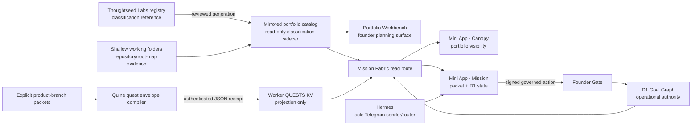

# Portfolio Workbench → Telegram Mini App linkage

Status: working-root assimilation reconciled on 2026-08-13; isolated Labs candidate and production promotion remain rollback-gated until every candidate probe passes.

## The important distinction

The Workbench does not synchronize all portfolio rows directly into the Mission scene. Cambium has two intentionally different read paths:

1. **Portfolio visibility**: the mirrored `PORTFOLIO_CATALOG` is embedded in the Workbench and joined into `GET /v1/mission-fabric/cambium`. The Mini App's Canopy can therefore show every classified WorkObject without granting it operational authority.
2. **Operational Mission state**: explicit product-branch packets are parsed by `loadBranchStories`, serialized by `quine write quests push`, accepted by the Worker's authenticated internal ledger route, and read from the active `QUESTS` KV ledger. Goal Graph admission, signed gates, execution, and receipts remain separate facts.

Making those counts equal by manufacturing branch packets would be an authority bug. Catalog membership means “visible”; a packet plus Goal Graph lineage means “operationally modeled.”

## System ownership

| Surface | Owns | Does not own |
|---|---|---|
| Thoughtseed Labs vault | Reviewed entity/classification evidence and durable human-readable context | Live task state, Telegram transport, Mini App session state, or automatic runtime writes |
| Working folders and root map | Physical repository/folder evidence and planning provenance | WorkObject classification or promotion authority |
| Portfolio catalog | A checked-in, digest-pinned, read-only WorkObject projection | Goal Graph state, agent assignment, execution, proof, or Telegram delivery |
| Portfolio Workbench | Founder review, local planning proposals, and authenticated hosted actions | Automatic Mission admission or direct Telegram delivery |
| Cambium D1 Goal Graph | Operational Mission/Task graph truth behind signed gates and CAS | Portfolio classification or transport |
| Worker `QUESTS` KV | Latest accepted quest/Mission projection | Canonical operational state or classification |
| TeamForge/Plexus | Identity, RBAC, and cross-system mappings | Goal execution or portfolio classification |
| Hermes/Temperance | Execution routing and the sole Telegram transport | WorkObject classification, D1 Goal Graph authority, or Worker deployment ownership |
| R2 | Immutable evidence/readback receipts | Goal Graph truth or live telemetry |

The vault's `CLAUDE.md` is the infrastructure context for this division. It is referenced during offline reconciliation and is never imported by the Worker or bundled into Cambium.

## Dated state comparison

The safe readback is stored in [`../evidence/2026-08-12-portfolio-miniapp-linkage-readback.v1.json`](../evidence/2026-08-12-portfolio-miniapp-linkage-readback.v1.json).

| State | Date/freshness | What it reports | Interpretation |
|---|---|---|---|
| Authenticated live Workbench | 2026-08-12 | Header: 73 total, 20 Saplings, 39 Branches, 15 Programs. Rendered cards: 73 total, 20 Saplings, 38 Branches, 15 Programs. | The header has an internal arithmetic/count mismatch. Its unreadable v4 draft is protected and autosave remains paused. |
| Local Cambium catalog | current working tree | 72 records: 17 Saplings, 40 Client Branches, 15 Internal Programs | App/Worker catalog mirrors are byte-identical and the reviewed root-map pin is advanced to the reconciled 2026-08-13 working-root census. |
| Vault registry reference | generated 2026-08-07 | 71 WorkObjects | Older classification reference; it is not silently rewritten from either live surface. |
| Mini App Mission ledger | derived 2026-08-11 12:12:56Z | Six branch packets; visible badge is stale by about 20 hours | This clock belongs to the quest-ledger projection, not the Workbench catalog. |

### Live Workbench versus local catalog

Only live:

- `sapling:klear-karma`
- `sapling:parkarea`
- `sapling:tirak`

Only local:

- `branch:klear-karma`
- `branch:safvr-landing-page`

The Workbench also contains `branch:parkarea` and `branch:tirak`, so its Sapling forms are duplicates that the local projection no longer carries. This explains the count change without converting a freshness problem into a classification problem.

### Vault reference versus local catalog

Only the 2026-08-07 vault registry:

- `sapling:klear-karma`
- `sapling:kristudios`
- `sapling:virtualtryon`

Only local:

- `branch:klear-karma`
- `branch:kristudios`
- `branch:safvr-landing-page`
- `sapling:dlock`

These are review inputs. Updating the vault registry remains an owner-reviewed vault task, not a Cambium runtime side effect.

## Explicit Mission packets

`loadBranchStories({ root }, 'cambium')` currently loads six packets:

| Packet | Canonical WorkObject | Role |
|---|---|---|
| Fitcheck | `sapling:fitcheck` | Product Sapling |
| Vantyx | `sapling:vantyx` | Product Sapling |
| IVerif | `sapling:iverif` | Product Sapling |
| DLOCK | `sapling:dlock` | Product Sapling, authority-held where evidence is incomplete |
| Snow Gloves OS | `program:snow-gloves-os` | Internal Program |
| Client delivery | none | Reusable template; never treated as an admitted WorkObject |

The other catalog rows are not “missing Mission branches.” They are visible portfolio records that have not received this explicit operational packet contract. The linkage audit represents each one with an `explicit-unadmitted-gap` Story Arc and Quest state, plus `workflow-available-unassigned` organs. This makes the missing connection navigable without pretending it is an admitted Mission.

## Working-root assimilation

The current Thoughtseed root has 62 depth-one folders. The reconciled proposal map accounts for all of them as 57 project/repository folders plus five infrastructure or exclusion folders. It performs no physical move and no vault mutation.

| Folder | Reconciled state | Authority note |
|---|---|---|
| `meristem` | `program:meristem-brand-system`, awaiting ingestion | Its project packet supplies exact repository and WorkObject evidence; the mapping still grants no D1 admission. |
| `session-atlas` | Internal Program, awaiting ingestion, no `workId` yet | Its project-birth packet is pending Cambium ingestion; TeamForge identity must precede a canonical catalog row. |
| `scroll-world` | Infrastructure/external skill reference | External upstream repository; not a Thoughtseed WorkObject. |
| `klear-karma` | `branch:klear-karma` | The unsupported fourth root kind and orphan `co-founded-venture:*` ID were removed; its co-founded relationship remains account/provenance context, not a new WorkObject grammar. |

The machine report now covers, in one read-only result:

- 62/62 physical folders with zero missing or unexpected rows;
- 72/72 catalog WorkObjects with unique identities;
- five packet-backed Story Arcs and 67 explicit unadmitted gaps;
- 48 packet-backed Quest rows;
- all five organ workflow definitions, with assignments kept unclaimed until receipt-backed;
- Canopy visibility for every WorkObject and Mission visibility only where packet evidence exists;
- Hermes as the only Telegram transport.

## What changes each surface

| Change | Required governed path | Visible result |
|---|---|---|
| Classification or repository evidence changes | Review source → regenerate both catalog mirrors/root map → advance reviewed pins → test → release | Workbench and Canopy catalog projection |
| Workbench local planning choice | Preserve readable local draft or submit an authenticated hosted action | Planning proposal only; no automatic Mission mutation |
| New or edited product-branch packet | Validate packet → compile quest envelope → authenticated internal ledger push with exact JSON receipt | Mission branch arc and freshness |
| Mission/Task operational change | Founder-signed Gate → D1 CAS commit | Mission Fabric operational projection |
| Telegram notification | Receipt-backed delivery instruction → Hermes validation/transport | Telegram topic delivery; Cambium remains non-sender |

## Production read-path boundary

The one approved direct-Worker push returned an exact JSON receipt, while the protected custom-domain Mission read remained on the older timestamp. Fresh Labs control-plane readback then proved that the direct Worker and custom hostname are the same Worker deployment. The apparent `CONTEXT_PROJECTIONS` discrepancy was a stale checked-in declaration: that R2 writer is retired for the knowledge plane and must remain absent. Therefore the remaining boundary is **between accepted direct-Worker state and the protected custom-domain read projection**, with exact active binding parity and candidate source provenance as release gates.

The earlier receipt cannot prove custom-domain freshness, and no second diagnostic ledger push is permitted. The isolated candidate must preserve every active secret/binding name, add only reviewed declared topology, pass preview route/portfolio/Mission probes, and leave traffic untouched until the candidate UUID is explicitly verified.

## Repository-safe audit and promotion gates

The linkage audit in `scripts/portfolio-miniapp-linkage.mjs` reports:

- catalog and root-map mirror parity;
- reviewed pin drift;
- canonical packet identities, templates, and unknown WorkObject references;
- optional offline vault and dated live-Workbench diffs;
- release blockers without rewriting any source.
- exact working-root coverage and unresolved intake rows;
- per-WorkObject filesystem, Story Arc, Quest, organ, Canopy, Mission, and Telegram transport states.

With the reconciled root snapshot and reviewed pin, the audit reports `aligned` for local authority/mirror/root coverage. That result makes an isolated candidate eligible for the remaining release gates; it does not make the dirty primary checkout deployable.

## Rollback-gated live step

The founder approved the isolated candidate and rollback-gated repair in this iteration. The bounded sequence is:

1. reproduce the verified patch in a clean worktree and pass focused/full release checks;
2. re-read the current Labs active Version, binding signature, and rollback UUID;
3. upload exactly one inert Version through the direct Cloudflare API, preserving the active binding signature exactly and keeping production traffic unchanged;
4. verify candidate UUID, bindings, health, fail-closed auth, portfolio counts, and Mission gaps;
5. promote only that verified UUID to 100 percent;
6. re-read production traffic, bindings, Access, Workbench, and Mission; immediately restore the recorded prior Version at 100 percent if any gate fails.

No second ledger push, personal-account deployment, Access weakening, credential mutation, vault write, Hermes mutation, or Telegram send is part of this repair.
