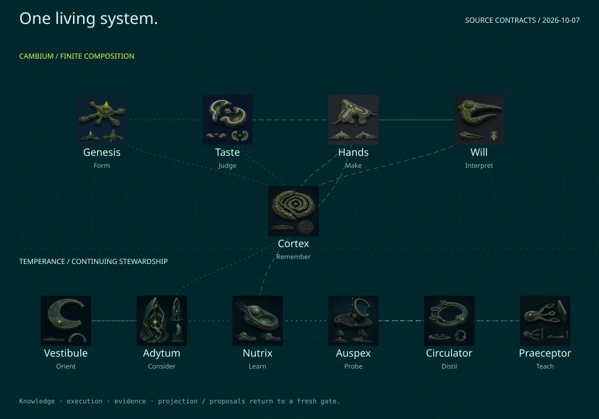
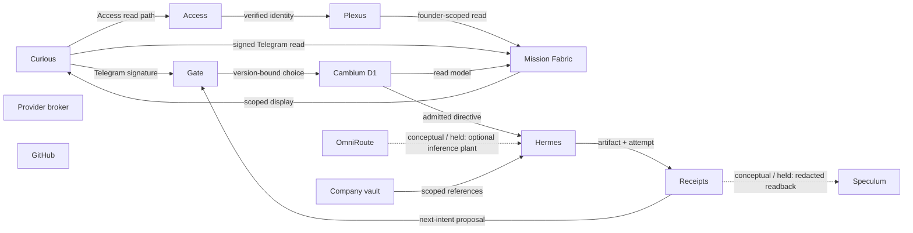

# The connected system — source atlas

[Open the interactive visual guide](../explainers/system-atlas-2026-10-07/index.html).



The same public-safe model and renderer serve the Mini App atlas and the visual
field guide. This edition is source evidence; local interaction proof and live
operational acceptance remain separate. It adds no command, identity or schedule.

| Organ | Family | Receives | Produces |
| --- | --- | --- | --- |
| Genesis | cambium | Approved brief + Source assets | Brand DNA + Copy + visual systems |
| Taste | cambium | DNA + exemplars + Artifact + checks | Quality verdict + Reroll or hold |
| Hands | cambium | Admitted task + Pinned capability | Artifact + Verifier handoff |
| Will | cambium | Product + DNA + Audience + verdict | Review packet + Approved delivery handoff |
| Cortex | cambium | Redacted receipts + Versioned context | Relevant retrieval + Next-intent proposal |
| Vestibule | temperance | Project + phase + Prior-session signals | Orientation + Source-tagged context |
| Adytum | temperance | Orientation + Distinct memory planes | Next-action card + Uncertainty or no action |
| Nutrix | temperance | Session outcome + Failures + receipts | Learning signals + Reviewable belief seeds |
| Auspex | temperance | Scoped health evidence + Containment contract | Health report + Eligibility or hold |
| Circulator | temperance | Signals + decisions + Health reports | Recommendation digest + Flag-change proposal |
| Praeceptor | temperance | Recent substrate + Learning signals | Proposed skills + Bounded workflow suggestions |

Cortex is cross-cutting. Finite composition runs Genesis → Taste → Hands → Will.
The six growth desks sit inside Will and use existing execution owners.



Permission, transport and semantic receipts occupy separate strata. An admin
email, successful transport, source image or local render cannot replace them.
Current Access policy, Plexus membership, organ callback/containment/usefulness,
learning and soak acceptance require named owner receipts.

Private growth prose stays in the vault; the atlas uses the reviewed public
growth topology. Effectful enrollment input and incomplete cell machine verbs
remain held. Superset, Constellation and the retired app planes are historical.
Snow Gloves local recovery is a separate product proof, not Cambium deployment.

Source contract: [system-atlas-v1](contracts/system-atlas-v1.md).
Machine projection: [system-atlas.v1.json](system-atlas.v1.json).
Portrait provenance: [PORTRAITS.v1.json](../assets/visual-flow/system-atlas/PORTRAITS.v1.json).

Verify without writing:

```sh
node scripts/build-system-atlas-portraits.mjs --check
node scripts/generate-system-atlas.mjs --check
```

Generated by `scripts/generate-system-atlas.mjs`; model digest sha256:8c3b1a1cfa7c3fb63a32127ef07ceb348c5605fddba1d04e39da65d6930d1a1f.
