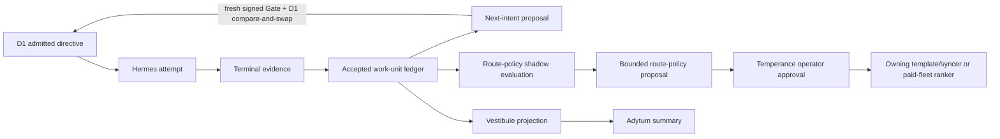

# Temperance continuous-learning integration contract

Status: **Doctrine / local documentation contract**. This document does not prove an installed or live learning loop.

## Purpose

Cambium projects may contribute accepted execution evidence to Temperance without giving telemetry, organs, Hermes, or a projection surface planning authority. The learning unit is one immutable accepted work unit, not an isolated provider call.

The planned versioned contract is `temperance.accepted-work-unit.v1`. Until its machine-readable schema, validator, and immutable writer exist, Cambium must not label a chain complete or accepted. A conforming unit binds:

- the exact WorkObject, work-unit, run, task, phase, correlation, decision, attempt, and verdict identities;
- the admitted feasible candidate-set digest, required decision-time `selection_propensity`, decision revision, and selected provider, connection, model, protocol, lane, executor, and harness;
- the policy, catalog, quota, capability, and circuit snapshots used at admission;
- task-difficulty features; quota windows, reservation, lease, concurrency, and ready-at evidence;
- terminal execution, failure class and scope, verification, cost, latency, utility, and acceptance evidence;
- the result lineage that identifies which output was accepted;
- policy, schema, and resolver revisions plus provenance, observation time, freshness, expiry, and redaction version;
- `next_intent_gate_ref`, allowed only for D1 next-intent foldback and bound to the existing signed Gate;
- `route_policy_operator_approval_ref`, allowed only for a Temperance route-policy proposal and bound to explicit Temperance operator approval.

Missing fields remain unknown. They are never inferred from a successful HTTP status, a projected banner, or a later aggregate.
Evaluation must control correlated retries, censoring, adaptive-selection bias, and duplicate outcomes.
The validator must reject a missing decision-time propensity and reject either approval reference when its authority kind does not match the proposal kind.

## Authority-preserving flow

- D1 remains the operational-intent authority.
- Hermes executes only an admitted, pinned directive and records terminal evidence.
- The accepted work-unit ledger is append-only evidence; it cannot mutate D1, provider policy, or live combos.
- Accepted evidence may emit a next-intent proposal; only the existing signed Gate plus graph-head compare-and-swap path may commit it to D1.
- Route-policy shadow evaluation may emit a separate proposal with confidence, exposure, and rollback bounds. Only Temperance operator approval plus the owning template/syncer or paid-fleet ranker may apply it. D1 never promotes route policy.
- Vestibule and Adytum target read-only projections. Current Vestibule orientation refreshes and rewrites provider claims, so this integration remains held until claim coordination is separated and a zero-write test passes.

## Three-vector learning boundary

| Vector | Evidence learned | Hard limit |
|---|---|---|
| V1 quota spread | binding window, reset boundary, reservation, exhaustion, freshness | unknown or stale quota cannot be converted into availability |
| V2 task fit | task/phase requirements, verified capability, accepted-result utility | synthetic combo-name similarity is not production fit evidence |
| V3 reliability | terminal outcomes, failure domain, latency, cost, verification and acceptance | HTTP success alone is not accepted quality |

Binary eligibility gates run before any weighted score. Learning may adjust weights only inside the feasible set; it cannot re-admit an unauthorized, unavailable, incompatible, or circuit-open connection.

## Long-horizon projection

The 900k-1M coding-context rule is a routing preference and projection input, not a durable queue. A long-horizon message board may project:

- objective, phase, dependencies, checkpoints, and next safe action;
- selected rail and resolved attempt history;
- context-budget estimate and compaction checkpoints;
- organ lifecycle state and deduplication key;
- blockers, acceptance evidence, and rollback boundary.

The board does not own admission, scheduling, provider mutation, or completion claims. Every displayed state must link to a durable source receipt and declare its freshness.

## Organ and combo obligations

Every organ invocation needs `proposed -> admitted -> started -> terminal -> accepted/rejected -> learned` lifecycle evidence, an idempotency key, correlation identity, and explicit authority. Auspex health must distinguish endpoint reachability from provider usability. Praeceptor safety holds remain binding.

Template-owned combos change through their source template and synchronizer. Paid-fleet order changes through its ranker. Any utility-based proposal must account for quota windows, exact-seat leases, concurrency reservations, cost, verified task fit, reliability, provider diversity, and failure-domain diversity, then pass dry-run, rollback, live read-back, and scheduled-convergence checks.

## Cambium and connected-repository adoption

1. Emit the accepted work-unit contract from one execution-disabled Fitcheck/Hermes canary.
2. Prove terminal evidence folds into a proposal without changing D1 or a live combo.
3. Render the same immutable unit in Vestibule, Adytum, and the long-horizon board with zero write side effects.
4. Run replay, deduplication, malformed-result, stale-quota, concurrency, rejected-result, and rollback tests.
5. Admit one rollback-bounded real adapter canary only after source, installed, live-event, and failure-isolation receipts agree.
6. Reuse the contract across connected repositories only after each repository names its WorkObject, authority boundary, source owner, and acceptance gate.

These steps are not executable phase gates yet. Each remains `HELD` until a checked-in `temperance.learning-phase-acceptance.v1` receipt names its owner, exact source revision, artifact digests, producing and verifying commands, success and typed failure codes, upstream receipt digests, evidence layers, approval, expiry, and rollback. The planned `temperance-learning-verify` command and receipt schema do not yet exist.

## Explicit non-claims

This document does not assert that production candidate generation, accepted-result lineage, unbiased replay, utility-ranked live combo writes, Vestibule/Adytum read-only purity, a durable long-horizon board, or a live Hermes learning loop is implemented. It authorizes no provider, D1, GitHub, deployment, publication, or connected-repository mutation.
