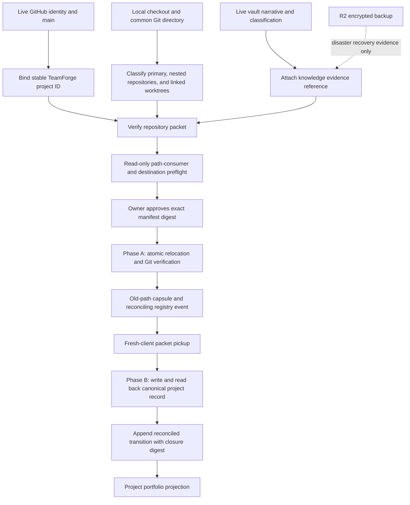

# Cambium relocation and portfolio reconciliation preparation

**Status:** active preparation; no relocation authority  
**Observed:** 2026-08-07  
**Repository:** `Sheshiyer/cambium`  
**GitHub owner:** [#287](https://github.com/Sheshiyer/cambium/issues/287)

This record preserves the current relocation state and the future sequence for
moving Cambium into the portfolio code root without losing its portfolio
implementation, creating nested Git ambiguity, or treating a backup as a live
checkout. It is a coordination record, not an execution runbook.

No statement here authorizes a rename, copy, clone, fetch, merge, checkout,
worktree removal, registry transition, R2 restore, deployment, or native-client
mutation.

## Path aliases

Committed Cambium documentation does not retain machine-local absolute checkout
paths. The relocation tool or an owner-approved manifest resolves these aliases
at execution time:

| Alias | Meaning |
|---|---|
| `$VAULT` | current PARA/Obsidian vault root |
| `$PROJECTS` | portfolio-first code root |
| `$CAMBIUM_OLD` | current Cambium checkout below the vault code tree |
| `$CAMBIUM_NEW` | proposed `$PROJECTS/thoughtseed/cambium` checkout |
| `$TEMPERANCE_REPO` | Temperance Engine repository containing relocation design and implementation plans |

## Source authority stack

These five external planning documents retain their historical decisions. This
record supplements their time-sensitive counts with observed current state; it
does not rewrite them.

| Source | Role retained here |
|---|---|
| `$TEMPERANCE_REPO/docs/plans/2026-08-03-vault-project-relocation-design.md` | ratified portfolio roots, authority split, packet, capsule, transaction, rollback, and reconciliation lifecycle |
| `$TEMPERANCE_REPO/docs/plans/2026-08-03-vault-project-relocation.md` | implementation sequence, approval boundaries, and rejection of linked worktrees/nested repositories without graph-specific plans |
| `$TEMPERANCE_REPO/docs/plans/2026-08-04-repository-grammar-execution.md` | exact repository grammar and classification rules |
| `$TEMPERANCE_REPO/docs/plans/2026-08-04-vault-relocation-status-and-sequencing.md` | build history, canary sequencing, and historical readiness evidence |
| `$TEMPERANCE_REPO/docs/plans/2026-08-07-vault-relocation-execution-handoff.md` | Phase A/Phase B distinction and the handoff state before the current relocation wave |

Current repository, filesystem, GitHub, and registry probes outrank stale counts
or path claims in those dated plans.

## Correction to the earlier portfolio handoff

The earlier OPUS remains useful provenance, but its location claim is stale.

| Earlier claim | Observed correction | Consequence |
|---|---|---|
| The isolated `cambium-portfolio-registry` worktree is authoritative. | That worktree path is absent. | Never copy or reconstruct from the missing path. |
| The portfolio implementation exists only in that worktree. | PR [#278](https://github.com/Sheshiyer/cambium/pull/278) is merged, and every named Cartographer, Worker, plan, and ISA path exists on GitHub `main`. | GitHub `main` is the code authority. |
| The primary checkout does not contain the slice, so it may be lost. | The checked-out relocation branch is not current `main`; absence from that tree does not imply absence from the repository. | Resolve against live GitHub main before future pickup. |
| The primary checkout branch is the relocation outcome. | PR [#286](https://github.com/Sheshiyer/cambium/pull/286) is merged into live main, while the local checkout remains on its source branch and is ancestry-divergent from live main. | Do not relocate the current branch as if it were a fresh canonical main checkout. |

Live GitHub main was `ca6a7a73fd9a68e38c47c7628a8ba6691360d65a`
when this record was prepared. That SHA is evidence for this snapshot, not a
permanent pin for future execution.

## Current Cambium repository graph

Cambium is one Git common directory with five registered worktrees:

| Checkout role | Branch/ref at observation | HEAD | Dirty paths | Relocation interpretation |
|---|---|---|---:|---|
| primary | `project-management/relocation-records` | `be41feb` | 9 | protected working bytes; PR #286 merged, but this is not live main |
| parity worktree | detached | `158dac7` | 2 | protected working bytes; separate owner disposition required |
| context projections | `codex/lifecycle-context-projections` | `d35b5e9` | 0 | linked worktree; branch is no longer on origin |
| operating fabric | `codex/cambium-operating-fabric` | `11d1c8a` | 0 | linked worktree with preserved implementation history |
| release proof | detached | `2c060d6` | 0 | linked release-evidence checkout |

The proposed `$CAMBIUM_NEW` path is absent. The six-file repository packet is
present in the current primary checkout:

- `PROJECT.md`
- `AGENTS.md`
- `CLAUDE.md`
- `.project/CONTEXT.md`
- `.project/project.yaml`
- `.project/HANDOFF.md`

Packet presence is necessary but not sufficient. The existing relocation
transaction rejects linked-worktree graphs, so Cambium is held until a separate
owner-reviewed decision proves how each registered worktree is preserved,
retired, or relocated.

## Destination portfolio snapshot

The destination Thoughtseed root currently contains **25 top-level
directories**, but directory count is not repository count:

- **22** top-level directories are exact standalone Git toplevels.
- **3** top-level directories are non-Git portfolio containers.
- Those containers hold **10** nested primary Git repositories.
- The relocation registry therefore represents **32 logical repositories**.
- Parkarea contains one additional healthy linked worktree; it is a checkout of
  `parkarea-aleph`, not a thirty-third project.

Every one of the 22 top-level repositories has a complete six-file repository
packet at the destination and a complete six-file relocation capsule at its old
path. Physical presence still does not imply Phase B completion.

### Top-level standalone repositories

| Destination directory / stable ID | Verified GitHub identity | Registry state |
|---|---|---|
| `brandmint-showcase` | `Sheshiyer/brandmint-showcase` | reconciling |
| `brandmint-v2` | `Sheshiyer/meristem` | reconciling |
| `bwssb` | `Sheshiyer/bwssb` | reconciling |
| `explee-skills` | `Sheshiyer/explee-skills` | reconciling |
| `fitcheck-landing` | `Sheshiyer/fitcheck-landing` | reconciling |
| `fmrl` | `Sheshiyer/fmrl` | reconciling |
| `github-next-wave-orchestrator` | `Sheshiyer/github-next-wave-orchestrator` | reconciling |
| `gram-cli` | `Sheshiyer/glam-cli` | reconciling |
| `hostscalev0` | `Sheshiyer/hostscalev0` | reconciling |
| `manifest-skill-cluster` | `Sheshiyer/manifest-skill-137` | reconciling |
| `monthlymealprep` | `Sheshiyer/rasa` | reconciling |
| `motionsites-export` | `Sheshiyer/motionsites-skills` | reconciling |
| `newsense` | `Sheshiyer/newsense` | reconciling |
| `newsense-launch` | `Sheshiyer/newsense-spatial` | reconciling |
| `ratan-pitch` | `Sheshiyer/Akshara-coauthor` | reconciling |
| `ratandevelopers` | `Sheshiyer/ratandevelopers-property-coauthor` | reconciling |
| `rssfeedscrapper` | `Sheshiyer/agentfount` | reconciling |
| `swarm-architect-skill` | `Sheshiyer/swarm-architect-skill` | reconciling |
| `synchronized-universe-blog` | `Sheshiyer/harshtruths-blog-v1` | reconciling |
| `thoughtseed-brand-atlas` | `Sheshiyer/thoughtseed-brand-atlas` | reconciled |
| `thoughtseed-paperclip` | `Sheshiyer/thoughtseed-paperclip` | reconciling |
| `virtualtryon-3d` | `Sheshiyer/virtualtryon` | reconciling |

### Non-Git containers and nested primary repositories

| Container-relative repository | Stable ID | Verified GitHub identity | Registry state |
|---|---|---|---|
| `klear-karma/kkv2-admin-panel` | `klear-karma.kkv2-admin-panel` | `Sheshiyer/kkv2-admin-panel` | reconciling |
| `klear-karma/kkv2-klear-karma-rn` | `klear-karma.kkv2-klear-karma-rn` | `Sheshiyer/kkv2-klear-karma-RN` | reconciling |
| `klear-karma/klear-karma-website-v2` | `klear-karma.klear-karma-website-v2` | `Sheshiyer/klear-karma-website-v2` | reconciling |
| `parkarea/parkarea-aleph` | `parkarea.parkarea-aleph` | `Sheshiyer/parkarea-aleph` | reconciling |
| `parkarea/wiki` | `parkarea.wiki` | `Sheshiyer/parkarea-wiki-v0` | reconciling |
| `tirak/admin-webapp/tirak-admin-command-center` | `tirak.admin-webapp.tirak-admin-command-center` | `pineappleinnovationlabs/tirak-admin-command-center` | reconciling |
| `tirak/backend/tirak-backend-alpha01` | `tirak.backend.tirak-backend-alpha01` | `Sheshiyer/tirak-backend-alpha01` | reconciling |
| `tirak/standalone-repos/tirakplus` | `tirak.standalone-repos.tirakplus` | `Sheshiyer/tirakplus` | reconciling |
| `tirak/standalone-repos/tirakplus0admin` | `tirak.standalone-repos.tirakplus0admin` | `Sheshiyer/tirakplus0admin` | reconciling |
| `tirak/tirakwiki/wikiv2-tirakapp` | `tirak.tirakwiki.wikiv2-tirakapp` | `Sheshiyer/wikiv2-tirakapp` | reconciling |

Parkarea's `.claude/worktrees/production-test-data-scrub` checkout resolves to
the `parkarea-aleph` common directory and must be modeled as a linked worktree,
not registered as another stable project.

### Classification rule that avoids outer-vault false positives

`git rev-parse --is-inside-work-tree` is insufficient: when run inside a
capsule or ordinary vault directory, Git can walk upward and report the outer
vault repository. A candidate is an exact repository only when both are true:

1. the candidate owns an exact `.git` directory or linked-worktree `.git` file;
2. `git rev-parse --show-toplevel` equals the candidate path.

Then inspect `git rev-parse --git-common-dir` and `git worktree list
--porcelain` before deciding whether the candidate is a primary repository or a
linked checkout.

## Authority model

| Fact | Canonical owner | Cambium / vault / R2 role |
|---|---|---|
| `project_id`, `client_id`, cross-system binding | TeamForge Cloudflare control plane | Cambium and vault reference; neither invents replacements |
| product/project active classification and narrative | live founder vault | Cambium projects it; R2 can recover encrypted backup evidence |
| committed code, branches, issues, PRs, reviews | GitHub | local checkout executes; R2 code snapshots are non-authoritative |
| uncommitted repository bytes and Git graph | local repository common directory | relocation must preserve and verify them directly |
| portable technical pickup | repository six-file packet | fresh clients resolve it without importing native sessions |
| old location and relocation evidence | old-path six-file capsule | pointer and rollback evidence only; never a repository |
| temporary relocation lifecycle | Cambium relocation registry | append-only `reconciling` → `reconciled` evidence |
| current canonical project-management outcome | Cambium canonical project record | written/read back in Phase B before reconciliation closes |
| binary durability and disaster recovery | encrypted R2 backup | one-way backup; `.git` excluded; never live code sync |

Paths and basenames are mutable attributes. The durable join is:

```text
TeamForge project ID
  + verified GitHub owner/repository
  + repository packet digest
  + relocation evidence digest
  + current-path attribute
```

## R2 boundary

The phrase “R2 synced vault copy” is unsafe shorthand. The ratified runbook says:

- R2 is an encrypted, one-way vault backup, not a founder-machine sync path.
- `.git` is excluded; GitHub is the code-history recovery source.
- A restore is a deliberate disaster operation into an empty recovery
  directory, not an input to a live project checkout.
- Nested repository content in R2 is a vault-adjacent snapshot only. It may help
  recover lost knowledge attachments or corroborate historical classification,
  but it must not be restored into a live code/runtime path.

Normal post-move portfolio mapping reads the live vault. If the live vault is
unavailable after a disaster, an owner-approved R2 restore can supply a
read-only recovery workspace; GitHub separately reconstitutes each repository.
The two sources are joined by stable identity and evidence digests, never by
copying one directory tree over the other.

## Preparation data contracts

```ts
type RepositoryGraphSnapshot = {
  observedAt: string;
  primaryCheckout: { pathRef: string; head: string; branch: string; dirty: boolean };
  commonDirRef: string;
  linkedWorktrees: Array<{
    pathRef: string;
    head: string;
    branch: string | null;
    dirty: boolean;
    disposition: "preserve" | "retire-after-proof" | "separate-graph-plan";
  }>;
};

type PortfolioIdentityBinding = {
  stableId: string;
  teamForgeProjectId: string;
  githubRepository: string;
  portfolio: "thoughtseed" | "tryambakam-noesis";
  pathRef: string;
  topology: "standalone" | "nested-primary" | "linked-worktree" | "container";
  packetDigest: string | null;
  registryEntryRef: string | null;
};

type RelocationReadiness = {
  identityVerified: boolean;
  packetVerified: boolean;
  destinationAbsent: boolean;
  sameDevice: boolean;
  worktreeGraphApproved: boolean;
  workingBytesApproved: boolean;
  pathConsumersResolved: boolean;
  manifestDigest: string;
  ownerApprovalRef: string;
};

type KnowledgeEvidenceRef = {
  liveVaultRef: string;
  r2RecoveryRef: string | null;
  evidenceDigest: string;
  classification: "live-vault" | "r2-disaster-recovery";
  codeAuthority: false;
};

type PostMoveReconciliation = {
  stableId: string;
  currentPathRef: string;
  githubRepository: string;
  packetDigest: string;
  relocationEvidenceRef: `sha256:${string}`;
  canonicalProjectRecordRef: string;
  closureManifestDigest: string;
  readbackVerified: boolean;
  transition: "reconciling" | "reconciled";
};
```

## Portfolio Workbench mapping-session contract

The current Portfolio Workbench is a 72-record, offline, proposal-only
planning artifact. It does not scan the filesystem and it does not yet contain
a repository/folder topology overlay. A later implementation may use it as the
human review surface only after a deterministic read-only snapshot has been
produced outside the browser.

The handoff packet for that future surface is:

```ts
type PortfolioFolderMappingProposal = {
  schema: "thoughtseed.portfolio-folder-mapping-proposal.v1";
  proposalOnly: true;
  observedAt: string;
  inventory: {
    topLevelDirectories: 25;
    standaloneRepositories: 22;
    containers: 3;
    nestedPrimaryRepositories: 10;
    logicalRepositories: 32;
    linkedWorktrees: 1;
  };
  records: Array<{
    stableId: string;
    workObjectId: string | null;
    teamForgeProjectId: string | null;
    githubRepository: string | null;
    pathRef: string;
    containerId: string | null;
    topology: "standalone" | "nested-primary" | "linked-worktree" | "container";
    reconciliation: "reconciling" | "reconciled" | "not-applicable";
    joinState: "exact" | "unmapped" | "conflict" | "stale-evidence";
    packetDigest: string | null;
    relocationEvidenceDigest: string | null;
    blockers: string[];
  }>;
};
```

`pathRef` is alias-relative or portfolio-root-relative. The packet cannot carry
a founder-machine absolute path, secret, native session identifier, raw vault
note, Git credential, or R2 object body.

### Read-only mapping flow

| Stage | Input authority | Operation | Output | Mutation ceiling |
|---|---|---|---|---|
| 1. Inventory | live `$PROJECTS` filesystem plus exact Git commands | classify each candidate as container, standalone, nested primary, or linked worktree | deterministic topology snapshot | read-only |
| 2. Identity join | TeamForge stable ID plus verified GitHub owner/repository | exact join; never basename or fuzzy-name matching | identity-bound repository rows | read-only |
| 3. Knowledge join | live vault classification and current relocation registry | attach narrative, packet/evidence digests, and `reconciling`/`reconciled` truth | evidence-bound mapping proposal | read-only |
| 4. Founder review | mapping proposal plus the 72-record WorkObject catalog | filter, group, inspect conflicts, and propose corrections in the Workbench | reviewed proposal export | browser-local only |
| 5. Execution handoff | approved proposal digest | reference the reviewed rows from a later Phase A manifest | owner-reviewable execution input | no apply in mapping session |

R2 may contribute a disaster-recovery evidence reference only. It cannot supply
the live path, Git graph, repository identity, or browser data source.

### Review rules

- A container groups repositories but never becomes a repository merely because
  it is a top-level directory.
- A nested primary repository is one logical project with its own GitHub and
  TeamForge identity.
- A linked worktree is another checkout of its common repository, not another
  project or relocation-registry row.
- `unmapped`, `conflict`, and `stale-evidence` remain visible review states;
  the Workbench cannot auto-create identities or silently choose a match.
- The initial mapping proposal must reproduce 25 top-level directories, 32
  logical repositories, one linked worktree, 31 `reconciling` entries, and one
  `reconciled` entry before a founder review can begin.
- Workbench review may export JSON or Markdown proposals. It cannot move files,
  change Git, write TeamForge/Vault/registry state, restore R2, or deploy code.
- Implementing the mapping overlay is a separate reviewed product change. This
  preparation defines its input/output and safety contract; it does not claim
  the overlay exists today.

## Future flow



R2 has no edge into Phase A, the checkout, Git verification, or GitHub state.

## Cambium-specific future sequence

### Gate 0 — keep the current preparation boundary

- Preserve the primary checkout's working bytes and the two dirty parity paths.
- Do not reconstruct the deleted portfolio worktree.
- Treat live GitHub main as the portfolio implementation source.
- Keep this record, the roadmap, handoff, and owning issue synchronized.

### Gate 1 — reconcile Git state before relocation

1. Start from a freshly verified live main, not the current source branch.
2. Review whether any uncommitted continuity work must become a PR; never clean
   or discard it merely to satisfy relocation.
3. Give each linked worktree an explicit owner-approved disposition backed by
   branch/HEAD and dirty-state evidence.
4. Prove the resulting Git common-directory graph is supported by the chosen
   relocation path. If not, write and approve a graph-specific relocation plan.

### Gate 2 — produce one exact Phase A manifest

The future dry-run must bind:

- `$CAMBIUM_OLD` and `$CAMBIUM_NEW`;
- stable ID `cambium`, portfolio `thoughtseed`, and GitHub identity
  `Sheshiyer/cambium`;
- live main HEAD and canonical refs;
- complete untracked/ignored/dirty and worktree-graph evidence;
- packet digest and exact old-path capsule render;
- path-consumer inventory, destination absence, same-device proof, and rollback;
- registry path, owner approval reference, and exact manifest digest.

No apply step begins until an owner approves that exact digest in a separate
execution task.

### Gate 3 — Phase A acceptance

Future execution may call the physical relocation complete only when all of the
following agree:

- destination filesystem and Git graph;
- HEAD, refs, remotes, working bytes, and worktree administration;
- unchanged repository packet digest;
- exact old-path capsule and relocation receipt;
- one append-only `reconciling` registry transition;
- fresh-client pickup from the packet with no session import.

### Gate 4 — Phase B reconciliation

Physical relocation is not portfolio reconciliation. The future owner must:

1. write the verified current path, GitHub identity, packet/knowledge refs,
   lifecycle metadata, and content-addressed relocation evidence into the
   canonical Cambium project record;
2. read it back and verify its digest against the closure manifest;
3. append `reconciled` with actor, owner ratifier, close time, canonical record,
   and closure-manifest digest;
4. retain the old-path capsule and append-only registry history as evidence.

The current portfolio demonstrates why this gate matters: 32 entries exist, but
31 remain `reconciling`; only `thoughtseed-brand-atlas` has a canonical project
record and closed reconciliation evidence.

### Gate 5 — portfolio knowledge projection

After Cambium itself is graph-safe and reconciled:

- resolve project IDs from TeamForge;
- resolve code and engineering state from GitHub;
- resolve current narrative/classification from the live vault;
- use R2 only when an explicit disaster-recovery workspace is required;
- classify containers, primary repositories, and worktrees separately;
- project current path, knowledge refs, reconciliation state, and evidence
  freshness into Cambium without creating another writer.

## Completion conditions for this preparation task

- This record is linked from the continuity index and active planning surfaces.
- One GitHub issue owns future readiness and reconciliation.
- The roadmap sequences Phase A and Phase B without implying execution.
- The handoff records exact blockers and read-only verification.
- No repository, worktree, registry, R2, deployment, provider, or native-session
  state is changed.
