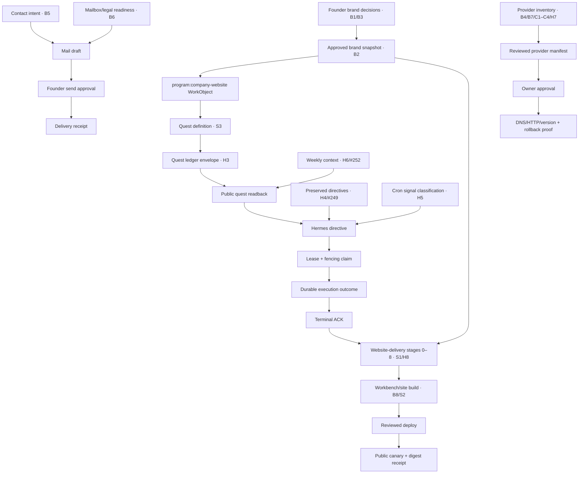

# Unfinished Brand, Cloudflare, Hermes, and Website-Delivery Continuity

> Status: active continuity plan
> Captured: 2026-08-07
> GitHub parent: [#285](https://github.com/Sheshiyer/cambium/issues/285)
> Authority rule: runtime state outranks this document and every linked issue

## Why this exists

An unfinished planning board recorded what appeared complete and what remained open
across the brand, Cloudflare, Hermes, quest, and website-delivery arc. The board was
valuable but unsafe as a backlog: it mixed source assertions, live-looking claims,
optional ideas, decisions, external-provider state, and executable work without stable
ownership or evidence classes.

This document preserves the board without pretending its claims are current. It gives
each open source ID exactly one disposition row, assigns an outcome issue, records its
dependencies, and names the probe that must re-establish truth before execution.

## Operating boundary

- The source board is provenance-bearing planning material, not runtime authority.
- Repository evidence verifies contracts and implementation shape, not live provider state.
- GitHub issues track intended outcomes; their prose is regenerated or reconciled when
  runtime evidence changes.
- Planning this arc authorizes no Cloudflare, Vercel, DNS, mailbox, cron, EC2, D1, KV,
  directive, registry, deployment, credential, session, or provider mutation.
- The vault remains referenced knowledge. Private notes, transcripts, and seed corpora
  are not copied into Cambium.

## Evidence classes

| Class | Meaning |
|---|---|
| `source_assertion` | The supplied board says this; it was not independently re-probed here. |
| `repository_verified` | Current Cambium source or documentation proves the named contract exists. |
| `github_tracked` | A current GitHub issue owns the unresolved outcome. |
| `live_verified` | A dated direct provider/runtime probe proves current state. None were added by this planning pass. |
| `external_unverified` | The claim depends on another repository, provider, account, mailbox, or host and must be re-probed. |

## Source-claimed completions retained as provenance

These eight rows are preserved as assertions from the supplied board. They are not
re-certified as current live facts.

| Source claim | Board note | Evidence class | Revalidation rule |
|---|---|---|---|
| CF-0…CF-5 relocation path | Labs zone, Workers, D1/R2, Hermes Access, secrets mint | `source_assertion` | Read-only account and binding inventory before any later provider change. |
| Apex Error 1000 | Fixed | `source_assertion` | DNS and HTTP probe if a related provider manifest is proposed. |
| Main site on Pages | `ThoughtseedOS-Site` → `thoughtseed-os-site` | `source_assertion` | Resolve current project/account and deployed commit before publishing work. |
| GitHub auto-deploy | Green on `main` | `source_assertion` | Inspect current workflow and latest run before relying on it. |
| Public canary | Six-hour, post-deploy, and dispatch paths green | `source_assertion` | Use a fresh canary run as ship-stage evidence. |
| Portfolio truth | `program:company-website` executing; brand-atlas WorkObject added | `source_assertion` | Resolve the canonical WorkObject and its current version before quest creation. |
| Composio mail read canary | Zoho lists `wave@`; Gmail labels readable | `source_assertion` | Re-probe metadata only; never expose message bodies or credentials. |
| Evidence notes | Brand spine and cutover notes exist | `source_assertion` | Reference source-owner-reviewed summaries; do not copy private vault material. |

## Repository and GitHub reconciliation

- `workers/quests/DEPLOY.md` documents `HERMES_RUNNER_EXECUTE_DIRECTIVES=false`
  and keeps legacy ACK-without-execution false until a delivery-disabled canary passes.
- `workers/quests/src/handler.ts` implements claim, outcome, and terminal-outcome-before-ACK
  enforcement for native directives.
- `bin/quine/hyphae/quests.ts` implements `quine write quests push`; the accepted
  envelope is written to `/internal/ledger/{tenant}` and read from `/api/quests/{tenant}`.
- `scripts/refresh-quests.sh` already invokes the quest push command.
- [#249](https://github.com/Sheshiyer/cambium/issues/249) already owns preserved July
  role-task directive reconciliation. H4 is reused there, not duplicated.
- [#252](https://github.com/Sheshiyer/cambium/issues/252) already owns the bounded
  weekly-context data path. H6 is reused there, not duplicated.
- No live Cloudflare, Vercel, mailbox, Hermes-host, cron, D1, KV, quest-ledger, or site
  probe was performed during this documentation task.

## Complete open-item disposition map

Every source ID appears exactly once in this table.

| ID | Source item | Evidence class | Disposition | Outcome issue | Depends on | Revalidation probe |
|---|---|---|---|---|---|---|
| B1 | Founder content decisions | `external_unverified` | founder decision | [#281](https://github.com/Sheshiyer/cambium/issues/281) | founder | Record chosen/rejected language and approval timestamp. |
| B2 | Full vault → atlas → site copy sync | `external_unverified` | planned | [#281](https://github.com/Sheshiyer/cambium/issues/281) | B1 | Compare approved source digest, atlas digest, and site copy digest. |
| B3 | `thoughtseed-space` redesign fate | `external_unverified` | founder decision | [#281](https://github.com/Sheshiyer/cambium/issues/281) | founder | Record keep/promote/archive decision and rollback target. |
| B4 | Brand atlas host | `external_unverified` | optional decision | [#282](https://github.com/Sheshiyer/cambium/issues/282) | provider inventory | Resolve current host/account, then choose keep or move. |
| B5 | Contact automation | `external_unverified` | planned, send-gated | [#280](https://github.com/Sheshiyer/cambium/issues/280) | B6, explicit send approval | Create one draft and one approved redacted delivery receipt. |
| B6 | `accounts@` mailbox | `external_unverified` | planned prerequisite | [#280](https://github.com/Sheshiyer/cambium/issues/280) | legal/owner checklist | Verify mailbox ownership and routing without message content. |
| B7 | GitHub → Pages native Git connection | `source_assertion` | optional decision | [#282](https://github.com/Sheshiyer/cambium/issues/282) | current workflow evidence | Keep Actions unless native Git has a reviewed benefit and rollback. |
| B8 | Workbench HTML regeneration | `external_unverified` | planned | [#281](https://github.com/Sheshiyer/cambium/issues/281) | B2 | Build from approved snapshot and compare deployed digest. |
| C1 | Pages personal → Labs | `external_unverified` | planned | [#282](https://github.com/Sheshiyer/cambium/issues/282) | read-only account inventory | Prove current project ownership before an exact move manifest. |
| C2 | CF-6 personal drain | `external_unverified` | planned | [#282](https://github.com/Sheshiyer/cambium/issues/282) | C1 | Inventory residual assets and classify keep/move/archive/delete. |
| C3 | Historical 68-object mop-up | `external_unverified` | stale candidate | [#282](https://github.com/Sheshiyer/cambium/issues/282) | read-only inventory | Recount exact objects; close as stale if the residual no longer exists. |
| C4 | Durable DNS write path | `external_unverified` | planned credential-class decision | [#282](https://github.com/Sheshiyer/cambium/issues/282) | owner approval | Verify minimum required scope by name only; never record token values. |
| H1 | Enable native directive execution canary | `repository_verified` | planned, approval-gated | [#283](https://github.com/Sheshiyer/cambium/issues/283) | H4/#249 | Re-probe both flags; prove delivery-disabled claim/outcome/ACK first. |
| H2 | One assign → execute → evidence → ACK | `repository_verified` | planned live proof | [#283](https://github.com/Sheshiyer/cambium/issues/283) | H1, H4/#249 | D1 terminal and acknowledgement probes plus redacted receipt chain. |
| H3 | Quest ledger push/readback | `repository_verified` | implementation exists; live proof missing | [#284](https://github.com/Sheshiyer/cambium/issues/284) | S3 | Push one derived envelope and verify matching public readback/digest. |
| H4 | Clear or reissue July pending directives | `github_tracked` | tracked existing | [#249](https://github.com/Sheshiyer/cambium/issues/249) | owning consumers | Execute or supersede durably; never delete audit history. |
| H5 | Mute noise crons | `external_unverified` | planned schedule classification | [#283](https://github.com/Sheshiyer/cambium/issues/283) | schedule inventory | Classify each schedule keep/mute/reschedule/remove with rollback. |
| H6 | Weekly-context 501 residual | `github_tracked` | tracked existing | [#252](https://github.com/Sheshiyer/cambium/issues/252) | curated sources | Resolve exact reviewed sources or remain explicitly fail-closed. |
| H7 | Hermes EC2 public-canary cron | `source_assertion` | optional decision | [#282](https://github.com/Sheshiyer/cambium/issues/282) | current GitHub canary | Add only if it closes a measured coverage gap. |
| H8 | Skill-cluster stage wiring into Hermes | `external_unverified` | planned | [#284](https://github.com/Sheshiyer/cambium/issues/284) | H3, H1 | Version stage inputs and require receipts before stage completion. |
| S1 | Full website-delivery PLAN | `external_unverified` | planned | [#281](https://github.com/Sheshiyer/cambium/issues/281) | B1, B2, H3, H1 | Record stages 0–8 as receipt-backed task/quest beats. |
| S2 | Brandmint refresh → atlas → site | `external_unverified` | planned | [#281](https://github.com/Sheshiyer/cambium/issues/281) | B1, B2, H3 | Compare one approved source snapshot through public canary. |
| S3 | Quest definition for `program:company-website` | `external_unverified` | planned | [#284](https://github.com/Sheshiyer/cambium/issues/284) | canonical WorkObject | Create stable quest identity and verify ledger/public projection. |

Count: **23 source IDs, 23 disposition rows, zero dropped.**

## Dependency flow



### Cross-links that control sequence

- B1 gates B2 and S2: there is no safe rewrite while two founder narratives remain valid.
- H4/#249 gates H1/H2: native execution cannot be enabled over unexplained preserved work.
- H3/S3 gates H8: stage orchestration cannot claim a quest it cannot push and read back.
- H5 changes observability, not execution authority: muting noise must never hide failures.
- C3 is a stale candidate, not a deletion instruction: inventory must prove it still exists.
- B7 and H7 are optional. “Keep the current working path” is a valid reviewed outcome.

## Shared continuity data contract

```text
ContinuityItem {
  sourceId,
  sourceLane,
  sourceClaim,
  evidenceClass,
  disposition,
  ownerRepository,
  githubIssue,
  dependsOn[],
  approvalGate,
  verificationProbe,
  lastCheckedAt
}
```

## Lane data contracts

### Brand publishing

```text
BrandDecision {
  id, question, chosenOption, rejectedOptions,
  decidedBy, decidedAt, rationale
}

CopySnapshot {
  sourceRefs[], sourceDigest, approvedTerms[], prohibitedTerms[],
  atlasVersion, generatedAt
}

PublishReceipt {
  repository, commitSha, buildDigest, deployTarget,
  canaryRunId, observedUrl, verifiedAt
}
```

### Contact operations

```text
ContactIntent { id, submittedAt, replyTo, subject, boundedBody, consent, sourcePage, idempotencyKey }
MailDraft { provider, mailbox, draftId, intentId, contentDigest, createdAt, status }
SendApproval { draftId, approver, approvedAt, expiresAt, nonce }
DeliveryReceipt { draftId, providerMessageIdHash, status, deliveredAt, failureClass }
```

### Cloudflare/provider hygiene

```text
CloudflareAsset { assetIdHash, assetType, accountClass, zone, runtimeOwner, desiredOwner, status, evidenceAt }
CleanupDecision { sourceId, action, reason, required, approvedBy, approvedAt, rollbackTarget }
ProviderManifest { manifestDigest, assets[], expectedBefore, expectedAfter, credentialClass, dryRunReceipt }
ProviderReceipt { manifestDigest, action, providerEventIdHash, observedState, verifiedAt, rollbackStatus }
```

### Hermes native execution

```text
ExecutionClaim {
  memberId, directiveId, idempotencyKey, inputDigest,
  executionId, runnerId, hostIdentity,
  claimId, fencingToken, claimedAt, leaseExpiresAt
}

ExecutionOutcome {
  memberId, directiveId, idempotencyKey, executionId,
  runnerId, hostIdentity, claimId, fencingToken, attempt,
  status, attestationDigest, recordedAt
}

AckReceipt { directiveId, executionId, terminalOutcomeDigest, acknowledgedAt, duplicate }
```

### Quest delivery

```text
QuestLedgerEnvelope {
  schema, derivedAt, source, tenant,
  beats[], openItems[], commands[], visual,
  ledger: { completed, total, current, rows[] }
}

QuestPushReceipt { tenant, derivedAt, status, publicReadUrl, envelopeDigest, pushedAt }
```

## GitHub execution surface

| Issue | Outcome | Source IDs |
|---|---|---|
| [#285](https://github.com/Sheshiyer/cambium/issues/285) | Parent continuity and status reconciliation | all |
| [#281](https://github.com/Sheshiyer/cambium/issues/281) | Founder brand truth → atlas → public site | B1, B2, B3, B8, S1, S2 |
| [#280](https://github.com/Sheshiyer/cambium/issues/280) | Approval-gated contact and mailbox operations | B5, B6 |
| [#282](https://github.com/Sheshiyer/cambium/issues/282) | Cloudflare ownership and hygiene | B4, B7, C1, C2, C3, C4, H7 |
| [#283](https://github.com/Sheshiyer/cambium/issues/283) | Hermes execute → outcome → ACK and signal | H1, H2, H5 |
| [#284](https://github.com/Sheshiyer/cambium/issues/284) | Company-website quest → ledger → delivery | H3, H8, S3 |
| [#249](https://github.com/Sheshiyer/cambium/issues/249) | Preserved directive reconciliation | H4 |
| [#252](https://github.com/Sheshiyer/cambium/issues/252) | Bounded weekly-context data path | H6 |

## Execution order

1. Record founder decisions for B1/B3 and classify optional B4/B7/H7.
2. Resolve #249 before proposing any native-execution flag change.
3. Prove #283 with execution disabled, then seek separate approval for a real E2E.
4. Establish the approved brand snapshot in #281.
5. Create and read back the company-website quest in #284.
6. Run website-delivery stages 0–8 with evidence and close #281 on public proof.
7. Run #280 and #282 only through their explicit approval gates.
8. Progress #252 in parallel; retain fail-closed behavior until curated sources exist.

## Maintenance rule

When a runtime probe changes an item's state:

1. Update the item's evidence class and `lastCheckedAt` in this document.
2. Reconcile the owning GitHub issue body or add a dated evidence comment.
3. Update Phase 9 in `.planning/ROADMAP-v0.4-continuation.md`.
4. Close optional or stale items with the evidence-backed decision; do not leave them
   open merely because the original board called them unfinished.
