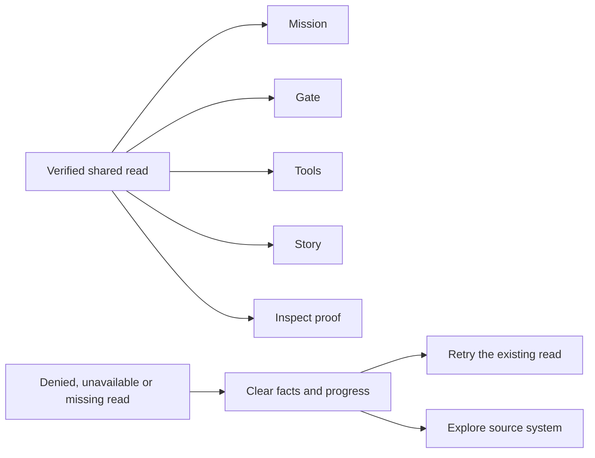

# Curious workbench · local review

The source atlas now supplies the working browser and Telegram app's palette,
organ portraits, selection rails and progressive inspection. Runtime authority
continues to come from the existing verified server response and signed actions.

| Shell | Visual path | Evidence path |
| --- | --- | --- |
| Legacy | Mission → Gate → Tools → Story → Inspect | Inspect / Proof or System |
| Operating Fabric | Canopy → Mission → Flow → Workforce → Forge | Task → Run → Receipt; System atlas from every scene |



Desktop uses a bounded frame. Phones retain independent content scrolling,
safe-area padding, reachable tabs, zoom and reduced motion. Flow stacks its
existing verified Task, Run and Receipt cells vertically on phones. Missing
facts remain missing; a visual arrow never supplies an absent relationship.

## Review locally

```sh
CAMBIUM_ATLAS_PREVIEW_PORT=18756 node scripts/preview-system-atlas.mjs
```

| Fixture path | Meaning |
| --- | --- |
| `/guide` | Source-bound organ and system atlas |
| `/miniapp/legacy` | Canonical populated legacy fixtures |
| `/miniapp/fabric` | Synthetic Telegram bridge and populated canonical projection |
| `/miniapp/browser` | Simulated verified browser response, without a Telegram header |
| `/miniapp/auth` | Prior hydrated facts followed by401 |
| `/miniapp/service` | Prior hydrated facts followed by503 |
| `/miniapp/offline` | Prior hydrated facts followed by a closed connection |
| `/miniapp/empty` | Prior hydrated facts followed by a missing ledger |

The loopback server labels synthetic data, serves an explicit document allowlist,
rejects writes and never proxies production. Unavailable states retain Retry and
source exploration across navigation. They clear old metrics, sheets and facts.
An older response cannot replace a newer accepted or denied read.

## Verification boundary

The current UI criteria are ISC-2737–2768 in `ISA.md`. Actual served-script tests
exercise hydration, races, denial, correction and failed Gate refresh. Existing
server identity tests preserve the founder-only browser path and denied unknown
principals. Canonical renderer tests preserve counts, joins, redaction and gaps.
IAB checks cover desktop and320/390CSS-pixel phones, keyboard focus, source sheets,
scroll reachability and all unavailable states.

Fresh affected regressions pass754/754. Generator and portrait parity checks pass;
the text-density audit passes with Gate at110/110words. Independent desktop QA
and root phone QA bind the same final served fixtures. Failed reads beginning
with hydrated facts clear every dependent panel and settle progress to zero.
The primary checkout and all26previously dirty tracked files retain their bytes.

The broader test attempt recorded2141passes and four failures before the final
Gate copy correction. That copy defect is fixed and covered by the final affected
suite. The remaining release holds are the pre-existing August screenshot digest,
historical atlas labels rejected by the retirement guard, and an anchor-test hang.
The hung test child was stopped after an ownership check; no full-suite pass is
claimed. Seven obsolete owned preview processes are stopped; one loopback review
server is retained. Cleanup and UI verification are recorded separately.

Local fixtures and screenshots do not establish a live Access policy, Telegram
signature, active company role, provider or deployed version. The August viewport
manifest and its images remain historical evidence; their old digest is never
rewritten to pretend these screenshots depict the new workbench. The broader
repository checks also require reconciliation of the existing retired-vocabulary
guard and a bounded repair of the existing anchor-test hang before release.

Publication, deployment and an authenticated live canary retain their separate
authority. Source contract: [Curious workbench](../architecture/contracts/curious-workbench-v1.md).
Visual reference: [connected system atlas](system-atlas-2026-10-07/README.md).
