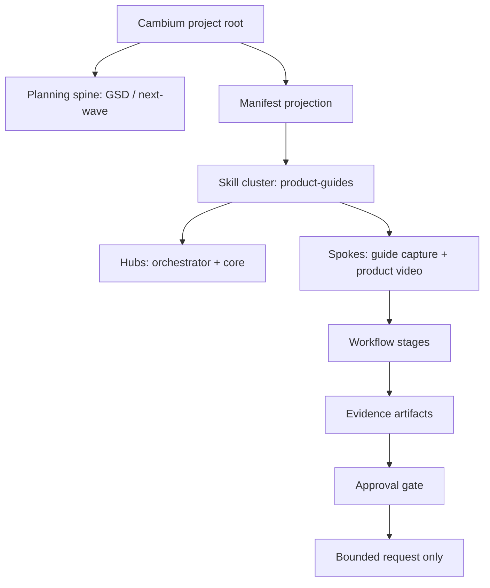

# Cambium as a fractal ecosystem

This guide is the project-local explanation and preparation contract for the
Moosh `product-guides` workflow. It is not a claim that browser capture,
video composition, or a worker swarm has run.

## The nesting model

Cambium repeats the same pattern at different scales: identity is resolved,
capability is selected, work is staged, evidence is produced, and a gate
decides whether the next scale may proceed.

The important distinction is between a map and an action. The planning
snapshot can show a wave, a route, and historical sessions while the worker
fleet remains inactive. The skill projection can show resolved spokes while
capture remains gated. The Manifest bridge is the read model that joins those
facts; it does not silently turn them into execution.

## Ownership map

| Layer | Owner | What it answers |
| --- | --- | --- |
| Project | Cambium contract | Which project is in scope? |
| Planning | GSD and next-wave records | What work is mapped? |
| Cluster | `product-guides` hubs | Which capability family applies? |
| Guide spoke | `build-product-user-guides` | What should be inventoried and captured? |
| Video spoke | `guide-to-product-video` | How does approved guide evidence become motion? |
| Manifest | Bridge projection | What is observed, ready, or gated now? |
| Approval | Project owner | May an evidence-producing request proceed? |

## Current Cambium reading

- The project is initialized and the Manifest bridge is reachable.
- The resolved cluster is `product-guides`, with two hubs and two Moosh spokes.
- Six ordered stages are visible: observe, resolve, prepare guide, capture
  evidence, compose video, and validate report.
- Planning and swarm state is mapped, not proof of active worker execution.
- The local guide and film contracts are now prepared in this repository.
- Capture and composition remain gated until prerequisites and a matching
  human approval receipt are present.

## How to run the flow safely

1. Read `docs/guide/guide-manifest.json` and confirm the chapters describe
   only observed or explicitly pending evidence.
2. Read `docs/guide/capture.config.json` and confirm the route, persona, and
   viewport remain bounded.
3. Re-read the Manifest capabilities and workflow projection.
4. Obtain the project owner’s approval receipt for the evidence-producing run.
5. Request the bounded guide run through the Manifest request contract.
6. Validate the guide output before considering the video FilmSpec.
7. Compose video only after guide evidence and video approval exist.

The current safe stopping point is step 3. A trigger request without the
approval receipt would be rejected by design and would not constitute a run.
