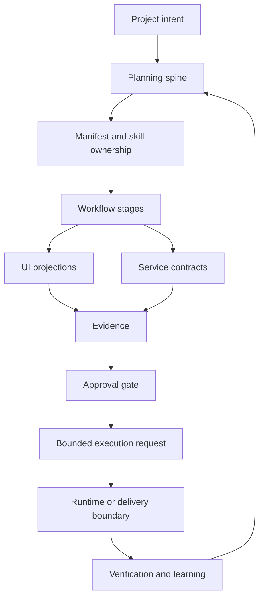
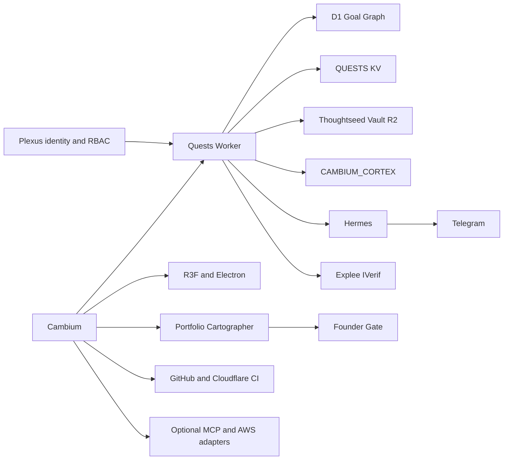

# Cambium system capability map

## What this document is

This is the deep, current explanation of Cambium as a fractal ecosystem:
one project spine expressed through several UI shells, service contracts,
planning artifacts, memory boundaries, and approval surfaces.

It is the human-readable companion to:

- [`cambium-surface-inventory.json`](cambium-surface-inventory.json), the
  bounded inventory of surfaces and connected systems;
- [`cambium-moosh-coverage.json`](cambium-moosh-coverage.json), the stage and
  evidence contract for the `product-guides` Moosh workflow;
- [`cambium-moosh-coverage-model.md`](cambium-moosh-coverage-model.md), the
  truth-tiered model separating UI, request/response, and execution evidence;
- [`cambium-moosh-multi-surface.md`](../runbooks/cambium-moosh-multi-surface.md),
  the current operator procedure; and
- [`../videos/ingest.md`](../videos/ingest.md), the future video ingest order.

The document explains readiness and capability. It does not claim that live
screenshots, hosted actions, worker execution, deployment, or video capture
have occurred.

## 1. The fractal idea

Cambium repeats the same operating pattern at different scales:

At the project scale, the loop is Cambium planning and acceptance. At the
workflow scale, it is Moosh: observe, resolve, prepare, capture, compose, and
validate. At the UI scale, each card or scene should disclose its source,
current state, and next governed action. At the service scale, each adapter
must declare its port, input, output, failure behavior, tenant mapping, and
privacy boundary.

The repetition is intentional. It lets a reader move from a high-level
portfolio view to a single governed action without losing authority or
evidence.

## 2. Reading order

Read in this order when onboarding:

1. `PROJECT.md` and `.project/HANDOFF.md` for repository boundaries.
2. `docs/LIFECYCLE.md` for current versus historical documentation.
3. The root `ISA.md` for the project’s active acceptance ledger.
4. This map for the system and capability model.
5. The surface inventory for every UI and connected boundary.
6. The truth-tiered coverage model for which evidence lane and authority tier
   each surface may claim.
7. The Moosh stage coverage contract for what is ready, gated, or external.
8. The runbook for safe operator behavior.
9. The source files named by the inventory when a claim needs verification.

Runtime state outranks stale prose. Evidence files are proof artifacts, not
current instructions. Historical plans explain decisions but do not authorize
execution.

## 3. Surface map

### Manifest console

The local Manifest console is the control-plane explanation surface. It joins
the skill registry, project identity, workflow projection, and approval state.
Its useful questions are:

- Which cluster resolves for this project?
- Which hubs and spokes own the work?
- Which workflow stages are ready?
- Which stage is gated, and why?
- Does a trigger request have both a bounded `request_id` and an existing
  `approval_id`?

It is read-only evidence for this work. A disabled trigger is a success state
when the prerequisite approval is absent: it prevents an unowned action.

### R3F web visual engine

The R3F surface is the visual product language. Its island routes provide the
user-facing progression:

| Route | Capability | Evidence focus |
| --- | --- | --- |
| `/#island-genesis` | project and system overview | orientation |
| `/#island-taste` | visual direction and design language | perception |
| `/#island-build` | construction and implementation flow | progress |
| `/#island-ops` | operating state and actions | governance |
| `/#island-cortex` | memory and retrieval context | context |
| `/#visualizations` | visual assets and diagrams | proof presentation |
| `/#elements-settings` | component and system settings | configuration |

The renderer can use an offline synthetic fallback. A visual render therefore
does not, by itself, prove that the Worker or connected stores are live. A
guide must label the source of every stateful claim.

### Electron shell

Electron wraps the visual engine as a desktop operator surface. It shares the
visual vocabulary but has a distinct shell lifecycle and capture target. The
desktop surface is not interchangeable with a browser screenshot: window
chrome, startup state, and local filesystem assumptions belong to the shell.
Its capture remains local and owner-approved.

### Portfolio Cartographer

Cartographer has two meaningful states:

- the local `bundle.html` preview, which is suitable for read-only layout and
  projection inspection; and
- the hosted `/admin/portfolio` Workbench, which is authenticated and can
  expose Founder Gate or action-queue behavior.

The hosted surface must not be represented by the local preview. The local
preview proves composition; the hosted Workbench proves authenticated runtime
state. R2 evidence precedes triggers, and the Goal Graph/D1 boundary remains
the operational writer.

### Mini App legacy scenes

The compatibility surface preserves the established operator scenes:

| Scene | Role |
| --- | --- |
| Mission | see and orient around current work |
| Gate | inspect a pending governed action |
| Tools | access bounded operator utilities |
| Story | understand narrative/project context |
| Inspect | see source and state without approval |
| Components | review surface primitives and contracts |

These scenes are still part of the product contract even as the Operating
Fabric becomes the preferred navigation model.

### Operating Fabric

The Operating Fabric is the newer project-scoped model. It is a hidden/inert
shell until activated and is built from `MissionFabricProjectionV1`.

| Scene | Capability | Safe interpretation |
| --- | --- | --- |
| Canopy | aggregate projects, programs, and saplings | overview projection |
| Mission | next move and active objective | prioritization |
| Flow | signals and movement | telemetry/progress |
| Workforce | agents and work ownership | proposal/readiness view |
| Forge | build and delivery posture | construction view |
| Gate | approval preflight | signature boundary |
| Inspect | fallback source/state view | no-approval inspection |

The Gate sheet validates bounded identifiers, freshness, expiry, fence, and
expected versions before it can open a governed approval preflight. When
freshness or a binding is missing, Inspect-only is the truthful outcome.

### Quests Worker and operator CLI

The Quests Worker is the API and read-model boundary behind the Mini App. It
is not merely a page server: it owns projections, request envelopes, health
surfaces, and guarded action lifecycle contracts. The local CLI complements
it by running tests, validators, proof generation, and bounded demos.

For Moosh, APIs and CLI commands are covered with request-response and
terminal evidence. They should not be forced into screenshot evidence simply
because a UI consumes them.

## 4. Connected ecosystem map

### Authority matrix

| Boundary | Owns | Does not own | Moosh treatment |
| --- | --- | --- | --- |
| Cambium repository | source, contracts, tests, docs, planning | provider credentials or hosted deployment state | local evidence |
| Manifest bridge | project-scoped skill/workflow projection | actual capture or worker launch | request-response |
| R3F/Electron | visual presentation and shell | authoritative remote truth | image after approval |
| Cartographer | portfolio projection and planning handoff | Goal Graph as sole operational writer | local/hosted split |
| Quests Worker | API/read model and guarded action envelopes | unbounded arbitrary commands | API evidence |
| D1 Goal Graph | operational graph writes | visual presentation | connected boundary |
| KV/R2/Vectorize | runtime state, evidence, retrieval | approval authority | connected boundary |
| Plexus | identity, tenant, RBAC, visibility | product content identity | auth boundary |
| Hermes/Telegram | transport and operator delivery | Cambium’s local acceptance | external boundary |
| Explee IVerif | GET-only observation | mutations | observer boundary |
| GitHub/Cloudflare CI | source and delivery automation | owner approval | delivery boundary |
| MCP/AWS adapters | optional provider capabilities | Cambium product identity | adapter map only |

The key distinction is authority versus adjacency. A connected system may
provide data or transport without becoming the source of truth for the
project’s product model.

## 5. Capability model

The following verbs make the boundary model operational:

| Verb | Meaning in Cambium | Typical authority |
| --- | --- | --- |
| Observe | read state, contracts, health, or projection | local docs, Manifest, APIs |
| Explain | connect ownership and workflow meaning | guide and system map |
| Propose | form a bounded next action or work item | Cartographer, Workforce, planning |
| Approve | authorize a specific action with a receipt | Founder Gate/project owner |
| Request | submit an idempotent bounded request | Manifest bridge/action queue |
| Commit | write operational state | Goal Graph/D1 or named store |
| Deliver | publish an approved artifact or deployment | owner-approved delivery boundary |
| Learn | record verification and refine the ISA | project ISA and handoff |

Moosh itself should stop at Explain, Prepare, and Request unless approval and
live evidence allow the next verb. The workflow may be ready while the action
is not eligible.

## 6. Moosh workflow across Cambium

The resolved `product-guides` cluster contains two hubs and two spokes:

- `product-guides-orchestrator` routes guide work;
- `product-guides-core` defines the domain behavior;
- `build-product-user-guides` prepares guide structure and evidence contracts;
- `guide-to-product-video` composes a future bounded FilmSpec from accepted
  guide evidence.

The six observed stages are:

1. **Observe project** — read project docs, source routes, runtime health, and
   current handoff. No capture.
2. **Resolve cluster** — confirm the project-to-cluster mapping and selected
   skill ownership. No worker launch.
3. **Prepare guide** — create guide chapters, persona, evidence records, and
   capture configuration with bounded local intent.
4. **Capture evidence** — capture only named surfaces, with approval, using the
   correct evidence mode. Currently gated.
5. **Compose video** — use accepted guide evidence and the FilmSpec. Currently
   gated behind capture and composition approval.
6. **Validate report** — re-read projections, validate files, run tests, and
   report every blocker. Ready locally.

The guide-first rule matters: a video is an explanation of accepted evidence,
not a substitute for it.

## 7. Planning and swarm semantics

Cambium has three different planning states that must remain separate:

| State | What exists | What it permits |
| --- | --- | --- |
| Planned | a documented sequence and acceptance criteria | review and refinement |
| Mapped | a swarm or task decomposition is assigned conceptually | coordination planning |
| Dispatched | governed workers received bounded tasks | execution observation |

This run has planning and mapping evidence. It has not dispatched a capture
fleet. A visible task map is not proof that workers ran. A workflow projection
is not proof that a screenshot or video exists.

## 8. Safety model

The safe trigger contract is deliberately narrow:

- `request_id` is bounded and idempotency-scoped;
- `approval_id` must already exist and match the project and request;
- the requested surfaces are enumerated by stable IDs;
- evidence type and output destination are explicit;
- arbitrary commands, checkout paths, secrets, prompt bodies, and implicit
  execution are rejected;
- an approved request remains a request; it does not launch workers or capture
  tools by itself.

This protects the distinction between describing the next action and taking
the action. It also keeps the Cambium repository from becoming a covert
credential or deployment store.

## 9. Current readiness

### Ready now

- The local Manifest bridge is reachable and its doctor check passes.
- The Cambium project is initialized in the Manifest projection.
- The `product-guides` cluster and four skills resolve.
- All six workflow stages are structurally present and reported ready before
  their explicit-approval gates.
- Guide, FilmSpec, inventory, coverage, and runbook artifacts validate locally.
- Local docs and terminal checks can be run without external mutation.

### Gated now

- Actual screenshot capture: no matching human approval receipt.
- The Manifest bridge responds, but its health projection is stale; the
  console therefore truthfully shows the local runtime as offline until a
  governed refresh occurs.
- Browser-attached live UI probe: the required extension is unavailable in the
  current desktop session.
- Hosted Cartographer and connected systems: owner-authenticated access is
  required and remains outside this repository’s authority.
- Video composition: guide evidence and capture approval must precede it.

### Not claimed

- No live screenshots were fabricated.
- No video was rendered from unobserved surfaces.
- No workers were launched.
- No provider credentials or secrets were read.
- No deployment, registry, native client, vault, or external repository was
  modified.

## 10. Operator recipes

### Explain the whole system

Start with this map, then open the inventory and read one source file for each
surface family. Use the truth-tiered coverage model to decide whether a claim
needs a document read, terminal output, HTTP response, or screenshot, then use
the authority matrix to decide who may authorize the next step.

### Prepare a new local surface

Add a stable surface ID to the inventory, name its owner and authority, choose
an evidence mode, add a coverage entry, and update the ingest map. Validate
the JSON and docs. Do not add a trigger or claim capture.

### Request an approved run

Re-read the Manifest projection, obtain the real owner-issued approval receipt,
construct a bounded request containing only surface IDs and evidence intent,
then submit the request through the typed endpoint. Preserve the response as
request evidence. The request is not execution evidence.

### Verify a completed run

For each surface, match the artifact to its stable ID, route, timestamp, and
evidence type. Re-run validators, inspect for secrets and unbounded paths, and
only then compose or publish. If a live probe was impossible, record the
follow-up instead of checking the criterion by inspection.

## 11. Troubleshooting by symptom

| Symptom | Likely boundary | Correct response |
| --- | --- | --- |
| Trigger disabled | Manifest approval projection | obtain matching approval; do not bypass |
| UI appears blank | local surface/runtime | inspect route and runtime health; do not infer API failure |
| Data looks synthetic | R3F fallback | label synthetic state; request live API evidence |
| Hosted Workbench differs | auth/runtime boundary | separate local preview from hosted claim |
| Gate opens to Inspect | freshness or binding failure | refresh projection; retain inspect-only state |
| Video lacks proof | guide/capture ordering | stop composition; capture accepted evidence first |
| Worker task map exists | planning/swarm distinction | report mapped, not dispatched |
| External adapter unavailable | provider boundary | mark external-wait; keep local docs usable |

## 12. Glossary

- **Cambium** — the project and operating spine represented by many surfaces.
- **Manifest** — project-scoped registry and workflow projection.
- **Moosh** — the bounded product-guide and product-video workflow.
- **Hub** — cluster-level routing or domain guidance skill.
- **Spoke** — executable product-guide capability selected by the cluster.
- **Surface** — a user-facing UI, operator entrypoint, or service boundary.
- **Projection** — a read model derived from an authoritative source.
- **Evidence** — a bounded proof artifact tied to a claim and surface.
- **Gate** — a deliberate approval or freshness boundary before mutation.
- **Founder Gate** — owner authorization boundary for portfolio actions.
- **Operating Fabric** — the Canopy/Mission/Flow/Workforce/Forge model.
- **Goal Graph** — operational graph whose governed store owns writes.
- **Boundary map** — a description of an external system without claiming it
  was captured or modified.
- **Request-only** — a typed idempotent request that does not execute work.
- **Deferred verification** — a criterion whose live probe needs a named
  follow-up because its prerequisite is unavailable.

## 13. Completion statement

Cambium is initialized, its planning and swarm map are visible, and its Moosh
workflow is prepared across all discovered UI and connected-system families.
The system is not falsely “run” yet: the final capture and execution steps
remain pending explicit approval, browser attachment, and any required owner
authentication. That is the correct state of a governed fractal ecosystem.
