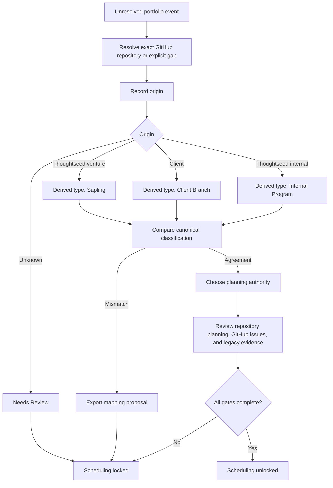

# Portfolio Repository-First Intake Design

**Date:** 2026-08-07
**Status:** implementation-ready; production promotion held
**Owner:** Cambium
**Related:** `docs/plans/2026-08-07-portfolio-continuity-board-and-repository-map.md`, GitHub unfinished-board preservation, repository relocation preparation, Portfolio Workbench

## Problem

The current Unplanned cards offer `Now`, `Next`, `Later`, `Park`, and `Needs Review` before Cambium has established what the work is, where its plan lives, or whether the catalog classification is valid. Those buttons create local scheduling intent, but they do not resolve the underlying portfolio question.

The missing prerequisite is repository-first intake. A folder name, a recent repository, a dated planning file, or the word "new" is not enough to classify work. Project-local planning is moving to GitHub repositories and their issues/plans; Cambium must coordinate the portfolio without becoming a second project-local authority. Tool and session files remain valuable historical evidence, but they must be reconciled rather than treated as live plans.

## Grammar

1. Only ventures or products originated by Thoughtseed can be Saplings.
2. Every client-originated project is a Client Branch, including newly started client work.
3. Shared Thoughtseed capability, infrastructure, and operations work is an Internal Program.
4. Unknown origin remains Needs Review.
5. "New" is never a WorkObject type.
6. Client Branch is a portfolio term, not a Git branch.
7. Reusable Thoughtseed IP discovered during client work becomes a separate linked Sapling proposal; the original client work remains a Client Branch.
8. Existing canonical classifications are never silently rewritten. A disagreement becomes a visible mapping proposal.

## Authority split

| Scope | Planning authority | Cambium behavior |
|---|---|---|
| One repository/project | That GitHub repository: issues, plans, roadmap, and repository packet | Link, summarize, and surface gaps |
| Cross-portfolio sequencing | Cambium | Coordinate dependencies, priority, and unresolved mappings |
| Work without an exact repository | Cambium until a repository is assigned or explicit no-repository handling is approved | Keep visible and locked |
| Tool/session/date planning files | Historical evidence | Mark reviewed, extract durable decisions, do not schedule from them directly |
| Vault registry | Canonical referenced classification evidence | Compare, never write from this offline UI |

## Intake flow



## Repository evidence

The browser stays offline and token-free. A build-time generator resolves every catalog `repo:*` source through these deterministic stages:

1. exact `githubIdentity` from the relocation registry;
2. exact qualified `owner/name` match;
3. unique exact repository-name match;
4. otherwise, explicit ambiguous or unmatched gap.

The first three stages identify a candidate repository name, but only an accessible immutable GitHub repository ID promotes that candidate to `resolved`. Owner/name candidates without immutable metadata remain `unverified`, retain their safe URL and mapping method, and cannot become planning authority. `No project repository` is valid only when the WorkObject carries no `repo:*` evidence at all; it cannot bypass a known mapping gap.

The generated snapshot contains only portfolio-safe metadata:

```ts
type RepositoryEvidence = {
  sourceRef: string;
  status: 'resolved' | 'unverified' | 'ambiguous' | 'unmatched' | 'malformed' | 'unsafe';
  repositoryId: string | null;
  nodeId: string | null;
  fullName: string | null;
  url: string | null;
  visibility: 'PUBLIC' | 'PRIVATE' | 'INTERNAL' | null;
  defaultBranch: string | null;
  archived: boolean | null;
  pushedAt: string | null;
  updatedAt: string | null;
  matchMethod: 'relocation-registry' | 'qualified-name' | 'unique-name' | null;
};
```

Descriptions, repository contents, credentials, issue bodies, private planning text, and machine-local paths are excluded. Duplicate immutable IDs, ambiguous aliases, and malformed metadata fail generation.

## Local state v4

Schema v4 preserves all v3 plans and review decisions and adds one reconciliation record per WorkObject:

```ts
type PortfolioOrigin =
  | 'thoughtseed-venture'
  | 'thoughtseed-internal'
  | 'client'
  | 'unknown';

type PlanningAuthority =
  | { kind: 'repository'; repositoryId: string; fullName: string }
  | { kind: 'cambium'; reason: string };

type PortfolioReconciliation = {
  workObjectId: string;
  repositorySourceRef: string | null;
  repositoryDisposition: 'resolved' | 'no-repository' | 'unmatched' | 'ambiguous';
  origin: PortfolioOrigin;
  clientFamilyId?: string;
  planningAuthority: PlanningAuthority | null;
  repositoryPlanningReviewed: boolean;
  githubIssuesReviewed: boolean;
  legacyEvidenceReviewed: boolean;
  note: string;
  updatedAt: string;
};
```

Derived type is a pure function of origin. Readiness is also pure: exact repository handling, non-unknown origin, planning authority, all review flags, and agreement with canonical classification. A mismatch produces a mapping proposal and keeps scheduling locked.

Existing horizon values migrate losslessly and remain visible as legacy local intent. For source-unplanned work they do not make the item ready until v4 intake is complete. Imports clear incompatible undo history and reject future or malformed schemas.

## User experience

- Unplanned cards expose one `Inspect & reconcile` action instead of five horizon buttons.
- The focused drawer gains `Intake`, `Plan`, and `Delivery` tabs.
- Intake shows exact, unverified, or unresolved repository evidence—or a no-repository gap only when no repository evidence exists—plus origin, derived type, canonical type, planning authority, three review checks, blockers, and readiness.
- Plan controls are disabled only for source-unplanned items that are not ready.
- Resolved work keeps existing Plan and Delivery behavior.
- Repository evidence links open GitHub explicitly; they never fetch or mutate state.
- The interface explains the Sapling/Client Branch/Internal Program rules and the separate-linked-Sapling pattern for reusable client-derived IP.
- JSON and Markdown exports preserve the three truth layers: canonical catalog, generated repository evidence, local founder proposal.

## Current mapping audit

The current catalog includes claims that require origin evidence before scheduling. In particular, Nimbus Gate, WanderFruit, and Kristudios must not remain Saplings merely because they look product-like; the earlier classification findings already suggest client or separate-entity relationships. Klear Karma and mixed client-derived surfaces also require explicit origin adjudication. This implementation exposes those conflicts but does not silently rewrite the registry.

## GitHub continuity

The unfinished-board issues and relocation-preparation issue remain the durable backlog. Repository-first work is split into bounded issues for:

1. Workbench intake and state migration;
2. repository/origin evidence audit;
3. repository-local planning authority migration;
4. Cambium packet human review;
5. later production promotion.

A dedicated GitHub Project contains those issues plus the preserved unfinished-board and relocation issues. No issue is duplicated when an existing issue already owns the work.

## Relocation boundary and sequence

This iteration prepares the mapping that later relocation depends on; it does not move files.

1. Reconcile repository identity, origin, and planning authority in Cambium.
2. Review and move the Cambium repository packet from `draft-held` to `reviewed-held` through the existing owner gate.
3. Execute the exact manifest-gated relocation plan one standalone repository at a time.
4. Reject nested repositories and dirty/unresolved sources before any move.
5. After relocation is proven, map the R2-synced Vault copy as referenced knowledge, never as a runtime dependency or second writer.

## Safety and release

The implementation is prepared in a clean checkout rooted at current `origin/main`; the dirty primary checkout remains untouched. No Vault registry, R2 copy, native client store, external repository, provider, or Cloudflare state is mutated. The exact standalone bundle and generated Worker embed are regenerated and verified locally, but production upload/promotion is held while the repository packet remains `draft-held`.

## Rejected alternatives

- **Relabel the five quick buttons:** rejected because identity and authority would still be missing.
- **Infer Saplings from names or repository recency:** rejected because client work can be new and product-shaped.
- **Fetch GitHub from the browser:** rejected because it introduces credentials, egress, nondeterminism, and a second live dependency.
- **Rewrite the canonical catalog automatically:** rejected because the UI is proposal-only and origin evidence may conflict.
- **Move folders first and reconcile later:** rejected because it preserves the same identity ambiguity and risks nested Git repositories.
