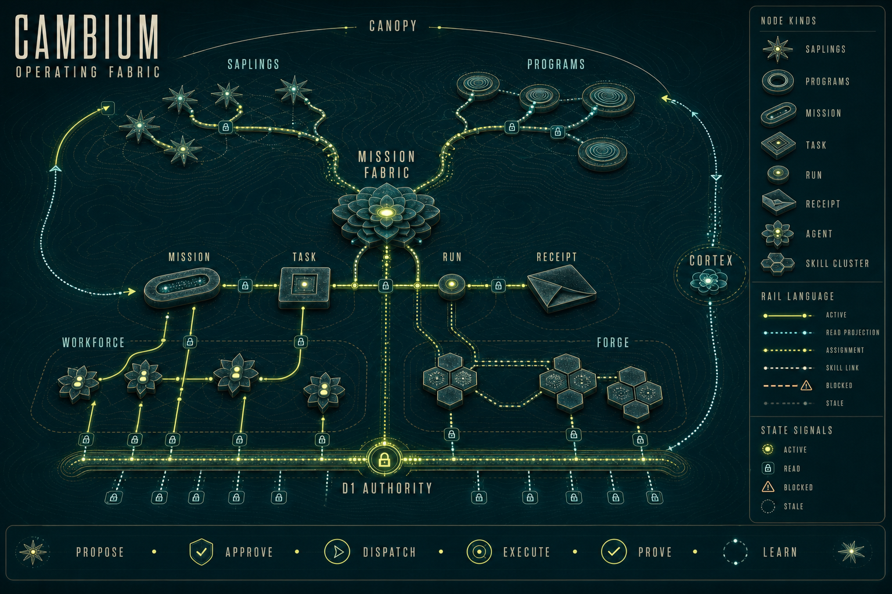
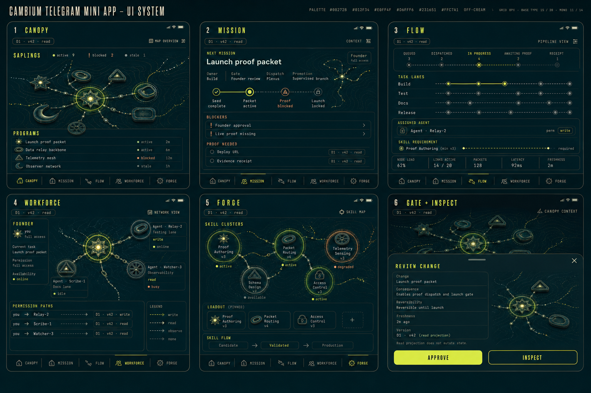

# Cambium Operating Fabric Moodboards

Generated 2026-07-28 through Codex OAuth with `gpt-image-2`.

Output size: 1536×1024 PNG for both boards.

These boards extend, rather than replace, the three supplied reference families:

- `../cambium-r3f-visual-moodboard/`
- `../constellation-ui-reference/`
- `../tg-miniapp-mission-control-reference/`

Exact image references supplied to both generation calls:

- `../cambium-r3f-visual-moodboard/cambium-r3f-visual-moodboard.png`
- `../constellation-ui-reference/04-workforce-mode.png`
- `../tg-miniapp-mission-control-reference/mission-control-mobile-reference.png`

## Files

| File | Purpose |
| --- | --- |
| `01-operating-fabric-system.png` | Landscape system board: Canopy, saplings, programs, Mission Fabric, task/run/receipt flow, agents, skill clusters, D1 authority, Cortex foldback |
| `02-operating-fabric-mobile-pages.png` | Landscape product board: six portrait page studies for Canopy, Mission, Flow, Workforce, Forge, and governed sheets |
| `prompt-system.md` | Exact production prompt for the system board |
| `prompt-mobile-pages.md` | Exact production prompt for the mobile page board |

## Reading rules

- Shape communicates node kind.
- Color, icon, and rail communicate state.
- Opacity and timestamp communicate freshness.
- The D1 Goal Graph is the only writer.
- Agents and skill clusters are execution overlays, not projects.
- Generated text is art direction; implementation copy comes from scene contracts.

## Commitment boundary

Both PNGs are aspirational visual direction, not evidence of implemented pages or data binding. A shape, label, interaction, or state becomes committed only when the canonical architecture contract defines it and an OF-001..OF-063 task accepts it. Any apparent action delegates to the signed Gate; the boards authorize no direct mutation.

## Implementation target

Use the boards with:

- [`../../../architecture/cambium-operating-fabric.md`](../../../architecture/cambium-operating-fabric.md)
- [`../../2026-07-28-cambium-operating-fabric-implementation-plan.md`](../../2026-07-28-cambium-operating-fabric-implementation-plan.md)
- [`../../../visual/cambium-operating-fabric-flow.html`](../../../visual/cambium-operating-fabric-flow.html)
