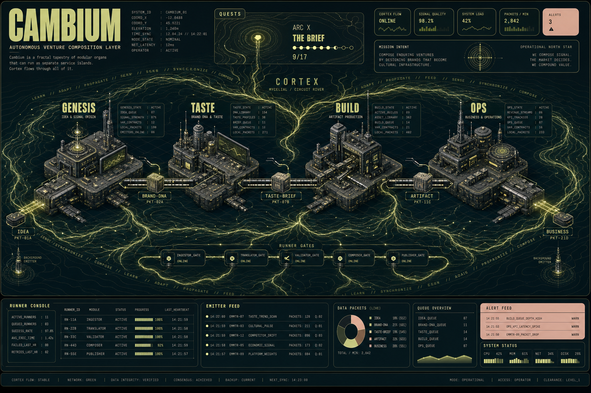

# Cambium Isometric Moodboard

## Review Read

Cambium is already structured as a modular service archipelago, not a monolith.
The repo-level conductor composes organs as external services and keeps the core
state truthful through derived ledgers.

- Source of truth: `registry.json`, `composition/pipeline.json`, and `composition/CONTRACTS.md`.
- Stages: Genesis -> Taste -> Build -> Ops.
- Cross-cutting layer: Cortex feeds all stages and records aesthetic memory/deviation signals.
- Runner: `bin/compose.mjs run` and `bin/lib/invoke.mjs` gate execution, thread stage output into the next stage, and fail closed on spend.
- "You are here" surface: `quine quests --tenant cambium` derives progress from `.operator` state, cortex records, MultiCA activity, and project evidence.
- Background story lanes: Paperclip, Hermes bridge events, world logs, and deviations emit live activity beats for the quest miniapp.
- Historical verified state for this review: Cambium was at Arc X, "The Brief", with 9/17 quests complete. Treat newer quest evidence as authoritative.

## Visual Thesis

Use an isometric operating atlas: four stage islands connected by contract rails,
with Cortex as a surrounding current rather than a fifth step. The user's current
position is a beacon on the quest layer, not a hardcoded screen title.

The attached Terrain references point to the right tone: dark cartographic grid,
pale chartreuse signal color, cream/peach telemetry cards, condensed industrial
headings, and tiny monospace evidence labels. Cambium should keep that tactical
operator feel but shift the metaphor from topography to service composition.

## Moodboard Asset

Generated image:



Prompt:

[prompt.md](assets/cambium-isometric-moodboard/prompt.md)

## Visual System

- Palette: charcoal green-black base, deep teal-black panels, pale chartreuse active signals, muted cream cards, soft peach warning states, low-opacity sage linework.
- Type: condensed industrial display for major labels; small uppercase monospace for telemetry, contract tokens, and runner logs.
- Geometry: isometric slabs, rail handoffs, contour rings, circular text paths, archive cards, and faint grid-floor depth.
- Motion cues for future UI: event pulses from emitters, cargo packets moving stage to stage, cortex current orbiting all islands, quest beacon breathing at the active arc.
- Density: cockpit-grade but organized; exact UI labels should be rendered by the app layer, not baked into generated art.

## Data Feed Mapping

| Visual element | Repo feed |
| --- | --- |
| Stage islands | `composition/pipeline.json` stages resolved through `registry.json` |
| Contract cargo | `requires`, `produces`, `blocking`, and variable groups in `composition/CONTRACTS.md` |
| Runner gate towers | `bin/lib/invoke.mjs` `gateStage`, `runStage`, `runPipeline` |
| Drift/error panels | `verifyOutput` plus `bin/lib/whyhandler.mjs` deviation records |
| Cortex current | `pipeline.crosscutting[]`, `bin/lib/cortex.mjs`, `.operator/cortex.db` |
| Quest beacon | `quine quests --tenant <tenant>` ledger rows and current arc |
| Activity pulses | Paperclip beats, Hermes bridge events, world logs, and deviations |
| Command console | `quine map`, `quine status`, `compose plan`, `compose run` |

## Implementation Direction

The visual engine should consume a bounded JSON snapshot, not scrape terminal text.
A useful first snapshot shape:

```json
{
  "tenant": "cambium",
  "plan": {
    "stages": [],
    "crosscutting": []
  },
  "quest": {
    "completed": 9,
    "total": 17,
    "current": {
      "arc": "X",
      "title": "The Brief"
    }
  },
  "feeds": {
    "beats": [],
    "openItems": [],
    "commands": null
  }
}
```

The safest next step is a small exporter that joins `planPipeline`, `questLedger`,
and the narrative beat gatherers into one `visual-engine.snapshot.json`. The
renderer can then build the isometric map from structured data while preserving
the current doctrine: every visible state derives from real world-state.
