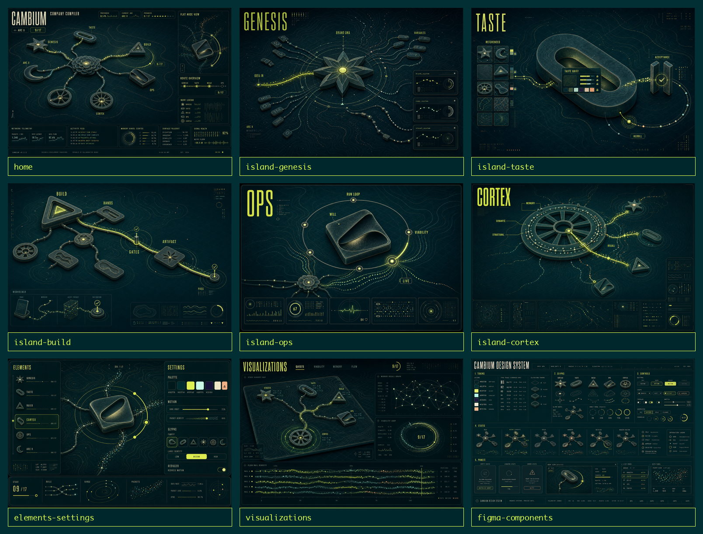

# Cambium R3F Screenshot Pack

This pack extends the accepted R3F visual moodboard into generated concept screenshots. These are visual targets for product direction and future R3F scene planning. They are not final browser screenshots and not implementation specs.

## Screenshots

| Screen | File | Purpose |
|---|---|---|
| Home overview | `docs/plans/assets/cambium-r3f-screenshots/images/home.png` | Main product workspace: 2.5D organ map, current arc, route overview, flat node preview, and telemetry. |
| Genesis island | `docs/plans/assets/cambium-r3f-screenshots/images/island-genesis.png` | Interior of the idea-to-brand-DNA stage: seed/star glyph, variable capsules, brand/copy/visual system channels. |
| Taste island | `docs/plans/assets/cambium-r3f-screenshots/images/island-taste.png` | Interior of the taste cortex: references, taste brief, acceptance gate, reroll orbit, palette checks. |
| Build island | `docs/plans/assets/cambium-r3f-screenshots/images/island-build.png` | Interior of the Hands/Build stage: triangular glyph, gates, artifact route, pass markers. |
| Ops island | `docs/plans/assets/cambium-r3f-screenshots/images/island-ops.png` | Interior of the Will/Ops stage: run loop, viability, live heartbeat, operational telemetry. |
| Cortex island | `docs/plans/assets/cambium-r3f-screenshots/images/island-cortex.png` | Interior of memory: semantic and structural lanes, recall paths, memory wheel, cross-stage links. |
| Elements/settings | `docs/plans/assets/cambium-r3f-screenshots/images/elements-settings.png` | Visual-engine control surface: palette, motion, glyphs, label density, reduced motion, selected preview. |
| Visualizations | `docs/plans/assets/cambium-r3f-screenshots/images/visualizations.png` | Spatial data page: quest map, viability ring, memory recall graph, flow rail density. |
| Figma components | `docs/plans/assets/cambium-r3f-screenshots/images/figma-components.png` | Design-system board: tokens, glyphs, controls, states, panels, loading/empty/error examples. |

## Prompt Archive

All prompts live under `docs/plans/assets/cambium-r3f-screenshots/prompts/`.

- `00-shared-style.md` holds the shared Cambium visual spine.
- `01-home.md` through `09-figma-components.md` hold screen-specific direction.

## Shared Design Decisions

- All frames use the accepted R3F moodboard as the primary reference.
- The screenshot set treats organs as abstract renderable glyph islands, not literal buildings.
- The product should show where the user is through selected nodes, progress rings, highlighted rails, packet trails, and compact telemetry.
- The future R3F translation can map these frames into primitives: planes, extrusions, curves, rings, instanced packets, shader-grain materials, and text labels.
- The component board should become the bridge into a Figma-style design doc and later scene token contract.

## Verification Notes

- Generated through local `codex-gpt-image` with Codex OAuth.
- All nine screenshot images are `1536x1024`.
- Contact sheet generated at `docs/plans/assets/cambium-r3f-screenshots/contact-sheet.png`.
- Visual inspection passed the main constraints: no houses, no city metaphor, no generic neon AI palette, and clear distinction between overview, island interiors, settings, visualization, and component inventory.
