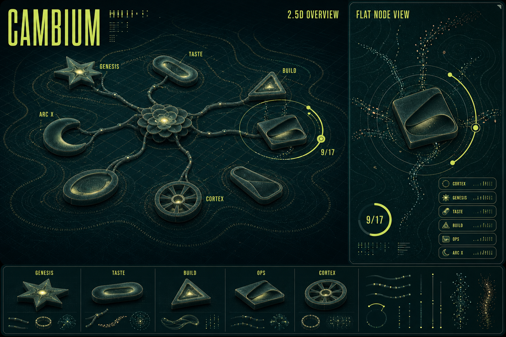

# Cambium R3F Visual Moodboard

This moodboard replaces the earlier HTML/SVG renderer direction with a visual-first target for a future React Three Fiber scene. It is not the scene spec yet. It exists to lock the visual language: Cambium as a living, brand-governed process map where modular organs can run as islands but still read as one organism.

## What It Understands

- **Cambium is a company compiler.** An idea enters Genesis, passes through Taste and Build, reaches Ops, and is continuously fed by Cortex memory.
- **The user needs location in process.** The current state should be readable from a highlighted island, orbit ring, progress chip, packet flow, and compact stage telemetry.
- **The product is a fractal tapestry, not a city.** The scene should use abstract organ-glyphs, hyphae rails, rings, particles, and map planes instead of houses, towers, or literal architecture.
- **The future output is R3F.** The objects intentionally look like simple renderable primitives: extruded shapes, instanced packets, curves, line rails, shallow planes, text labels, and material variants.

## Visual Modes

| Mode | Purpose | Visual Language |
|---|---|---|
| `2.5D OVERVIEW` | The whole operating map: all organs, cross-stage Cortex, and the user's current path. | Tilted dark grid, topographic rings, abstract Coolshapes-inspired organ objects, hyphae signal rails, small telemetry chips. |
| `FLAT NODE VIEW` | A zoomed island view for the selected organ or current quest. | Top-down plane, selected glyph, breathing ring halo, progress `9/17`, stage list, packet trails, local contour field. |
| `SPECIMEN STRIP` | A reusable shape/material vocabulary for later scene work. | Labeled organ glyphs for `GENESIS`, `TASTE`, `BUILD`, `OPS`, `CORTEX`, plus rail, ring, and particle samples. |

## Brand Guardrails

- Palette remains inside Cambium's Cortex contract: `#00272B`, `#012F34`, `#E0FF4F`, `#D6FFF6`, `#231651`, off-cream, and tiny peach/warning accents.
- Motion implied by the board should later map to transform/opacity: ring orbit, seed breath, packet drift, shimmer sweeps, and stage focus transitions.
- No neon outer glow, no generic purple/blue AI gradient, no photoreal buildings, no city-map metaphor.
- Typography should stay condensed for headings and tiny mono for telemetry.

## Reference Inputs

- Attached Terrain references for the dark cartographic cockpit, topographic text/rings, grid plane, and dense telemetry tone.
- Cambium repo sources: `README.md`, `composition/pipeline.json`, `cortex/cambium/contracts/acceptance_checks.json`, `cortex/cambium/contracts/interaction_plan.json`, and `docs/plans/assets/stage-handoff-matrix.json`.
- Taste/Codrops corpus shots:
  - `../Skill-clusters/taste/corpus/shots/webgl-for-designers-creating-interactive-shader-driven-graph.webp`
  - `../Skill-clusters/taste/corpus/shots/from-flat-to-spatial-creating-a-3d-product-grid-with-react-t.webp`
  - `../Skill-clusters/taste/corpus/shots/digital-craft-wild-soul-building-san-ritas-topographic-web-e.webp`
- Coolshapes direction: abstract shape categories with grainy gradients should inspire the node glyph vocabulary, but the board avoids importing implementation detail.

## Generated Files

- Moodboard image: `docs/plans/assets/cambium-r3f-visual-moodboard/cambium-r3f-visual-moodboard.png`
- Generation prompt: `docs/plans/assets/cambium-r3f-visual-moodboard/prompt.md`

## Next Spec Boundary

The next step should not be "rebuild this screenshot." It should translate the board into a small R3F scene contract:

- stage/node data shape,
- camera modes,
- glyph mapping,
- material tokens,
- interaction states,
- reduced-motion behavior,
- and performance budget.

That spec should happen after this visual direction is accepted.
